## Yunwei Cui | Pentesting Course

# h4: Fuzzy

## x. Summaries

### Karvinen 2023: Find Hidden Web Directories - Fuzz URLs with ffuf

- Fuff is used for webfuzzing. You can use a wordlist to find hidden web pages and directories that the author otherwise would not want you to know

- You can not just fuzz pages, but also headers, POST parameters, etc.

First we download a example target from the website. The command has already been given on the website: 
`wget https://terokarvinen.com/2023/fuzz-urls-find-hidden-directories/dirfuzt-0`
This gets the fuzzing target
`chmod u+x dirfuzt-0`
this turns the gotten tar file into an executable
`./dirfuzt-0`
We run it

Now when we go to localhost 8000, we will see the target. There is a hidden directory but we don't know what it is. This is where we need Ffuf

`sudo apt-get install ffuf`

Now we can get a wordlist `wget https://raw.githubusercontent.com/danielmiessler/SecLists/master/Discovery/Web-Content/common.txt`

`./fuff`

`./ffuf -w common.txt -u http://127.0.0.2:8000/FUZZ`
wordlist first then target, and use `FUZZ` for the fuzzing parameter

Everything looks ok, but it only means HTTP 200 ok, it doesn't necessarily mean we got what we wanted. 

We need filter options: `-fc` for status, `-fs` for size in bytes, `-fw` for words, `-fl` for lines. `-ft` for duration.

So if we wanted more size than 132, we would use 
`./ffuf -w common.txt -u http://127.0.0.2:8000/FUZZ -fs 132` 
Now we can find the admin panel

### Hoikkala 2023: ffuf README.md

Readme documentation of ffuf by its creator. Web fuzzer that is written in Go.

###### Example usage:

A lot of examples are external, this is basic documentation

Basic use: 
`ffuf -w /path/to/wordlist -u https://target/FUZZ`

Fuzzing host header because sometimes websites can have the same ip address but use host header to determine which site to serve you: `ffuf -w /path/to/vhost/wordlist -u https://target -H "Host: FUZZ" -fs 4242`

Fuzzing GET parameter, which means like the stuff we are getting e.g. 'name': `ffuf -w /path/to/paramnames.txt -u https://target/script.php?FUZZ=test_value -fs 4242`

We can also fuzz the values of the param: `ffuf -w /path/to/values.txt -u https://target/script.php?valid_name=FUZZ -fc 401` also -fc 401 filters out 401 responses

Fuzzing POST request param such as password or username using FUZZ: `ffuf -w /path/to/postdata.txt -X POST -d "username=admin\&password=FUZZ" -u https://target/login.php -fc 401`

Use `-maxtime 60` in seconds to determine maximum time ffuf will run

We can also add recursions if we find subdirectories: `ffuf -w /path/to/wordlist -u https://target/FUZZ -maxtime-job 60 -recursion -recursion-depth 2` -maxtime-job means how long per job whenever we find the current directory and continue on the next one.

Example use of fuzzing both username and password in POST request to a form. We are using 2 wordlists:
`curl -c -X POST -H "Content-Tye: application/x-www-form-urlencoded" -d 'username=USER$password=PASS' -u <https page> -fr 'errored' -w users.txt:USER -w password.txt:PASS`

 Default path for a ffufrc file is `$XDG_CONFIG_HOME/ffuf/ffufr`and you can change the content to specify the configs for each job. You can also use -config flag for different configs.

 Pressing ENTER during a ffuf job will drop the job and let user enter an interactive shell

## a. Practicing Ffuf on a target
Install target: `wget https://terokarvinen.com/2023/fuzz-urls-find-hidden-directories/dirfuzt-1`

Run target by turning it into `chmod u+x dirfuzt-1` and running it `./dirfuzt-1`

It works:
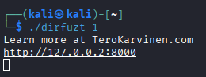

Now I will try running the same wordlist on the target using: 
`ffuf -w wordlists/common.txt -u http://127.0.0.2:8000/FUZZ`

We can see that 4750/4750 succeeded but it doesn't necessarily mean we got what we wanted. We can see majority of the responses have size of 154 bytes. We will now increase the size and see if we get something new. We will use `-fs 154` to filter out anything of that size.

`ffuf -w wordlists/common.txt -u http://127.0.0.2:8000/FUZZ -fs 154`

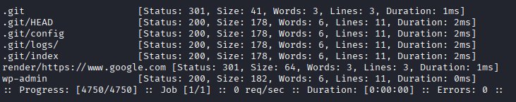

We can see that there's fewer results now. If we enter /.git or /wp-admin, we get the flag

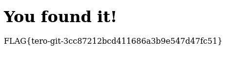

FLAG{tero-git-3cc87212bcd411686a3b9e547d47fc51}

## b. Installing ffufme web target

First we have to install dockerized version of ffuf: `sudo apt-get install docker.io git ffuf`

We clone the ffufme target: `git clone https://github.com/adamtlangley/ffufme`

cd into it and build it using docker: `sudo docker build -t ffufme .`

Run the target: `sudo docker run -d -p 80:80 ffufme`

Now the target is running on localhost port 80:

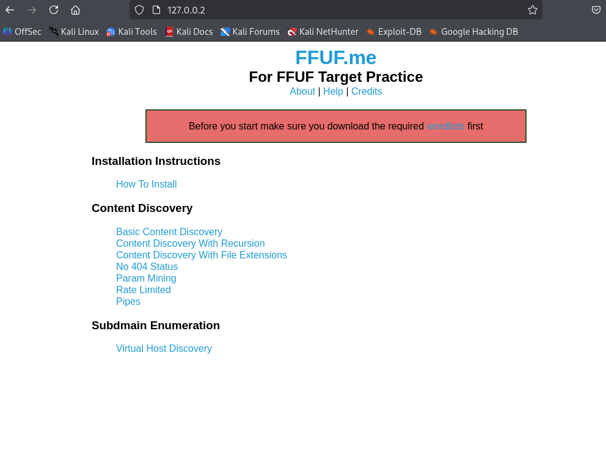

I will install some required wordlists as per the instructions:
`wget http://ffuf.me/wordlist/parameters.txt`

`wget http://ffuf.me/wordlist/subdomains.txt`

Then I made sure my internet connection is off so I dont accidentally fuzz anything on the internet.

## c. Basic Content Discovery

In this ffuf exercise we are doing basic discovery of directories. 

The target page is `http://127.0.0.2/cd/basic`

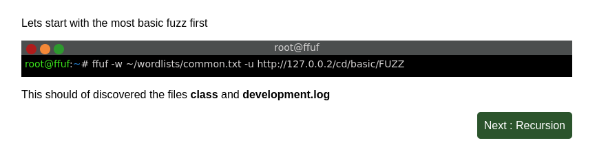

It is telling us to run a basic FUZZ on the subdirectories in the basic/

`ffuf -w ~/wordlists/common.txt -u http://127.0.0.2/cd/basic/FUZZ`

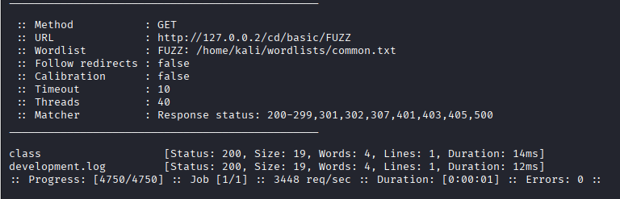

We get the class and development.log subdirectories. 

We have solved the lab

## d. Recursions

Now we learn how to do recursions inside sub directories

With this command `ffuf -w ~/wordlists/common.txt -recursion -u http://127.0.0.2/cd/recursion/FUZZ`

We are telling ffuf that every subdirectory it encounters, it should do recursions and find more directories.

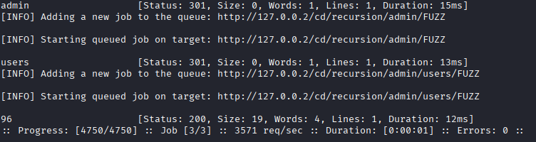 

Here we have found admin sub directory and inside it, users, and inside it, 96

## e. Content Discovery With File Extensions

When we encounter certain paths like /log, but cant view its contents, we can use -e flag to specify if we want to find a specific extension type for a file, e.g. user.log

We can use the following `ffuf -w ~/wordlists/common.txt -e .log -u http://127.0.0.2/cd/ext/logs/FUZZ`

and will find any .log files.

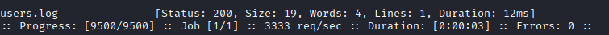 

## f. No 404 Status

This shows the problem when websites return "page not found" without HTTP 404 response, so Ffuf shows it to you. 

We can use `-fs` flag to filter out the size, e.g. we have a ton of requests coming back in that are the same size, we can just not show them and only show results with different content other than "page not found"

`ffuf -w ~/wordlists/common.txt -u http://127.0.0.2/cd/no404/FUZZ -fs 669`

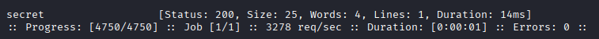 

## g. Param Mining

We can fuzz GET request parameters `ffuf -w ~/wordlists/parameters.txt -u http://127.0.0.2/cd/param/data?FUZZ=1`

It will show all parameters with =1 as a value.

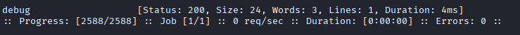 

 

## h. Rate Limited
If there is a rate limit the users from only sending a few requests a second, so we can use `-mc` flag to display certain statuses. 

`ffuf -w ~/wordlists/common.txt -u http://127.0.0.2/cd/rate/FUZZ -mc 200,429`

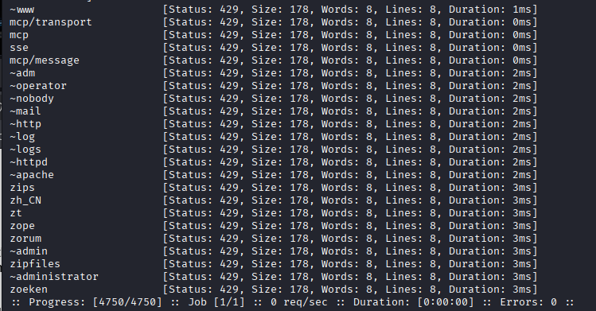 

this only displays HTTP 200 and 429 results but we dont get errors because we get rate limited withh 429

We can add `-p` tag to specify pause in seconds and `-t`flag for 5 different versions of ffuf, so we get 50 requests per second.

`ffuf -w ~/wordlists/common.txt -t 5 -p 0.1 -u http://127.0.0.2/cd/rate/FUZZ -mc 200,429`

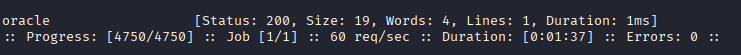 

We find the result.

## i. Subdomains - Virtual Host Enumeration

Same thing as before, fuzzing host headers if the subdomains are on the same IP, e.g. botbook.com & terokarvinen.com are under the same IP, we use host header to find the right page.

So we can use `ffuf -w ~/wordlists/subdomains.txt -H "Host: FUZZ.ffuf.me" -u http://127.0.0.2`

with `-H "Host: FUZZ.ffuf.me"` to find the subdomains on the page ffuf.me
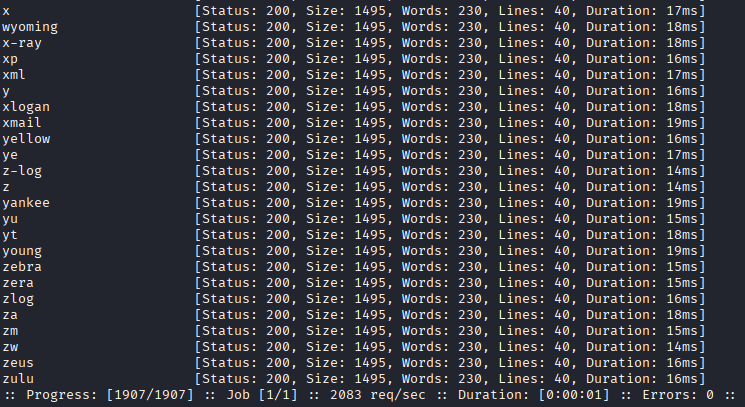

We get a lot of results with size 1495.

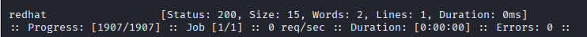

Now we get the solution when filtering out the size with `-fs 1495`

## References

https://terokarvinen.com/2023/fuzz-urls-find-hidden-directories/

https://terokarvinen.com/2023/fuffme-web-fuzzing-target-debian/

https://github.com/ffuf/ffuf/blob/master/README.md
