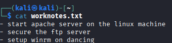

# Goal line

## x. Summaries

### Karvinen 2025: Start Your Research with a Review Article

In this article, it talks about review articles which are basically condensed versions of the literature.

It has tiers such as JUFO 1, 2 or 3 and the publication channel is listed on JUFO: https://jfp.csc.fi/jufoportal

It's best if it's fresh and not older than 2 years.

https://scholar.google.com/ncr 

Is a good place to find articles. Search `<subject> + word: "review"`

You don't need to pay for the articles and PDF is usually in the search results

### Choosing an JUFO article to summarize

I chose this article: https://tampere.chronoshub.io/?fq=subjectarea%3A1700&start=260

From within it, I chose the `SQL injection attack detection in network flow data` by `Ignacio Samuel Crespo-Martínez, Adrián Campazas-Vega, Ángel Manuel Guerrero-Higueras, Virginia Riego-DelCastillo, Claudia Álvarez-Aparicio, Camino Fernández-Llamas,`

ISSN: 0167-4048

Volume 127

It describes how SQL injections are a significant portion of security problems in web apps. It is OWASP top 3 2021.

They gathered network flow data from SQLIAs.

There have been similar work before them but and got high accuracy in predicting attack patterns. But this is all network-layer packets. 

They tried to do flow data which is how fast packets are sent on a network and their flow. The packets within the same flow have similarities such as IP addresses, etc. 

A study before them "Sarhan et al. (2020)" did flow-based study but only achieved 25% detection rate.

The article is a bit long (11 pages) so I will skim through majority of the pages and summarize the basic idea.

They looked at SQLIA injections through insecure inputs and used NetFlow to monitor the packets.

They trained a machine-learning model based on the gathered flow data.

They got high reliability from the trained models in predicting attacks, with the best models achieving 96% accuracy in predicting SQL injection attacks.

## a. Done

## b. HTB Tier 0: Dancing

First we spawn the machine and I have connected to it using my kali linux via OpenVPN connectino.

Now I will nmap all the ports. `nmap -A -T4 -p- -sS -sV -O 10.129.221.51`

`-sS` = half-open and fast scan
`-sV` = service version
`-O` = OS version
`-p-` = all ports
`-A` = Aggressive 

- Task 1 & 2: with a short google search we find that the 3 letter acronym for SMB is the server message block which is a port on 445

- Task 3: the service name for port 445 was found using the `-sV` flag which means service version.

and it says `microsoft-ds`

- Task 4 & 5: According to a quick Google search, we can do `smbclient -L <host>` to list available shares, and we can find 4.

Let's try access them.

- Task 6: I also tried `smbclient //10.129.221.51/WorkShares -N` according to another Medium guide by ibrahim atasoy and got an interactive shell with 4 folders.

I got access to the WorkShares directory.

- Task 7: we can use `get <filename>` to download files

We will download the worknotes.txt using `get worknotes.txt`

It is downloaded into the folder we launched smbclient from and we can read it `cat worknotes.txt`

Nothing interesting yet.

Now when we go back to the James' directory, we find the flag. 

The flag reads:

## c. HTB Tier 1: Responder

I connect to hack the box machine.

- Task 1: it is asking us to visit the website with the IP address of the box: `10.129.141.210` but we get a blank page with the domain name being `unika.htb` 

- Task 2: it is asking us what scripting language is used to generate the page

I believe I was running into an error with the unloaded webpage so I looked at a writeup. Indeed I havve to first associate the domain name with the target IP address by editing `/etc/hosts` and add the IP with unika.htb

References:

https://terokarvinen.com/review-article/

https://www.sciencedirect.com/science/article/pii/S0167404823000032

https://medium.com/@agvask/youre-using-nmap-all-wrong-3d8a5ff189e

https://nmap.org/book/man-version-detection.html

https://medium.com/@ibo1916a/smbclient-command-2803de274e46

https://medium.com/@ibo1916a/smbclient-command-2803de274e46