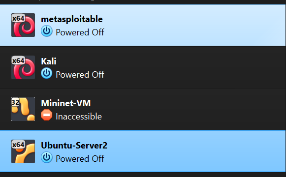
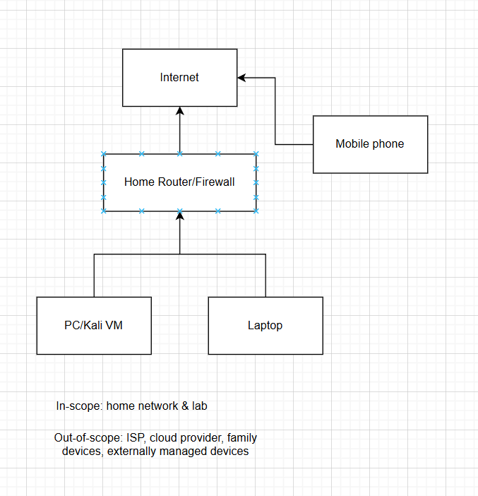

# H1 Command and Concure

## a. Baseline
Draft an Information Security Management System scope for home network and study lab 

### 1. What is included:
- PC connected to home Wi-Fi (hosts Kali Linux VM and other lab VMs)

- Laptop connected to home Wi-Fi (used for study, coding, notes)

- Personal cell phone on own mobile network (used for MFA and study access)

- Kali Linux VM inside PC (lab practice and testing environment)

- Information assets: course materials, personal notes, projects, code repositories, lab VMs, and account credentials used for personal, school and professional workplace.

### 2. What is excluded and why:
- Dad’s PC is outside of my administrative control

- Smart TV is not used for my school or work and is irrelevant

- Mother's laptop is outside my administrative control

### 3. Key interfaces:

- Connection from home router/firewall to the public internet

- GitHub repositories, SoundCloud, Spotify, OneDrive, N8N, password managers

- Remote access: SSH to Github or remote virtual machines in HTB

- Suppliers/service providers: ISP for internet connectivity, device updates from vendors, cloud service providers for account access

### Evidence:
- Router config page listing my home devices. (excluded due to privacy reasons) 

- Github repos, project screenshots for personal and professsional work (excluded except git repo)
        https://github.com/dragonisdev

- VM listing on PC. 

- Backup configuration on Onedrive. (excluded due to privacy reasons) 

- MFA settings page for cloud accounts. (excluded due to privacy reasons) 

For each item I could provide a screenshot or sample file if required.

### Diagram:

 
## b Tie It to the Standard

Task: Identify at least 2 interested parties in a home network context, and for each write:

Interested parties

Need/requirement

ISO 27001 requirement area it links to 

How would you demonstrate fulfillment (evidence)

| Interested party | Need/Requirement                                                                              | ISO 27001 Area     | Evidence                                                       |
|------------------|-----------------------------------------------------------------------------------------------|--------------------|----------------------------------------------------------------|
| Me (Owner)       | Good internet for doing school and work tasks, protection of private data, projects and notes | Planning/Operation | Backups, screenshots, files                                    |
| Family members   | Privacy, separated from lab environment and not be interfered by it                           | Leadership         | Wi-fi network segmentation documentation, network usage report |

## References

Course page: https://terokarvinen.com/application-hacking/
ISO 27001 guidelines: https://www.iso.org/standard/27001