# H2 Break & Unbreak

## x. Summaries

### OWASP: OWASP Top 10: A01 Broken Access Control

This article by OWASP talks about Broken Access Control which is in the 5th position in the Top 10 vulnerabilities. 

It is when users are able to perform actions outside of their intended permissions.

Examples of this are:
- Violation of least privilege
- Bypassing access control checks by modifying URL and internal application state or the API
- Permitting viewing or editing of someone else's account content by providing its unique identifier (insecure direct object references)
- APIs without access controls for PUT, POST, DELETE

To prevent, we must ensure server side validates and checks for access controls always.

### Karvinen 2023: Find Hidden Web Directories - Fuzz URLs with ffuf

- Fuff is used for webfuzzing. You can use a wordlist to find hidden web pages and directories that the author otherwise would not want you to know

- You can not just fuzz pages, but also headers, POST parameters, etc.

First we download a example target from the website. The command has already been given on the website: 
`wget https://terokarvinen.com/2023/fuzz-urls-find-hidden-directories/dirfuzt-0`
This gets the fuzzing target
`chmod u+x dirfuzt-0`
this turns the gotten tar file into an executable
`./dirfuzt-0`
We run it

Now when we go to localhost 8000, we will see the target. There is a hidden directory but we don't know what it is. This is where we need Ffuf

`sudo apt-get install ffuf`

Now we can get a wordlist `wget https://raw.githubusercontent.com/danielmiessler/SecLists/master/Discovery/Web-Content/common.txt`

`./fuff`

`./ffuf -w common.txt -u http://127.0.0.2:8000/FUZZ`
wordlist first then target, and use `FUZZ` for the fuzzing parameter

Everything looks ok, but it only means HTTP 200 ok, it doesn't necessarily mean we got what we wanted. 

We need filter options: `-fc` for status, `-fs` for size in bytes, `-fw` for words, `-fl` for lines. `-ft` for duration.

So if we wanted more size than 132, we would use 
`./ffuf -w common.txt -u http://127.0.0.2:8000/FUZZ -fs 132` 
Now we can find the admin panel

### PortSwigger: Access control vulnerabilities and privilege escalation

This article talks about access control which is what a user is allowed and not allowed to do

Types of access controls:
- Vertical: regular user vs admin user
- Horizontal: restricts access to resources owned by other users
- Context-dependent: restricts actions based on application state

Broken access control happens when we don't check if the user has the right privileges to execute certain functions, or our logic is flawed. This can cause normal users to unintentionally execute actions only an administrator should have rights to.

### Karvinen 2006: Report Writing (in Finnish)

This article talks about how to write reports.

It says that we should write reports while doing the work which helps with reproducibility and learning, as well as documentation.

Reproducibility:
- Another person should be able to get the same results using the same environment
- Always document the environment

Precision: 
- Record exact commands and steps taken to achieve the result
- Timestamps and work environment are important
- If something went wrong, why did it go wrong and how did you fix it?

Easy to read:
- Write in clear language and use proper structure

Sources and references:
- Always cite what sources you used

Mistakes:
- Do not fabricate tests you did not do
- Do not plagiarize
- Do not use images or content you don't have permission to use

## a. Break into 010-staff-only

In this exercise, we download a python flask web app from terokarvinen website: https://terokarvinen.com/hack-n-fix/#tips

We first run the command `wget https://terokarvinen.com/hack-n-fix/teros-challenges.zip` to get the zip file 

Then unzip it `unzip teros-challenges.zip`

In the first exercise 010, we install the required dependencies `sudo apt-get -y install python3-flask python3-flask-sqlalchemy`

`python3 staff-only.py`

I had to run `sudo kill -9 $(sudo lsof -t -i:5000)` to kill the process that ran on port 5000 before starting the app.

We are greeted by the login form: 

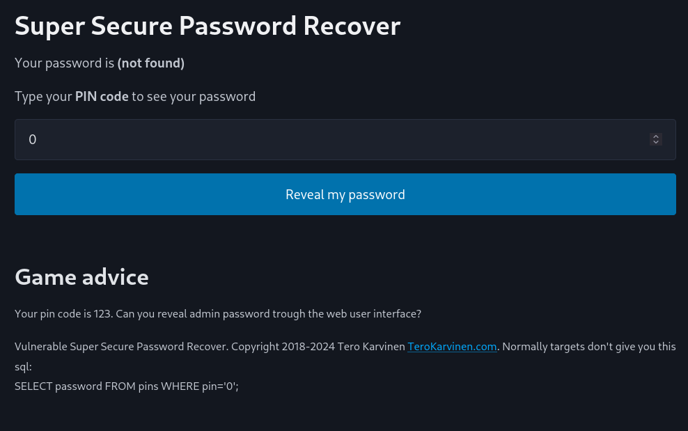

When we try to input 123 into the input field, we get our password:

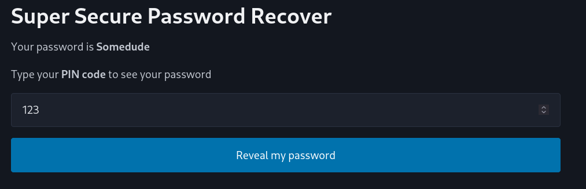

The website already givces us a hint: 
`SELECT password FROM pins WHERE pin='0'; `

And on Tero's website we have another hint: 
`Reveal admin password. It contains the string "SUPERADMIN"`

Thus, we need an SQL query that gets the password that contains SUPERADMIN in it. 

We can try a simple injection like `' OR 1=1--`, but the input field will say it only allows numbers. We just have to edit the html input field to accept string:

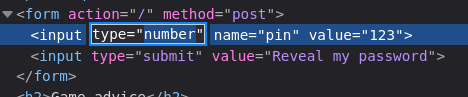

Now we can get a password, but it doesn't contain SUPERADMIN string so it's the right one.

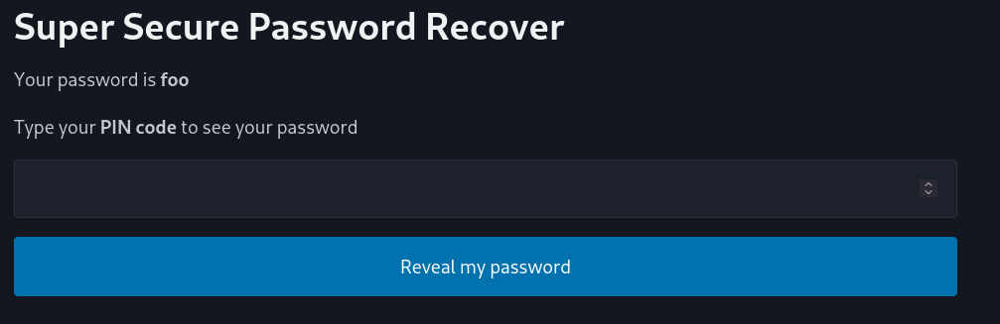

The query we need is: 

`SELECT password FROM pins WHERE pin='whatever' OR pin LIKE '%SUPERADMIN%';`

Since we already have the beginning: 

`SELECT password FROM pins WHERE pin='123'`

We just add the rest: 

`' OR password LIKE '%SUPERADMIN%'--`

We have to make sure it is password LIKE %SUPERADMIN% because we don't want to query from pins.

Now we get the flag:

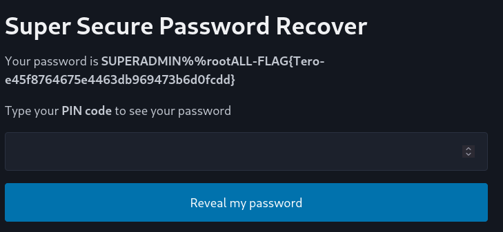

## b. Fix the 010-staff-only vulnerability from source code. 

Looking at the source code, we micro into it and see the following:

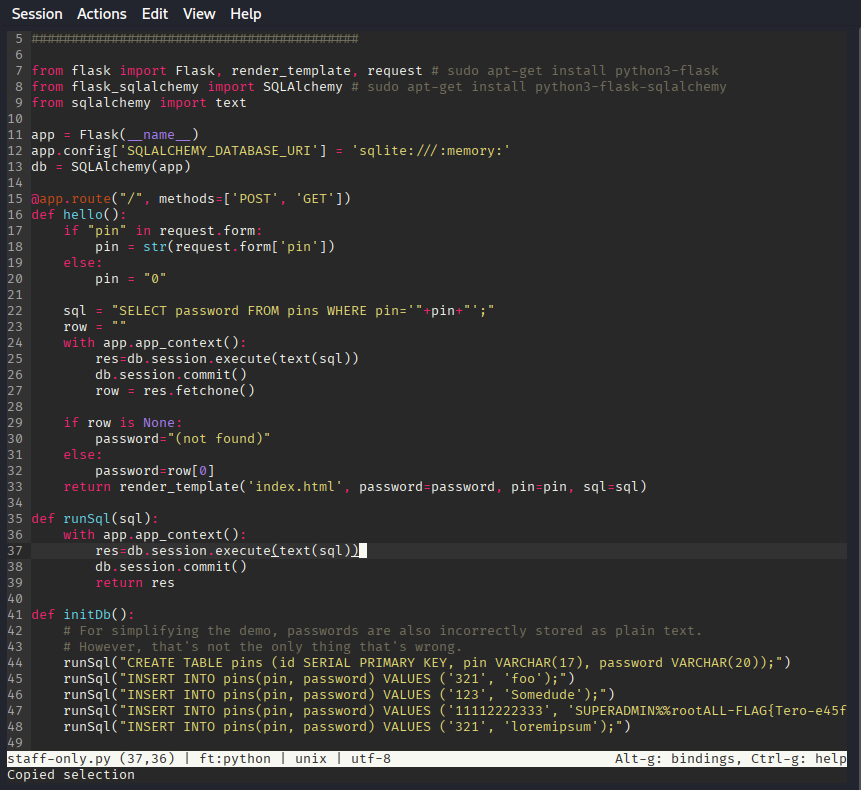

We can clearly see the issue: 
    
`sql = "SELECT password FROM pins WHERE pin='"+pin+"';"`

and 

`res=db.session.execute(text(sql))`

The pin is not sanitized and just appended to the query and executed. 

According to ChatGPT Free Tier, Model 5 on 2025-01-22 after prompting "How do I fix the SQL injection on present in the image", it suggested the following:

`sql = text("SELECT password FROM pins WHERE pin = :pin")`

`res = db.session.execute(sql, {"pin": pin})`

This ensures that the string is not concatenated and will be treated as data and not SQL query.

Now when we run the same query again, it won't find the password, but will find normal intended queries.

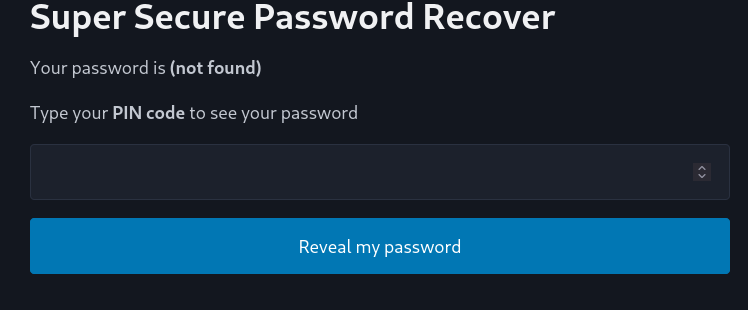

## c. Solve dirfuzt-1 from the article Karvinen 2023: Find Hidden Web Directories - Fuzz URLs with ffuf

Install target: `wget https://terokarvinen.com/2023/fuzz-urls-find-hidden-directories/dirfuzt-1`

Run target by turning it into `chmod u+x dirfuzt-1` and running it `./dirfuzt-1`

It works:

Now I will try running the same wordlist on the target using: 
`ffuf -w wordlists/common.txt -u http://127.0.0.2:8000/FUZZ`

We can see that 4750/4750 succeeded but it doesn't necessarily mean we got what we wanted. We can see majority of the responses have size of 154 bytes. We will now increase the size and see if we get something new. We will use `-fs 154` to filter out anything of that size.

`ffuf -w wordlists/common.txt -u http://127.0.0.2:8000/FUZZ -fs 154`

We can see that there's fewer results now. If we enter /.git or /wp-admin, we get the flag

FLAG{tero-git-3cc87212bcd411686a3b9e547d47fc51}

## d. Break into 020-your-eyes-only

cd into the project folder, `pip install -r requirements.txt` 

`cd logtin/`

`./manage.py makemigrations; ./manage.py migrate`

We made the migrations and now run the server:

`./manage.py runserver`

We are greeted by the webpage:
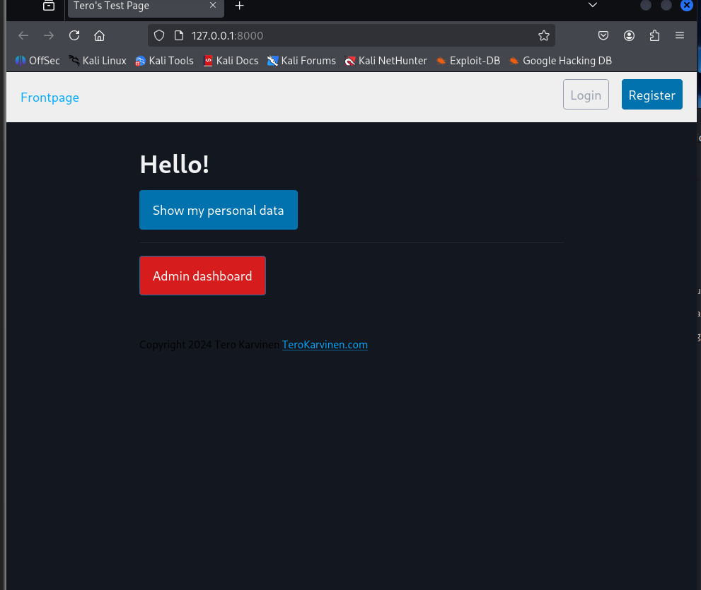

The page gives us a hint: 

`Your hacking goal: Access adminstrative console. The page contains text "you've found the secret page" the vulnerability through the web interface, without looking at the source code.`

I believe the task is asking us to Fuzz the subdirectories of the website. So according to previous exercise, we use the ffuf command and the common.txt wordlist to try and find the hidden directories:

`ffuf -w wordlists/common.txt -u http://127.0.0.2:8000/FUZZ`

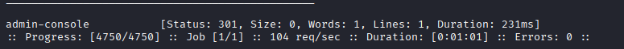

We find "admin-console" subdirectory and visit it:
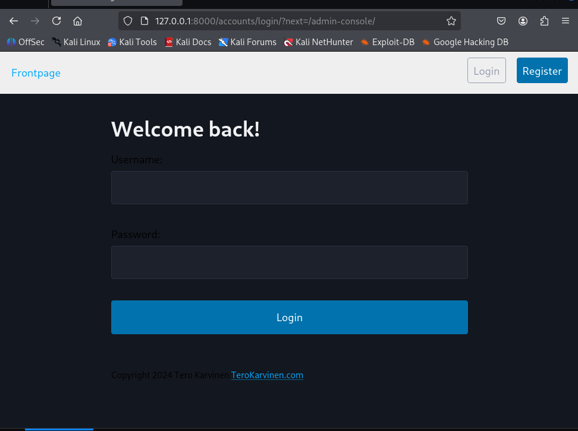

Unfortunately it still asks us for login.

I notice that we can register into the website so I made an account and logged into it.

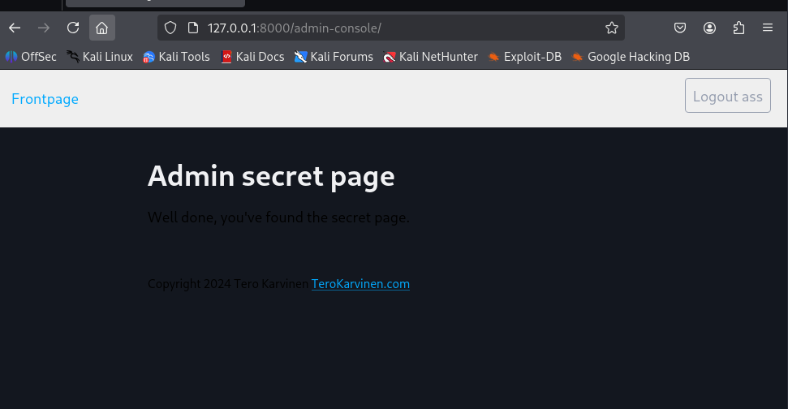

The admin-console is accessible now accessible.

This is a common problem with indirect object reference vulnerability where we don't check if the user has the rights to access the contents.

## e. Fix the 020-your-eyes-only vulnerability from source code. 

There are a lot of files in this django project, finding the right file was probably the biggest problem.

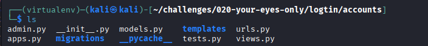 

There is a lot of files so I try to grep for admin-console from project root `grep -R "admin-console" .`

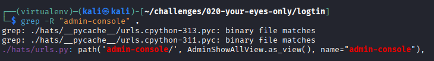

Now we can open the file and see the issue:

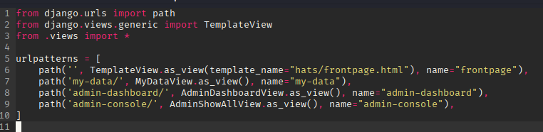

`path('admin-dashboard/', AdminDashboardView.as_view(), name="admin-dashboard"),`

`path('admin-console/', AdminShowAllView.as_view(), name="admin-console"),`

One has AdminDashboardView while the other has AdminShowAllView, and I assume that's the issue.

Now I changed both to having `AdminDashboardView` and the admin-console is not accessible anymore.

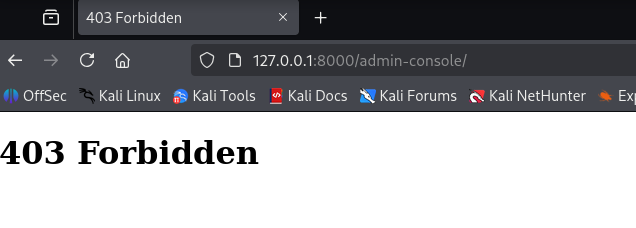

## g. Solve Portswigger Academy's "Lab: SQL injection vulnerability in WHERE clause allowing retrieval of hidden data"

https://portswigger.net/web-security/sql-injection/lab-retrieve-hidden-data

This lab is fairly simple. They give you the query that is executed when you browse a category: 

`SELECT * FROM products WHERE category = 'Gifts' AND released = 1`

In the URL it appears as follows: filter?category=Clothing%2c+shoes+and+accessories

We must simply append `AND released = 0-- ` to the query to get the hidden data.

However, that is not the model answer. The actual answer they want you to put is `'+OR+1=1--` which will show all the results, regardless if it's released or not but I think my answer is better.

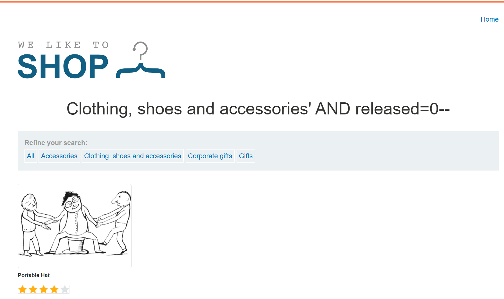

## h. Solve Portswigger Academy's "Lab: SQL injection vulnerability allowing login bypass"

https://portswigger.net/web-security/sql-injection/lab-login-bypass

In this lab, we are given a login form and must bypass it using SQL injection to get into `administrator` account.

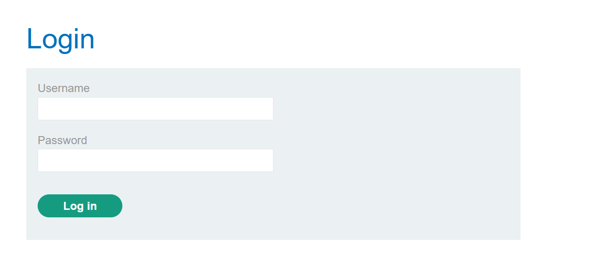

Since we already know the username, we can simply inject `' OR 1=1-- ` into the password field to bypass the query which is probably:

`SELECT * FROM users WHERE username = 'administrator' AND password = 'something123'`

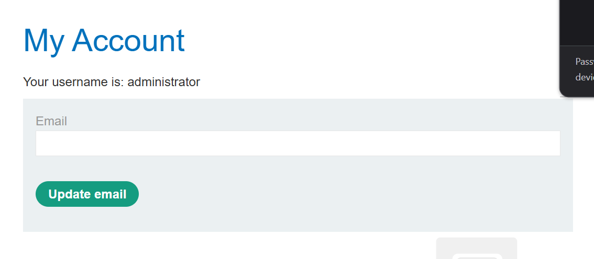

We must be careful about the correctness of syntax and make sure there is space in the correct places or otherwise there will be internal server error. 
A

## References

OWASP Top 10: https://owasp.org/Top10/2021/A01_2021-Broken_Access_Control/index.html

Karvinen 2023 Find Hidden Web Directories: https://terokarvinen.com/2023/fuzz-urls-find-hidden-directories/

PortSwigger Access control vulnerabilities and privilege escalation: https://portswigger.net/web-security/access-control

Lab: SQL injection vulnerability in WHERE clause allowing retrieval of hidden data: https://portswigger.net/web-security/sql-injection/lab-retrieve-hidden-data

Lab: SQL injection vulnerability allowing login bypass: https://portswigger.net/web-security/sql-injection/lab-login-bypass

Karvinen 2006 Report Writing: https://terokarvinen.com/2006/raportin-kirjoittaminen-4/

Karvinen Hack-n-fix:https://terokarvinen.com/hack-n-fix/

ChatGPT Free Tier, Model 5 accessed 2025-01-22