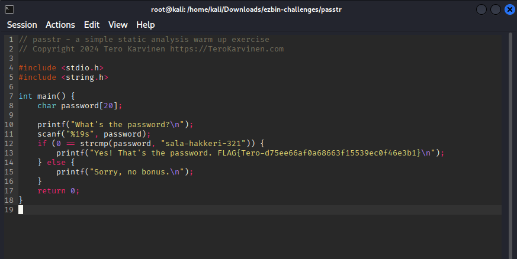
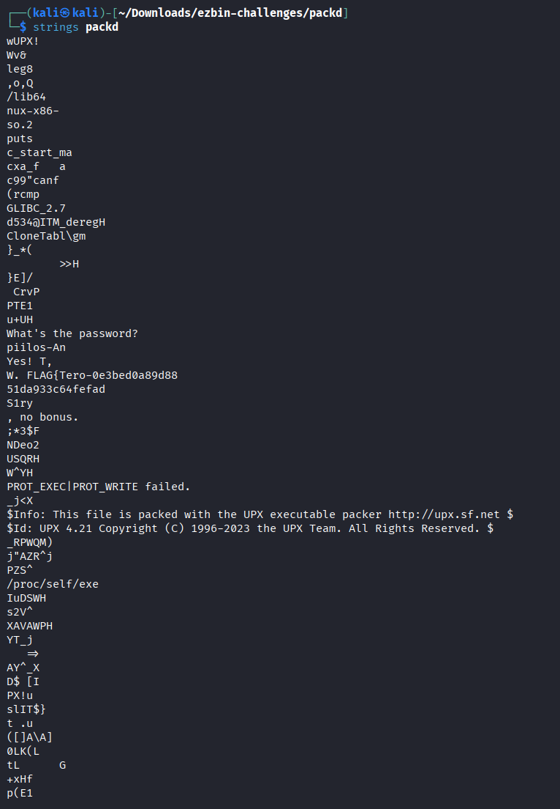

# H3 No Strings Attached

## a. Download ezbin-challenges.zip. 

In this exercise, we must download a binary zip and run "passtr" to find the correct password using `strings` as well as the flag without looking at the source code.

We've downloaded the zip and we will unpack it using `unzip ezbin-challenges.zip`

`cd challenges`

We see the passtr folder

`cd passtr`

In the folder, we have a c file, and a passtr file that is an executable. 

We can run it with `./passtr` and it asks for a password. When we input the wrong password it gives:


The exercise asks us to use strings command so we do `strings passtr` and we get a lot of strings


We see every readable ASCII string that is inside the binary. We see the flag already which is 

`FLAG{Tero-d75ee66af0a68663f15539ec0f46e3b1}`

We can `strings passtr | less` and then type `/pass` to see all the words that contains pass 


password `sala-hakkeri-321`

## b. Make a new version of the passtr.c program where the password doesn't appear directly as-is in the binary.

The code stores the password and flag in plaintext: 



There's a few options, I'm thinking of putting an obfuscated base64 string in the place of the flag and decode it at runtime.

First we encode `sala-hakkeri-321` into base64 which is: `c2FsYS1oYWtrZXJpLTMyMQ==`

We want to turn the user input into base64 and if it matches the hash, we print the flag.

As I am not familiar with C, I used ChatGPT Free Tier Model accessed 28.1.2026 to help me write the entire code.

```#include <stdio.h>
#include <string.h>
#include <openssl/evp.h>

int main() {
    char password[64];
    unsigned char encoded[128];
    int out_len;

    printf("What's the password?\n");
    scanf("%63s", password);

    out_len = EVP_EncodeBlock(
        encoded,
        (unsigned char *)password,
        strlen(password)
    );

    if (strcmp((char *)encoded, "c2FsYS1oYWtrZXJpLTMyMQ==") == 0) {
        printf("Yes! That's the password. FLAG{Tero-d75ee66af0a68663f15539ec0f46e3b1}\n");
    } else {
        printf("Sorry, no bonus.\n");
    }

    return 0;
}
```

We then compile it with `gcc passtr.c -lcrypto`


It works.

Now we do `strings a.out`


We do not see the password in plaintext. We can still try our initial password `sala-hakkeri-321` to see if it works:


It does! We have succesfully encrypted it.

## c. Packd. Run 'packd' from the package ezbin-challenges.zip. What is the password? What is the flag?

In this exercise we run `strings packd` and we get some strings



We already see the beginning of the flag:

`FLAG{Tero-0e3bed0a89d8851da933c64fefad` 

but we are missing the ending.

We can run `strings packd | grep FLAG` to grep the FLAG string and we get: 

`FLAG{Tero-0e3bed0a89d8851da933c64fefad4ff2}`

We can also see the password which is: `piilos-An`

## d. Optional bonus: Crytopals
https://www.cryptopals.com/sets/1

Do task 1-4

### 1. Convert hex to base64


## References: 
Course page: https://terokarvinen.com/application-hacking/