# H4 Some Disassembly Required 

## x. Summaries

### Hammond 2022

In this video, John Hammond shows ways to begin binary reverse engineering. He starts with some like ltrace and strace for a binary he is trying to reverse engineer. 

He also shws GEF as a tool for searching for strings.

With no success, he then shows how to use Ghidra to disassemble the binary.

He installs it with zip, and then extracts it. However, you can also install apt install ghidra.

He shows how to create and open a project as well as how to import a file into the project.

Open the code browser by clicking the dragon icon.

It will prompt you to analyze the file again.

## a. Install ghidra

`sudo apt install ghidra`

It automatically installs it with necessary dependencies and I can use it.

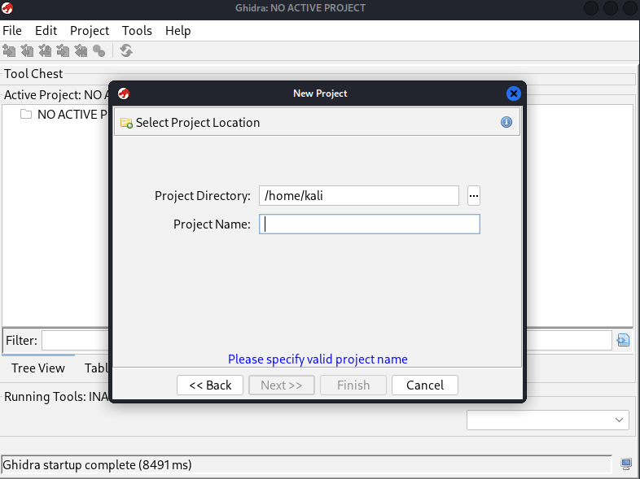

## b. rever-C. Reverse engineer the packd binary to C language with Ghidra.

The goal of this exercise is to explain what the program does and give variables their names. We should solve the task using just the binary.

Now we will import the packd binary into ghidra.

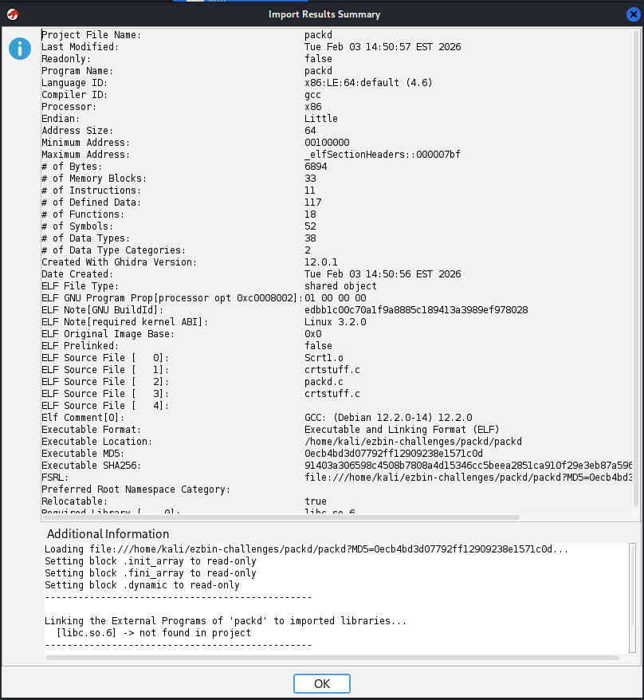

It does its analysis thing first.

After which we open it in the code browser.

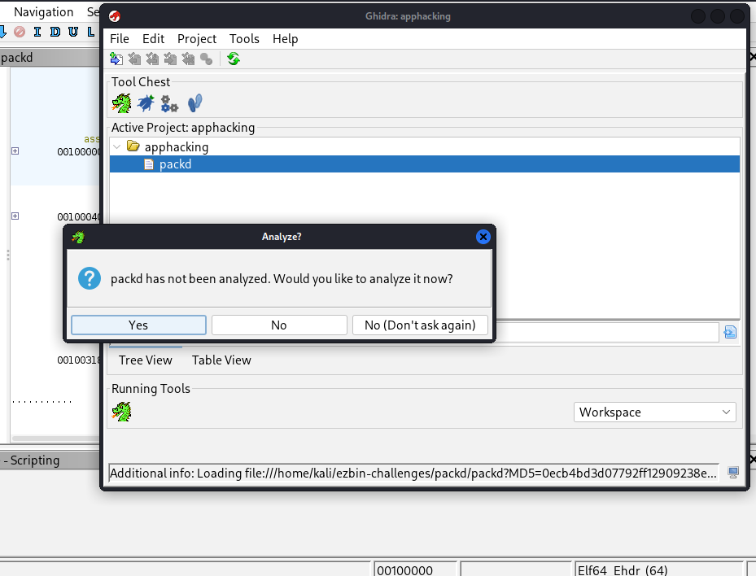

It asks us to analyze it again and we click "yes" and just analyze in default mode.

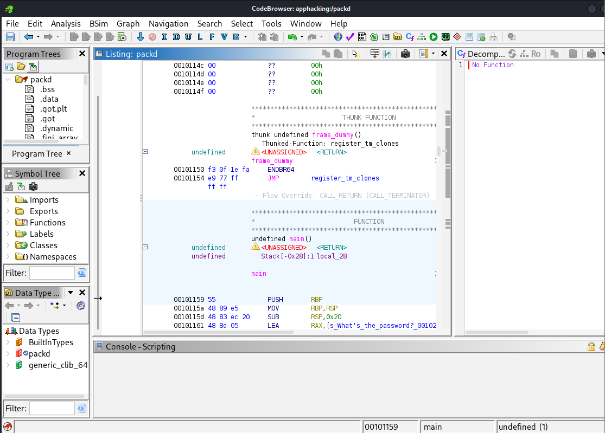

Now we see the packd code.

We can go to window => define strings and search for important strings.

Since the goal is to explain what the program does first, let's see what we get with the `password` word in the search bar.

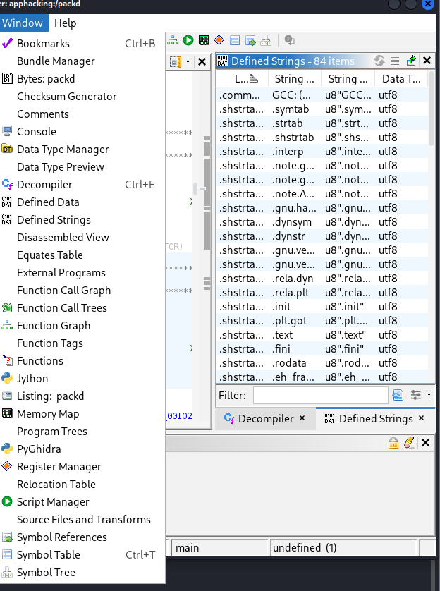

We can see that it is tied to the main function:

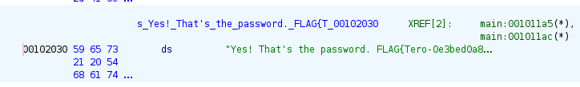

Which we can then view in C source code essentially in the Decompile panel:

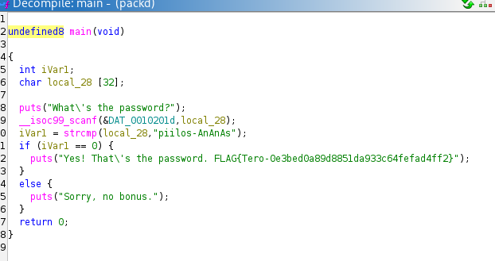

Now the answer becomes clear, it is a password checker and the flag and the password is in plain text in the source code.

Password is: `piilos-An`

Flag is: `FLAG{Tero-0e3bed0a89d8851da933c64fefad4ff2}`

## c. If backwards. Modify the passtr program's binary so that it accepts all passwords except the correct one.

Now we will examine the binary of the previous exercise called `passtr`

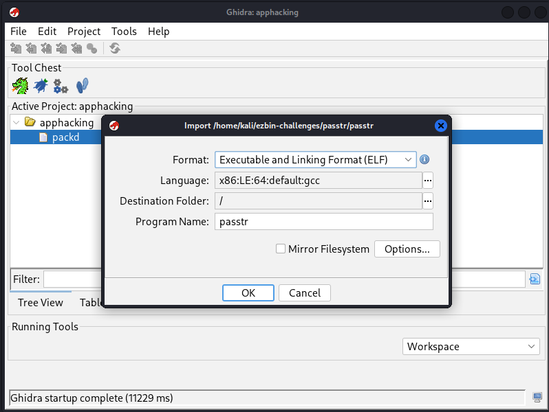

We will import the file, it will do a quick analysis and now we can see the source code.

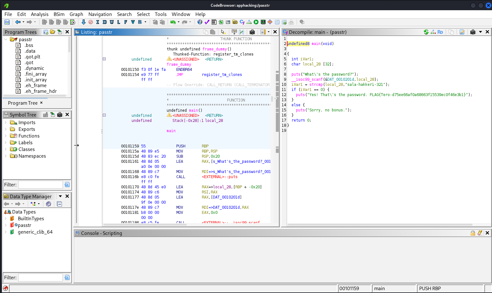

The function is pretty straightforward and we can see everything in plain text.

In ordere to reverse the logic for the binary to accept any string that is not the password, we need to invert the logic.

According to ChatGPT Free Tier Model accessed 5.2.2026, we need to flip the logic in the binary to not jump if the user puts the wrong password by inverting the JNZ to JZ.

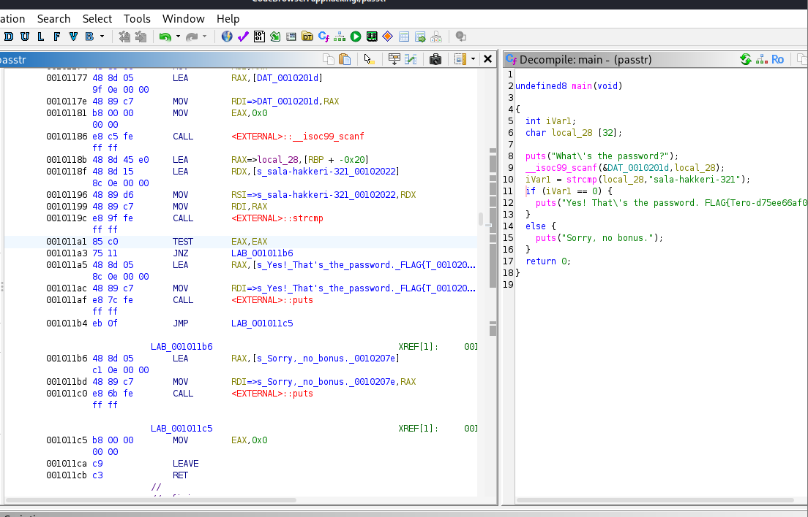

We hover over the JNZ and right click and patch instructions.

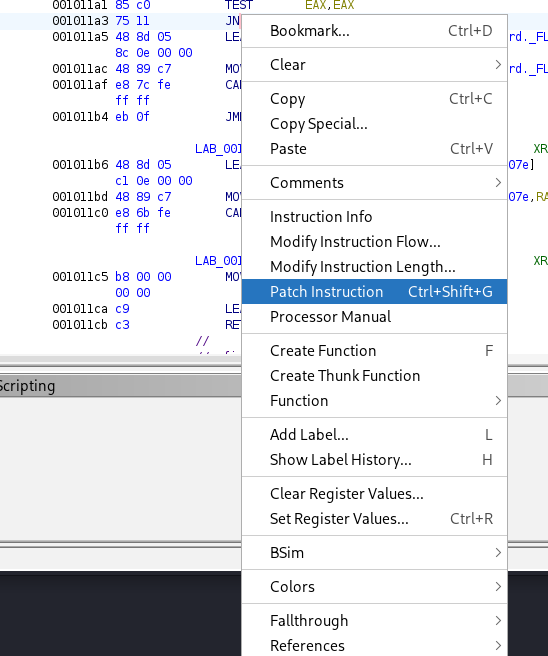

We change JNZ to JZ and click enter:

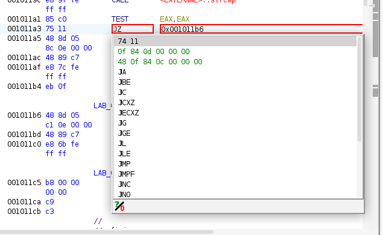

Now we go file and export program.

We can now run it and enter any password and it will give us the flag.

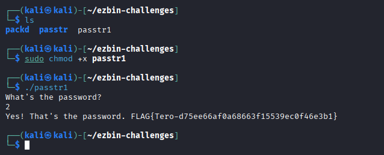

## d. Nora CrackMe: Compile to binaries Tindall 2023

In this exercise, we are supposed to reverse engineer the binaries using ghidra for example and see how they function and find the flag.

NoraCodes crackmes: https://github.com/NoraCodes/crackmes.git 

We have to compile each binary using `make <filename>` and then we can run it. `./<filename>`

## e. Part 1. Nora crackme01. Solve the binary.

Let's try the first one.

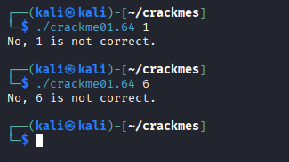

We must give exactly 1 input but we don't know what it is. Let's open ghidra and see what we are supposed to put in.

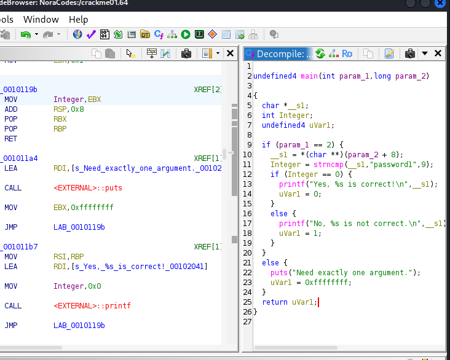

In here, it shows that it's doing a string compare between the input, and `password1` which is the input we must give.

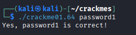

## e. Part 2. Nora crackme01e. Solve the binary.

The second exercise is very similar.

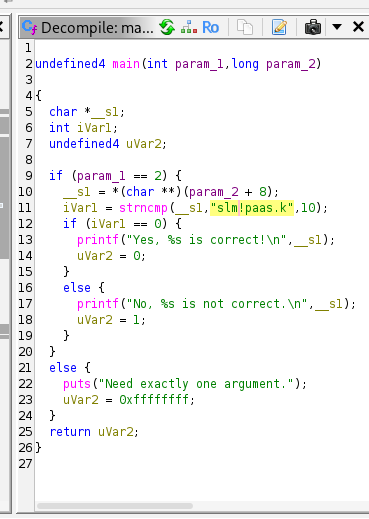

This time we just need single quotes around the argument to make sure we escape the `!`

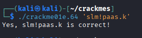

## f. Nora crackme02. Name the main program's variables from the reverse-engineered binary and explain the program's operation. Solve the binary.

We open the binary in ghidra:

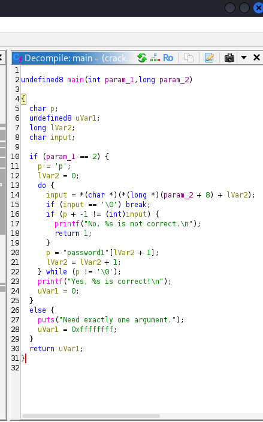

This one seems a bit more complicated with its functionality.

In here, the logic is essentially checking each letter of the input.

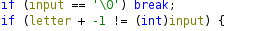

It loops through each letter and does a -1 on it. It is according to the ASCII table, so p becomes o, 1 becomes 0, a becomes backtick `.

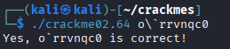

## g. Optional: And beyond. Crackme01 has multiple solutions. How many can you find? Why?

You can bruteforce it using a bash script to use the rockyou.txt as the argument.

You could also just be lazy and `strings crackme01.64 | grep password`

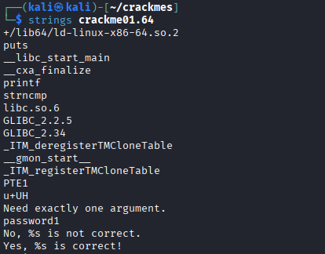

## h. Optional: Unsolicited. Crackme02 has two solutions. Can you find both?

## i. Optional, slightly more challenging: A ray. Nora crackme02e. Solve the binary.

## References

Course page: https://terokarvinen.com/application-hacking/

Hammond 2022: Ghidra for Reverse Engineering: https://www.youtube.com/watch?v=oTD_ki86c9I

NoraCodes: https://github.com/NoraCodes/crackmes.git