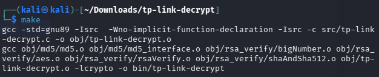
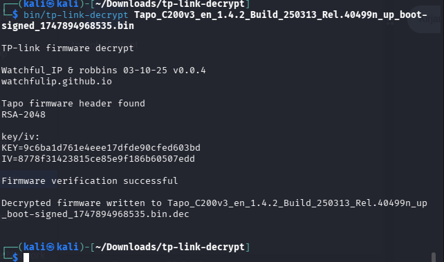
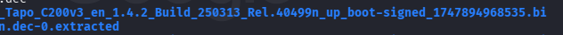
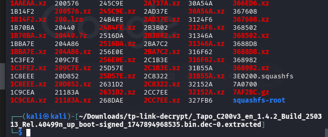
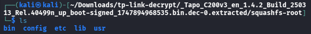
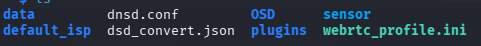
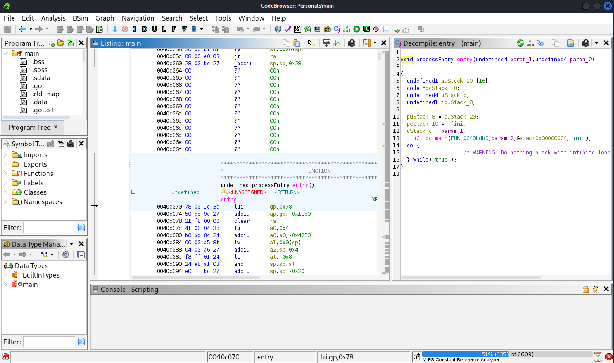
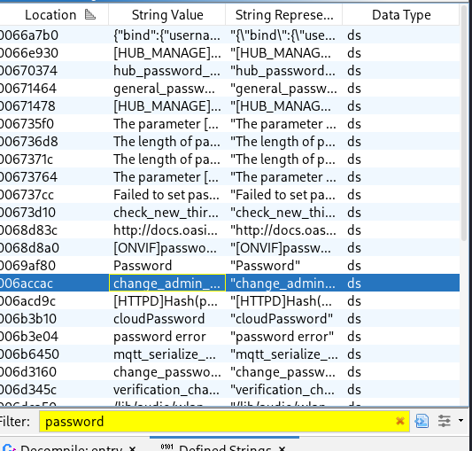
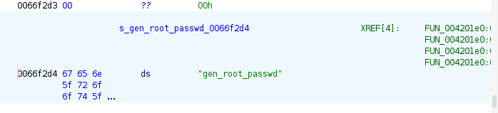
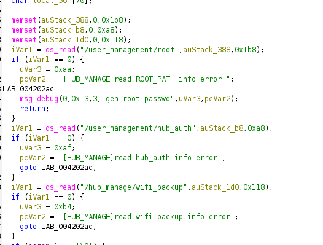

# H5 Embedded Devices

In this homework task, we are supposed to root a tp-link tapo c200 and find the root password or access key which we can use to access all of the devices since they all share the same root/admin key.

First we will obtain the firmware. According to blog post by Simone Margaritelli on evilsocket.net, there is a public S3 bucket with all tp-link firmware: `$ aws s3 ls s3://download.tplinkcloud.com/ --no-sign-request --recursive`

We want to grab `1.4.2 Build 250313 Rel.40499n`

This is the binary file: `Tapo_C200v3_en_1.4.2_Build_250313_Rel.40499n_up_boot-signed_1747894968535.bin`

We can grab it from here: `http://download.tplinkcloud.com/firmware/Tapo_C200v3_en_1.4.2_Build_250313_Rel.40499n_up_boot-signed_1747894968535.bin`

It is however, encrypted and we must decrypt it first using another tool linked in the course page: `https://github.com/robbins/tp-link-decrypt`

This will help us decrypt the binary file. We must first clone it:

`git clone https://github.com/robbins/tp-link-decrypt`

then we will install the dependencies:

` ./preinstall.sh`

then we will extract RSA keys from TP-Links GPL code

`./extract_keys.sh`

`make`



`bin/tp-link-decrypt Tapo_C200v3_en_1.4.2_Build_250313_Rel.40499n_up_boot-signed_1747894968535.bin`


We now have a decrypted binary file of the firmware image.

We still have to run through binwalk before we can open it in ghidra:

`binwalk -e Tapo_C200v3_en_1.4.2_Build_250313_Rel.40499n_up_boot-signed_1747894968535.bin.dec`

I was missing lzop package so I had to install that first:

`sudo apt install lzop p7zip-full lzma`

Then I ran binwalk and got the filesystem.



We must go to the squashfs-root 



Now we see the file system:



We can check out /etc/shadow for hashes or /bin for binaries. There is no shadow file? 



But there is a main file binary executable, which I decided to open in ghidra.



We can see the entry point. I will see if we can get low hanging fruits with string search for password.



We can see quite a lot of potential password strings. What about root?



There is a gen root password function? This could be interesting



I pasted the code into Claude Sonnet 4.6 and asked it what the code meant. 

It gave a long explanation regarding how the password is generated and stored, but it is too complicated for me to understand:

```
param_1 == 1 is a backdoor-style override — a caller can inject an arbitrary root password by passing it in param_2+0xc, bypassing all stored credential logic.
The global DAT_0077c5b4 is written without synchronization — potential race condition if called concurrently.
acStack_367 (the fallback) comes from /user_management/root but Ghidra hasn't resolved its exact offset — it may be a hardcoded default password in the config.
This looks like firmware from a home automation hub or WiFi router, given the paths and naming (hub_manage, wifi_backup, HUB_MANAGE).
```

This is where I will stop as I run out of time. However, I would proceed by looking at all other functions related to password and root and check how they work if I can see any hardcoded strings.

## references

https://github.com/AndroOtt/Application-Hacking-and-Vulnerabilities/blob/main/h5.md

https://quentinkaiser.be/security/2025/07/25/rooting-tapo-c200/

https://www.evilsocket.net/2025/12/18/TP-Link-Tapo-C200-Hardcoded-Keys-Buffer-Overflows-and-Privacy-in-the-Era-of-AI-Assisted-Reverse-Engineering/

https://github.com/robbins/tp-link-decrypt