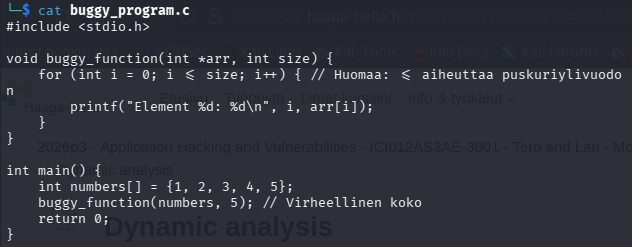
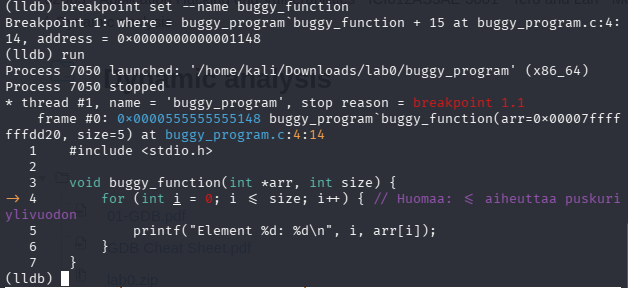
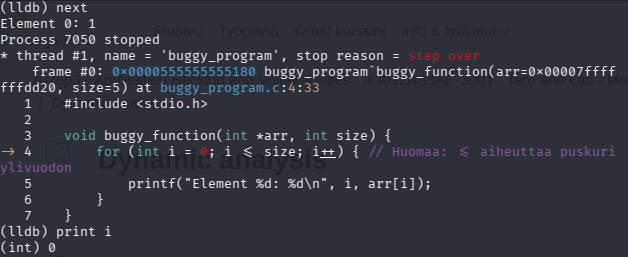
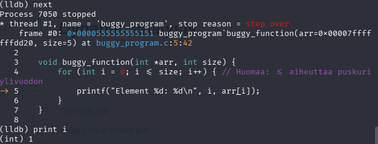
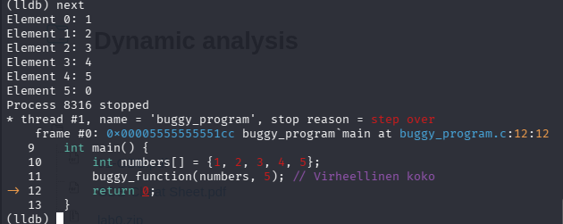

# H6 GNU Debugger

In this homework task, we must do the following tasks using LLDB, as opposed to GNU Debugger which we learned in class and see the differences.

We will go through the lab binary but instead of using GDB we use LLDB. 

For this exercise I have downloaded the lab 0-2 zips, but for the lldb part I will only use lab0 as an example.

## a. Watch a value change in a loop

First we must install lldb: `sudo apt install lldb`

Then we have to open the file in lldb: `lldb lab0buggy_program.c`

We can see the source code in this case and that it includes some functions.

We can set a breakpoint at buggy function.

This has stopped at the breakpoint at the buggy function.

We can step through the program step by step using `next`

We can also then print [i] inside the function and see how it changes

## b. Modify a return value from false to true

To modify a return value from false to true, we want the return to be 1 instead of 0. We will step through the main entry point of the code and play it until it goes to the return line.

I used the following commands:

`breakpoint set --name main`
`run`
`next` until I'm on the return line.

## c. Modify a function argument (try both a local variable and register manipulation)

## d. Compare your experience to the slides: did you find it easier? Which tool would you use, and when?

## e. GDB Labs 0–2 

## References: 

https://lldb.llvm.org/