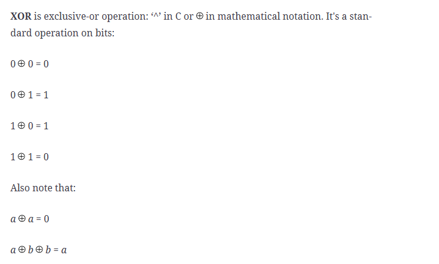
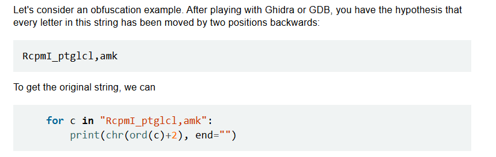
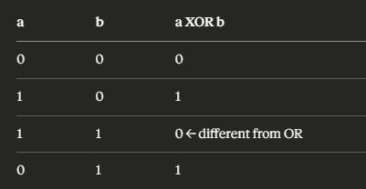
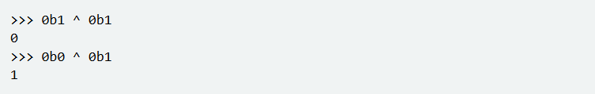
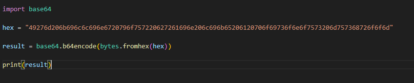
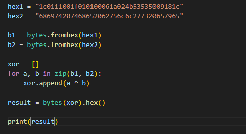
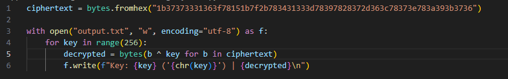
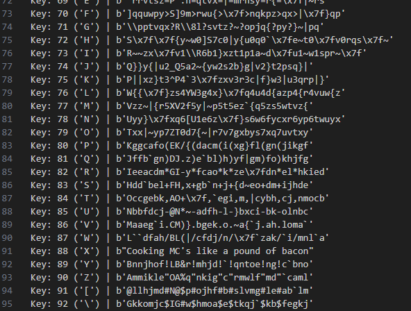
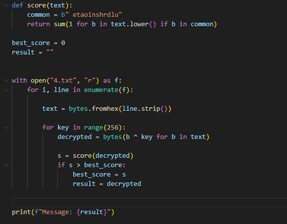

# H7 Uhagre2

## x. Summaries

### Schneier 2015: Applied Cryptography, 20ed: Chapter 1: Foundations:

#### 1.1 Terminology ("Historical Terms" to the end)

- Historically code refers to words, phrases that could be the cipher for entire phases. 
- A cleartext phrase may hide hidden meaning

#### 1.4 Simple XOR



XOR refers to exclusive-or operation. There are truth tables that determine the output from the inputs by logic.gate. Examples are: 
- OR = true if A or B or both are true. 
- AND = A and B must be true. 
- XNOR if both inputs are the same.

#### 1.7 Large Numbers

Large numbers like exponents are needed to show how long it will take to break cryptography because "it is so easy to lose sight of these numbers and what they signify"

### Karvinen 2024: Python Basics for Hackers

- use python in the terminal and compile using F5 instead of needing to open micro and doing python3 python.py every time.
- ord("T") → 84, chr(84) → 'T'
- hex(84) → '0x54', bin(84) → '0b1010100'
- Modulus % is important

Loops:


It prints "TeroKarvinen.com"

`[chr(ord(c)+2) for c in "RcpmI_ptglcl,amk"]`

It prints each letter of the cryptography and converts it into ASCII, and then +2 in ASCII table, and then converts back into character

You can then also put a `"".join` before it to join the final characters back into string.

XOR is reversible. If a ^ b = c, then c ^ b = a. It is symmetric encryption



We can do bitwise operations in python.



Some useful commands from the Tero's website:

```
$ echo -n "VGVyb0thcnZpbmVuLmNvbQ=="|base64 -d
$ echo -n "TeroKarvinen.com"|base64
$ man ascii
```

## Solve CryptoPals Set 1 challenges.

### a. Convert hex to base64

In this one we have to convert a long hexcode to base64.

We can simply convert the hex strings to raw bytes, and then encode those bytes to base64.



We get the result `b'SSdtIGtpbGxpbmcgeW91ciBicmFpbiBsaWtlIGEgcG9pc29ub3VzIG11c2hyb29t'`

[See the code here](base64encode.py)

### b. Fixed XOR.

In this task, we must convert 2 fixed hexadecimal numbers to bytes, and then XOR them together to produce a final string.

With the help of online guides and Claude Sonnet 4.6 free tier, I have concocted the following logic:



Essentially, we have converted the 2 hexadecimals into bytes, and then compared each byte against each other, and XORed them together and appended them to an array.

If we print one of the strings in binary, we see the hexadecimal, for example b1 = `b'\x1c\x01\x11\x00\x1f\x01\x01\x00\x06\x1a\x02KSSP\t\x18\x1c'`

Python is displaying it as hex however instead of bytes. the first one would be 28 as 1c in hex = `0001 1100` and we are comparing that with XOR against the first byte of the other string.

0 0 0 1 1 1 0 0   ← 28
0 1 1 0 1 0 0 0   ← 104
―――――――――――――――
0 1 1 1 0 1 0 0   ← 116

We then convert these bytes back into hex at the end after comparing them and appending them to a list and we get.

`746865206b696420646f6e277420706c6179`

[See the code here](fixedXOR.py)

### c. Single-byte XOR cipher.

In this task we have a hex encoded string `1b37373331363f78151b7f2b783431333d78397828372d363c78373e783a393b3736`

It has been XORed against a single character. We must try every character in the alphabet, but how do we know which one is the correct plaintext answer?

According to online guide by Tero, we see that we can give a point to each character that's in `etaoin shrdlu` as they are the most common letters in English alphabet, and show top 5 cleartext answers that have the most points.

But what if I just want to see all the answers in a separate text file anyway?

What if I don't care about ETAOIN SHRDLU scoring?

Well I'm just gonna print every single 256 output decrypt attempt into a file and look from there:



We compare each character and print those to a file

By chance on key 88: X, we get the cleartext



We see in the file however that majority of it is jibberish and does not contain any common characters even, making the etaoin method better.

### d. Detect single-character XOR.

In this task, we have 60 long strings and one of them is encrypted by a single character in XOR. We need to decrypt it. This time we can't just read through all the lines, so instead we will actually use the `etaoin shrdlu` method.

We will begin by defining our common letters:



If a string decoded against a character has multiple english letters like e, t, a, o, the higher its score. Based on that we will put it as the highest scoring string, and finally when we have ran through all the strings and XOR decoded them against each character, we get the single string that scored the highest which is `b'Now that the party is jumping\n'`

## References:

https://learning.oreilly.com/library/view/applied-cryptography-protocols/9781119096726/08_chap01.html#chap01-sec006

https://terokarvinen.com/python-for-hackers/

https://cryptopals.com/sets/1

https://www.youtube.com/watch?v=PeCTdtgRhVg

https://terokarvinen.com/getting-started-python-cryptopals/