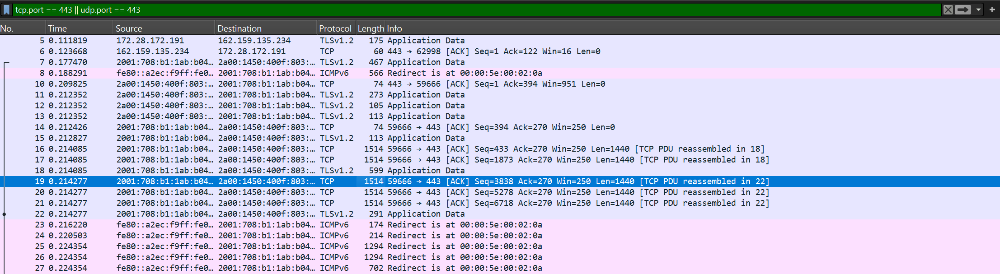
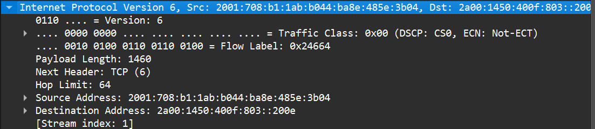
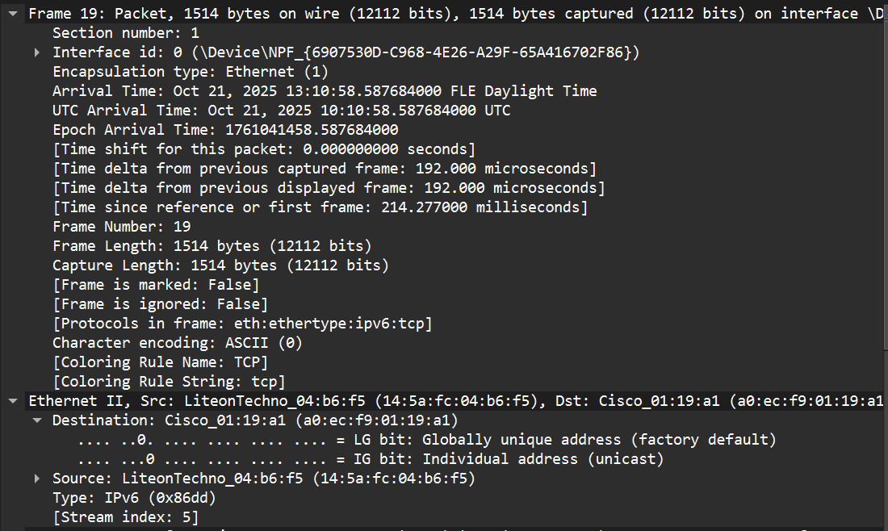

# H0

## 4 layers of a packet

Here is text

```This should be code```

Here is a screenshot of a network packet captured by wireshark. You can see that I have filtered the traffic to port 443 which is only HTTPS traffic.



The 4 layers of TCP/IP are as follows: 
- Application
- Transport
- Network
- Data link

Here you can see the Transport layer which is TCP or UDP



Here you can see the network layer which is IPv6



Here you can see data link layer and source and destination MAC address


## References

Course page: https://terokarvinen.com/tunkeutumistestaus/
Wikipedia: https://en.wikipedia.org/wiki/Transmission_Control_Protocol
Geeksforgeeks: https://www.geeksforgeeks.org/computer-networks/tcp-ip-model/
