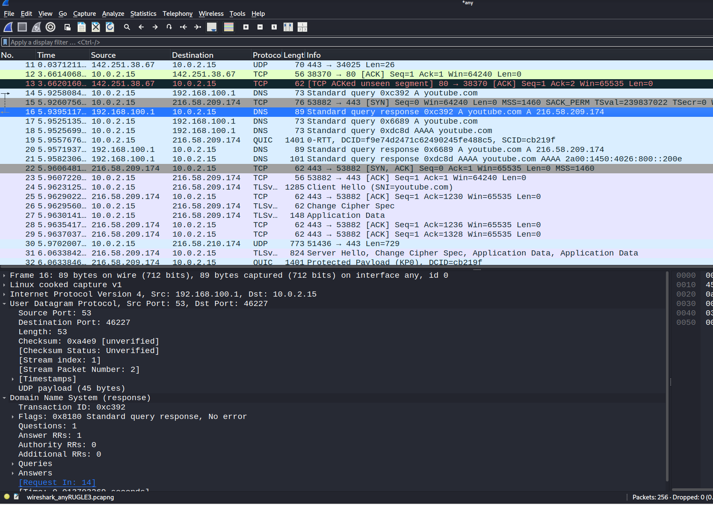

# H1

## Summaries

### Karvinen 2025: Wireshark - Getting Started

In this article we explore how we install wireshark onto linux. 

Wireshark itself comes pre-installed in Kali Linux, but if you have some other version you might have to install it.

```sudo apt-get update```

```sudo apt-get install wireshark```

Select the option that non-su can also capture packets

You should select the right interface that you want to sniff, and it usually shows you which ones have traffic so you can easily select them.

You can select any to capture all interfaces.

Now you can see a lot of traffic. You can click the red box to stop capturing because it might be too much. 

You can also save the session. 

Also there are filters for different types of packets such as ```dns, tls, http, tcp.port==443, ip.addr==192.168.122.7, frame contains "string"```

There is also option to follow TCP stream or UDP stream to see unencrypted text if there is any.


### Karvinen 2025: Network Interface Names on Linux

This article talks about network interfaces and virtual network interfaces.

Linux has virtual NICs such as loopback for localhost.

In linux, network interfaces are named systemd.

Naming scheme and prefixes:

```en``` mean wired Ethernet
```wl``` means WLAN 
```lo``` means loopback adapter which is used for localhost 
```enx``` means physical wired ethernet card

the numbers after the prefix refer to the device or MAC addess.

You can check interface with ```ip a```

### a. Kali
I already have kali linux installed from previous course.

### b. Disable network

I can disconnect my internet by will. I am using NAT.


Enable my connection.


### c. Wireshark

I opened up wireshark and then opened up Firefox and went to google.com.


Here we can see port 80 TCP traffic.

### d. TCP/IP

The TCP/IP stack consists of 4 layers:
- Application
- Transport
- Network
- Data link

Here we can see the packet and the port number it is sent from which is 443 which is usually HTTPS.


We can assume it is HTTPS protocol in the application layer. 

We can see that UDP is a transport layer protocol.

Then we can also see it is using IPv4 protocol in the network layer.

Finally we can determine the source MAC. Sometimes the destination too.


### e. Surfing-secure.pcap

I am analyzing a wireshark file. 

There are 2 a few machines on the network:
- 192.168.122.7
- 192.168.122.1
and they are making requests to some websites using HTTPS which IPs are:
- 216.58.210.164
- 139.162.131.217

Protocols:
- DNS, TCP, TLS, HTTPS, QUIC
Ports: 
- 443, and some ethereal ports


### f. What web browser

What web browser is the user using? From some research online, I found that we can expand Client Hello TLS handshake to reveal some information 


I can't really say for sure what browser it is. It says TLS v1.2 and there are a lot of cipher suites


There is also ALPN which refers to application layer protocol negotiation but I can't determine anything.


### g. Network Interface Type

In the surfing-secure.pcap it seems like the user is using eth network interface.


You can also see it in the capture file properties.


### h. What websites user has visited

This is apparently difficult but you can see before the user connects with TLS the domain name.

We can see:
- terokarvinen.com 
- google.com:
- commentero.terokarvinen.com
- terokarvinen.goatcounter.com


### i. Analyzing own traffic:

In this task I opened up chrome and then went to youtube.



Here it shows the first DNS request made to target IP address of ```10.0.2.15``` as a standard query. We see that the destination port is 46227 which is an ephemeral port using UDP protocol.


We can see it uses a packet type of unicast and used ethernet with source MAC of ```52:54:00:12:35:02```

It uses IPv4 with header length of 20 bytes which is standard. The total length of the packet is 73 bytes. We can see the source address of ```192.168.100.1``` for IPv4

Now we can see response from the IP address of ```10.0.2.15```


Here the source port and destination port have been reversed. The source port is another ephemeral port and the source MAC has been revealed as ```08:00:27:6b:52:c8```

We can see that the length of the packet is smaller, with only 57 bytes. It still uses IPv4.

## Reference

Terokarvinen: https://terokarvinen.com/verkkoon-tunkeutuminen-ja-tiedustelu/

Wikipedia: https://en.wikipedia.org/wiki/Ephemeral_port

Catchpoint: https://www.catchpoint.com/blog/wireshark-tls-handshake
