# H2

## Summary

### Bianco 2013: Pyramid of Pain

The pyramid of pain refers to a pyramid that shows different kinds of threat indicators that a defender can block to cause trouble to attackers. 

At the bottom of the pyramid are hashes for example. If a defender blocks a specific hash or IP, it causes little trouble while it is easy to do, and an attacker can simply change a hash or their IP.

The higher in pyramid you go, the harder it is to disrupt but the more problematic it is for the attacker. For example, identifying nmap scans and blocking it could cause significant trouble as a hacker has to find another way to scan ports.

### Caltagirone et al 2013: Diamond Model

Diamond model is a threat model that is used to analyze cyber threats.

It has 4 parts: Adversary, as in who did the attack. Capability, as in how did they do it. Victim, as in who they did it to. And Infrastructure, as in what was used.

In the article by Kraven security, it was explained very simply as in, "adversary deploys a capability over some infrastructure against a victim."

It is used to understand how the attack happened and who was behind it, and see what tools and infrastructure the attacker used.

## a. Apache log

Downloaded apache web app into my virtual machine and inspect the traffic.

`sudo apt install apache2` to install apache2
`sudo systemctl start apache2` to start it

We open it in localhost and we see the default page

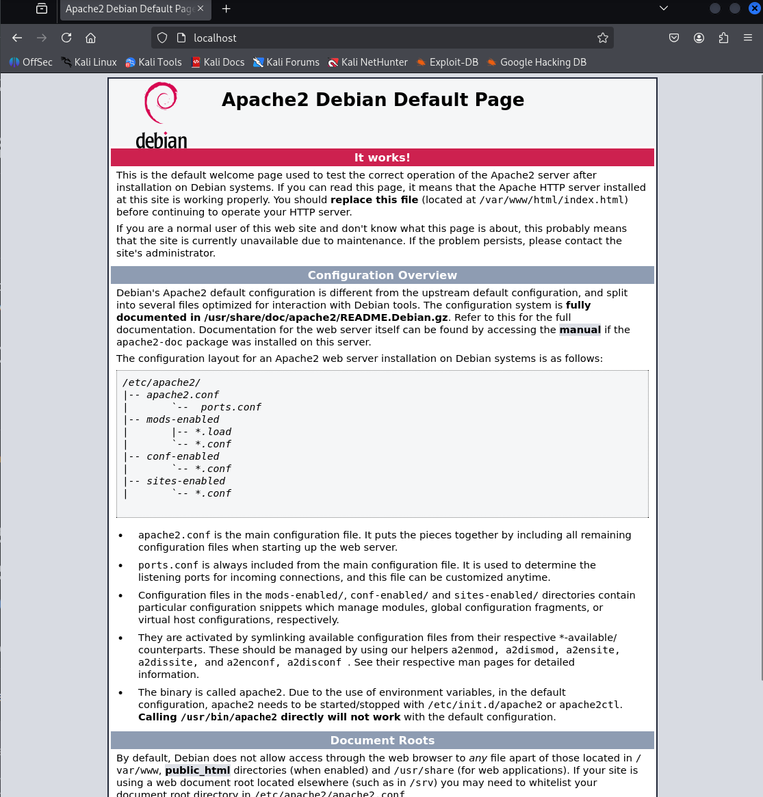

You can see the logs in `/var/log/apache2/`

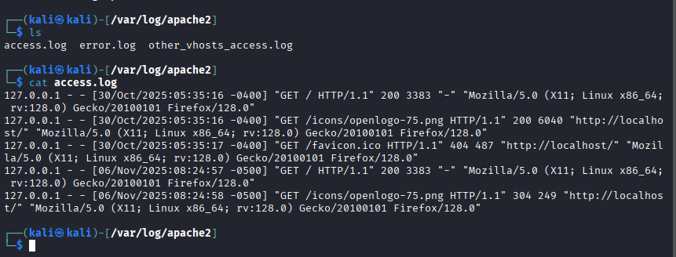

Here we can see the corresponding load that was first started:

`127.0.0.1 - - [30/Oct/2025:05:35:16 -0400] "GET / HTTP/1.1" 200 3383 "-" "Mozilla/5.0 (X11; Linux x86_64; rv:128.0) Gecko/20100101 Firefox/128.0"`

The `127.0.0.1` refers to the IP address of who is accessing it

Next two dashes refer to authentication such as ident and authentication but since we don't have login or user ID, they are both returning null which is dashes.

Then we have `[30/Oct/2025:05:35:16 -0400]` which is date and time

`GET /HTTP/1.1` refers to the type of request that is being made

`200` is the HTTP server response

`3383` is the size of the returned data

We have a `-` but this part should be a referrer which shows what page the user came from originally. It's empty because we entered the site by typing the localhost url and weren't redirected

Then we have the browser data finally which is Mozilla.

## b. Nmapped port 80

Port scanning my own apache app on port 80 using tcp with the command `sudo nmap -A -p 80 localhost`

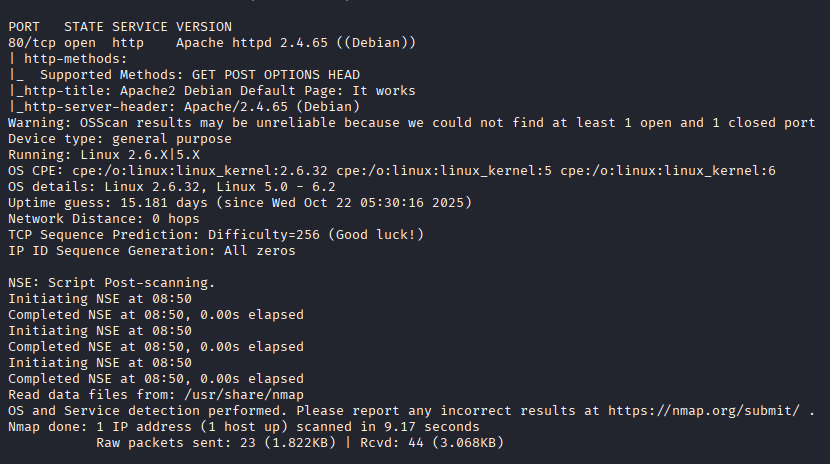

We see a port 80 tcp open with the type of service that is running which is Apache2 Debian. We also see the Linux version and other details


## c.

The automatic scripts happen when I use `-A` flag for the nmap scan are OS detection, version detection, traceroute and NSE default scripts.

```
|_http-title: Apache2 Debian Default Page: It works
|_http-server-header: Apache/2.4.65 (Debian)
Warning: OSScan results may be unreliable because we could not find at least 1 open and 1 closed port
Device type: general purpose
Running: Linux 2.6.X|5.X
OS CPE: cpe:/o:linux:linux_kernel:2.6.32 cpe:/o:linux:linux_kernel:5 cpe:/o:linux:linux_kernel:6
OS details: Linux 2.6.32, Linux 5.0 - 6.2
Network Distance: 0 hops
```

## d. Traces in the logs

In apache2 /var/log/apache2/ we can see if we find any traces of an nmap scan.

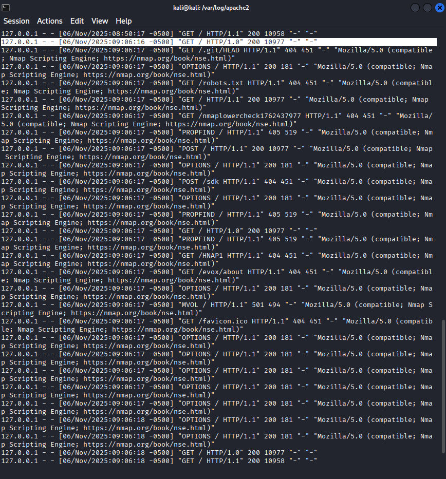

We can see quite a lot including the nmap word in plain text. 

You can also identify the nmap.org url as well as the NSE script text in plain text in the logs. `Nmap Scripting Engine; https://nmap.org/book/nse.html`

We could technically just grep everything from the access.log that has the words nse or nmap.

The logs also show probing into robots.txt and other sources.

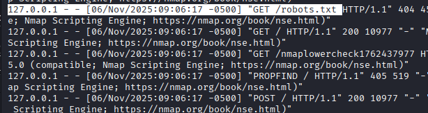


## e. Wiresharking

We are on loopback adapter, trying to capture the nmap scan traffic using wireshark.

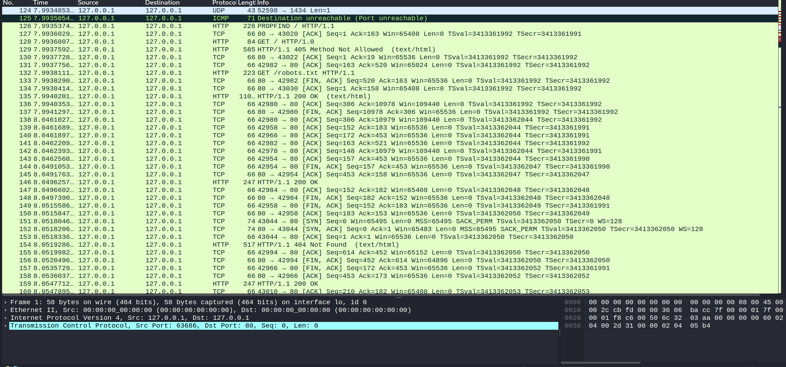

We see a lot of packets but we only want the packets where there is something about NMAP. This is easy because the requests are done through HTTP plaintext and we can just filter the frames that contain the word "nmap"

`frame contains "nmap"`

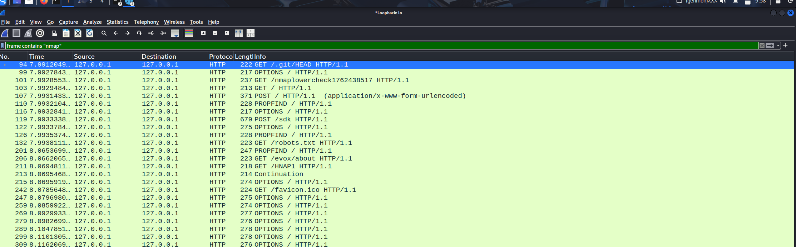

Here we can see some requests which we saw before on the apache logs.

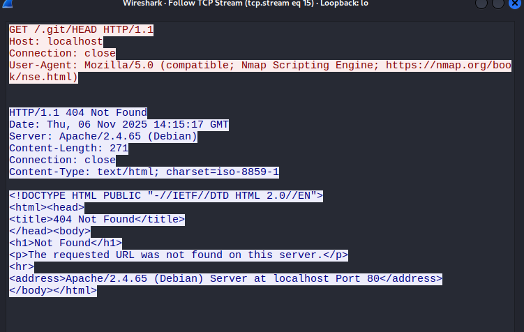

We can follow the TCP stream and we can see the plaintext request which contains Nmap Scripting Engine.


## f. Net grep

`sudo ngrep -d lo -i nmap`

We will use net grep to watch the network packets that contain the word "nmap"

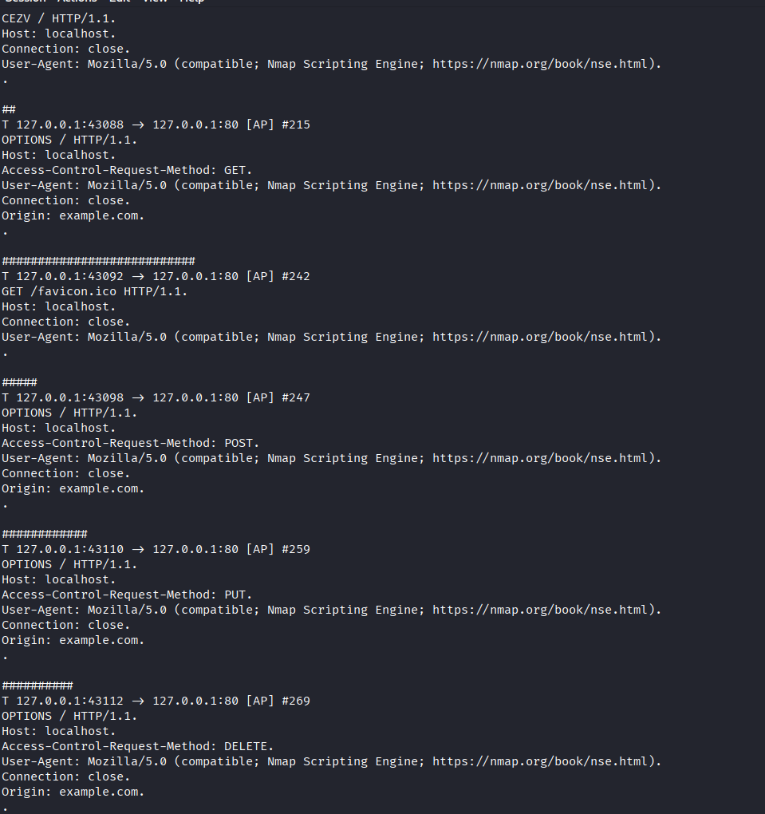

We then run the same nmap commands on the apache

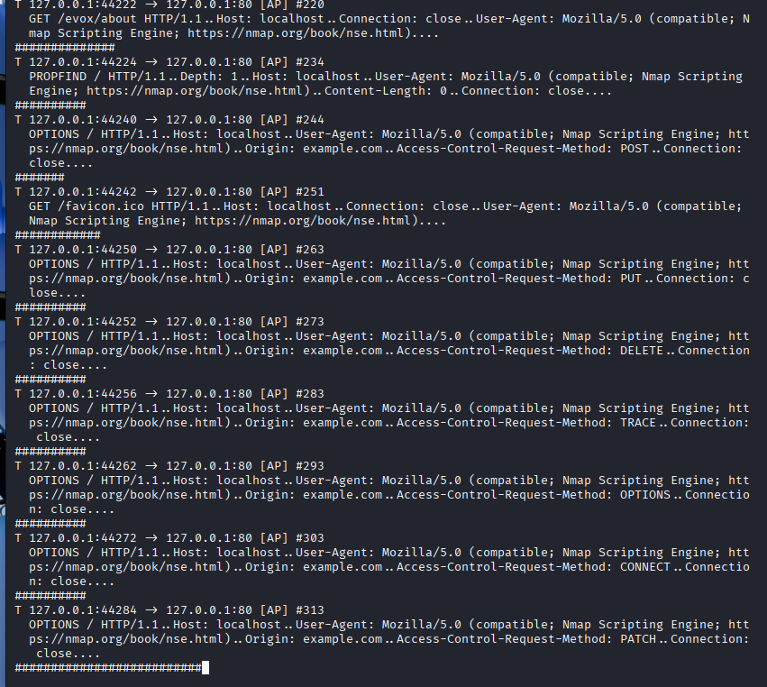

We now see all packets sent over the network containing the nmap word

## g. Agent

So when we use nmap we can try change the log that appears on apache using: 
`sudo nmap -A -p 80 localhost --script-args http.useragent="Mozilla/5.0"`

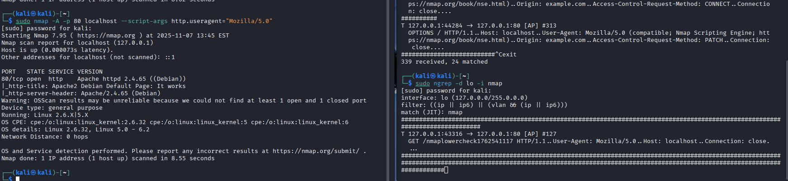

On ngrep, we can only see one line now in the network packets with the nmaplowercheck'

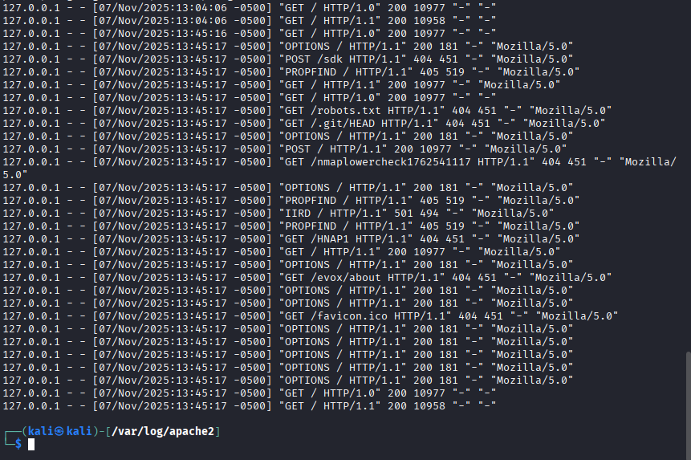

In the apache2 access logs you cannot see nmap very clearly either

## i. LoWeR ChEcK

In this one we want to remove even the trace of lower check. In order to do so, we first navigate to the folder with nmap scripts `/usr/share/nmap`

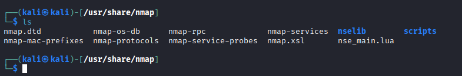

I began editing the `nse_main.lua` because I assumed that was where everything is and my friend said he had trouble with finding the script from a "lua file".

However, realizing there's no lowercheck string in the file, I began doubting if that was the right file I was editing. After asking my friend, he said it was the http.lua file in nselib and found the strings that had lowercheck.

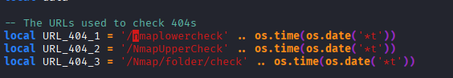

and changed them to `lollowercheck`


## j.

## Reference

Terokarvinen: https://terokarvinen.com/verkkoon-tunkeutuminen-ja-tiedustelu/

Bianco 2013: https://detect-respond.blogspot.com/2013/03/the-pyramid-of-pain.html

Kraven Security: https://kravensecurity.com/diamond-model-analysis/

Sumo Logic: https://www.sumologic.com/blog/apache-access-log

Wireshark: https://www.wireshark.org/docs/dfref/f/frame.html

Geeksforgeeks: https://www.geeksforgeeks.org/linux-unix/ngrep-network-packet-analyzer-for-linux/

AndroOtt: https://github.com/AndroOtt/Verkkoontunkeutuminen/blob/main/h2.md