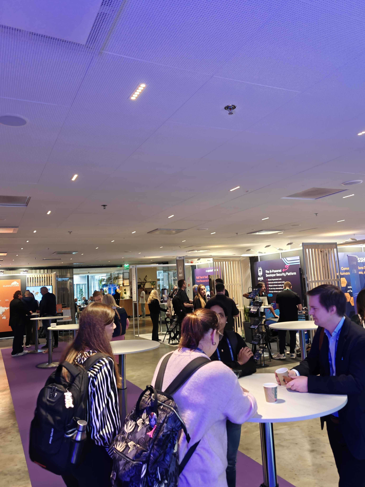
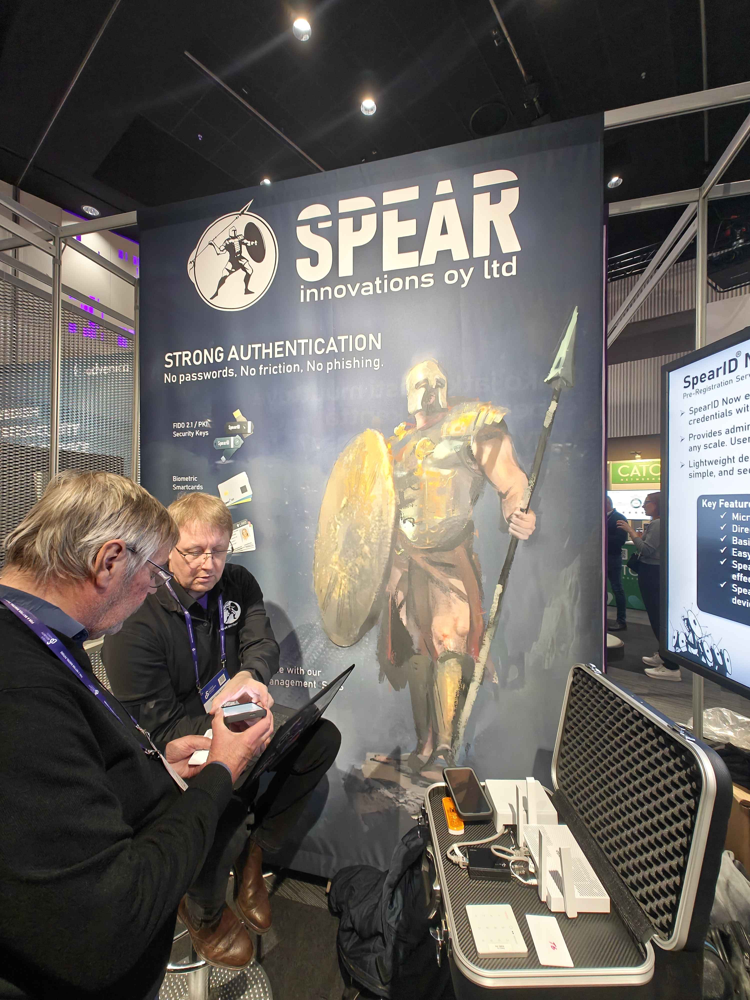
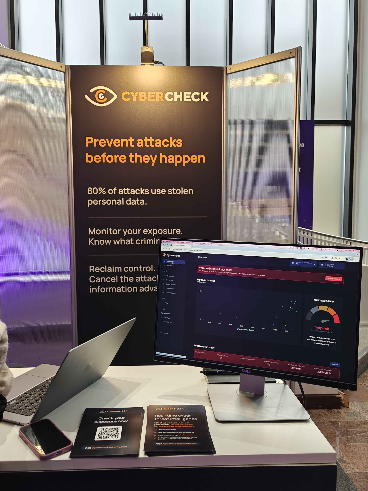
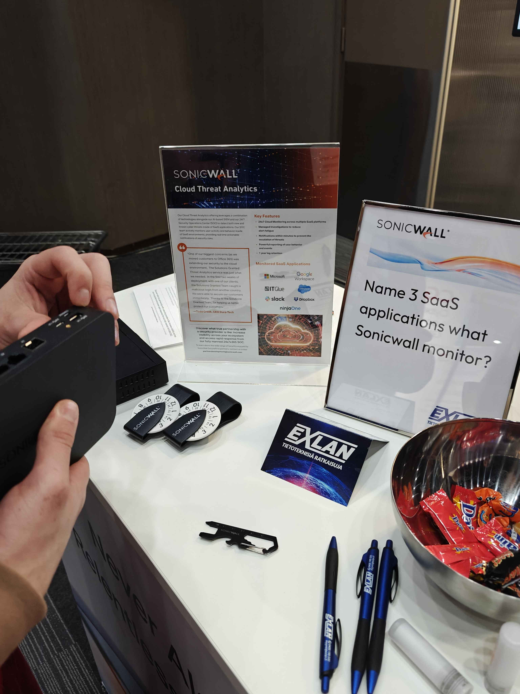

# H3

## Summary

Today was a eventful day at Cyber Security Nordic 2025 and Hybrid Multi-Cloud World event by IBM

First I went to check up on our lecturer Lari Iso Anttila's hustle called Spear Innovations OY which basically did phishing-proof NFC card auth systems. You can't copy the NFC interaction and it has multi-factor authentication system such as requiring you to put your fingerprint on the card before being able to scan it. On top of that, they have USB FIDO2 passwordless security key authentication systems requriing you to only have a physical token to access what you need. I really liked how they presented their technology and even were using it in production in their workshop.

The next most interesting was Cybercheck which was a SaaS solution that monitors for any credential leaks of any personnel, be it a consumer or a company account. They integrate multiple data sources and constantly monitor dark forums for the latest password, credential and PII leaks which you can identify based on your email, similar to HaveIBeenPwned. However, they have more data sources which they pull from and have a team of experts monitoring very deep forums constantly.

Finally, an interesting company at the event was SonicWall, which offered a physical firewall Router-Switch configuration designed to protect against cyber threats like malware, ransomware, intrusions, and unauthorized or suspicious access. It inspects all traffic using features such as Deep Packet Inspection (DPI), Intrusion Prevention System (IPS), VPN support, and content filtering. It provides higher performance and reliability than software firewalls, making it ideal for businesses that need continuous, high-speed protection for multiple users.

Shout-out to Reversec for giving away t-shirts for solving their encrypted message, really liking the cat t-shirt. I will enroll in your cyber security academy in the upcoming year for sure!

However, Cyber Sec Nordic wasn't the only event I went to today no. I also went to IBM Hybrid Multi-Cloud workshop. Essentially, IBM presented their service called Turbonomic which is a IT infrastructure management system. From what I got out of it, if you have a lot of cloud computing micro services, you can use this service to monitor and check for failures and potential improvements as well as areas where you can save a lot of money from your monthly cloud bill. 

It is very interesting and as a cloud computing enthusiast, I will definitely keep this in mind in the future. 