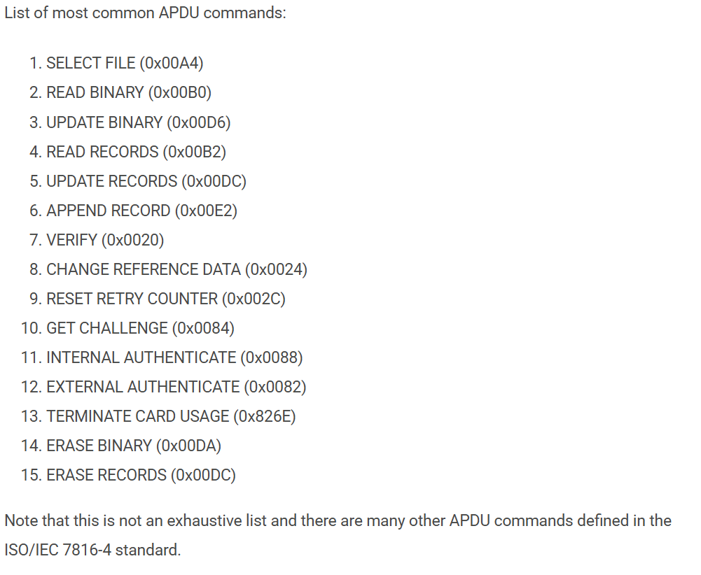

# H3

## a. What kind of RFID devices do I have and how well am I protected?

I own a phone that can be used to pay with NFC, bank cards that have NFC and keys that have NFC access tokens.

In terms of protection, I do not have any concrete physical methods of protecting myself. I can only pray and trust that the encryption on my bank card is strong enough and that it doesn't get swiped.

However, it is a genuine fear that what if someone just swipes your card and can clone it for whatever purpose. 

I believe a method of protection would be to have a card case that protects from skimming or reading of the cards if the card is not taken out.

## b. Familiarize with APDU commands 

I'm using ChatGPT and Google to familiarize myself with APDU per task recommendations. 

According to Card Logix, APDU mean Application Protocol Data Unit which is a method of communication via smart cards via RFID or NFC. It consists of either a command or response message that is sent or received from the smart card.

APDU consists of CLA | INS | P1 | P2 | [Lc | Data] | [Le]

`The CLA byte defines app-specific class of instructions, like a family of commands such as ISO-standard or app-specific`

`The INS byte defines instructions within the class of instructions by CLA byte, like READ, WRITE, SELECT, AUTH`

`The P1 and P2 field are used to qualify instructions and to provide input data such as modes, file IDs, etc`

The other fields are optional.

`LC determines how many bytes of data you're sending to the card`

`Data which is the payload, like text content, PIN, file, etc.`

`Le which is how many bytes of data you expect in response`

When the card gets an APDU command, it also gives a APDU response where it often consists Response Data, SW1-SW2 response trailer

Example APDU hex: `00 A4 04 00 07 A0 00 00 00 03 10 10 00`

Breakdown:

00 = CLA (ISO, no secure messaging)

A4 = INS = SELECT

04 = P1 (select by AID = application ID)

00 = P2 (first or only occurrence, no special options)

07 = Lc = length of Data (7 bytes)

Rest is data

Example of common APDU commands:

## c. RFID Hacking News

An interesting piece of news about hacking RFID was on Hacker News where researchers found a backdoor in Mifare Classic Cards used for hotel rooms and office cards.

It lets people open doors even if they do not know the security key by simply getting access to the card and copying it because the manufacturer (Shanghai Fudan) included a master key inside the card.

This meant that all the cards share a hidden secret key and if you know the key you can bypass all the locks.

FM11RF08 and FM11RF08S cards can share the same master key and by being close to the card and sending the backdoor command, you can read the card and copy it.

## References:

Card Logix: https://www.cardlogix.com/glossary/apdu-application-protocol-data-unit-smart-card/

CHATGPT Model 5.1 accessed 26.11.2025

The Hacker News: https://thehackernews.com/2024/08/hardware-backdoor-discovered-in-rfid.html