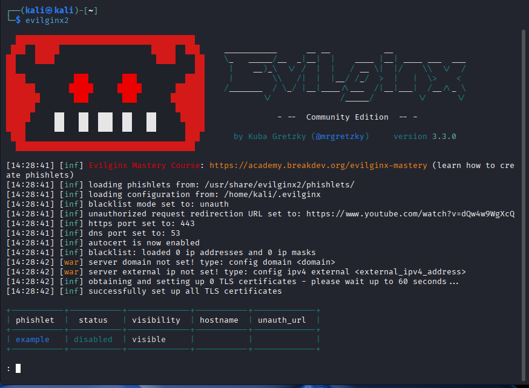

# H5

## a. Familiarize with tools

### Evilginx2

#### Installation:

`sudo apt install evilginx2`

`evilginx2`

#### Working with it:

`sudo apt install docker.io -y`

#### Spoofing attempt:

## b. Mininet virtual environment for simulating TCP SYN-Flood attack

## References

Terokarvinen: https://terokarvinen.com/verkkoon-tunkeutuminen-ja-tiedustelu/

Evilginx: https://breakdev.org/evilginx-3-3-go-phish/