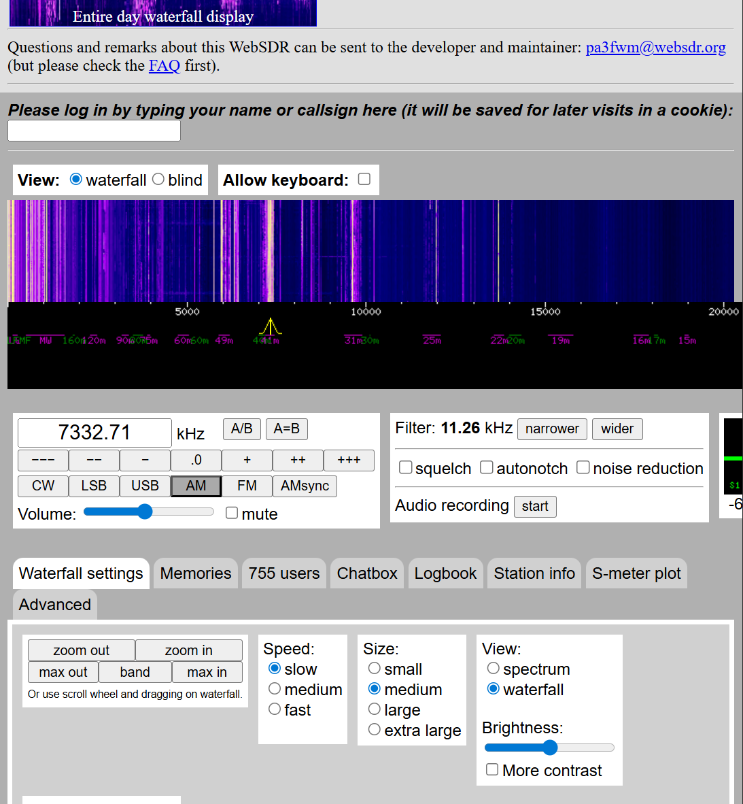
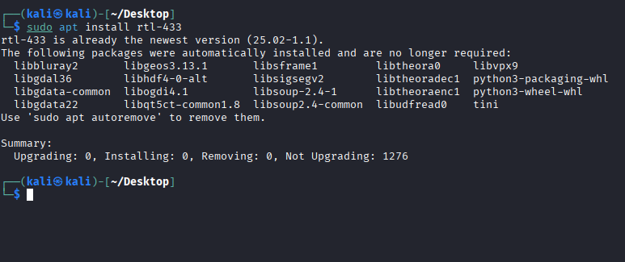

# H6

## x. Summaries

### Hubacek URH

In this video, we look at how we use universal radio hacker tool to record a signal.

We choose the correct frequency and look at the waterfall frequency. 

When we intercept a signal, we can stop and then tune into the frequency to see where the signal is.

Then we can go into frequency and record the signal and get the waveform info and save it.

Then we can go back to main view and choose the right modulation and see if we can get the autodetect parameters.

We can modify parameters such as bit length, noise, etc.

We can then demodulate it in case the signal isn't too clear.

Finally we can choose to view the info in hex or ASC. 

### Cornelius 2022 Decode Weather Station

In this writeup, we read about a user who decodes and reverse engineers a wireless protocol of a weather station sold by Lidl because they broke the sensor and now they are replicating it.

Decode with rtl_433 first and identified device as Nexus-TH. They were able to see information such as temperature and humidity.

They then used URH to record, analyze and retransmit information if the hardware had the function.

They go through the process of capturing, tunneling in and saving the captured signal. They note that "the captured signal should be at least double the noise amplitude"

They then create a signal based on a chosen part of the recorded signal and demodulate it. Then they go through a decoding process and can reproduce it using an Arduino and 433 MHZ transmitter in ASK modulation.

## a. WebSDR

In this task we go on a website which allows you to tune into radio frequencies of diffent countries.

We go on websdr.org

From there we can choose a bunch of different locations which have radio listening which we can tune into. 

For example, we will take University of Twente in Netherlands: http://websdr.ewi.utwente.nl:8901/

We find a frequency which has a broadcast information which is highlighted by the yellow in the waterfall display. 

We zoom in and must then test the different modulation modes like FM, AM. 

In this case we can listen to actual broadcast with AM. I'm not sure how confidential the broadcast is so I won't mention the contents.

The frequency is 7281kHz in AM modulation. 

Wavelength is 300 / 7.281 = 41.2 meters

Content: a broadcast in Mandarin.

## b. rtl_433 installation

`sudo apt-get update`

`sudo apt install rtl-433`

## c. Automatic Analysis RTL

We analyze a .cs8 packet using rtl_433 software.

## References

Terokarvinen: https://terokarvinen.com/verkkoon-tunkeutuminen-ja-tiedustelu/

Hubacek 2019: Universal Radio Hacker SDR Tutorial on 433 MHz radio plugs: https://www.youtube.com/watch?v=sbqMqb6FVMY&t=199s

Cornelius 2022: Decode 433.92 MHz weather station data: https://www.onetransistor.eu/2022/01/decode-433mhz-ask-signal.html
