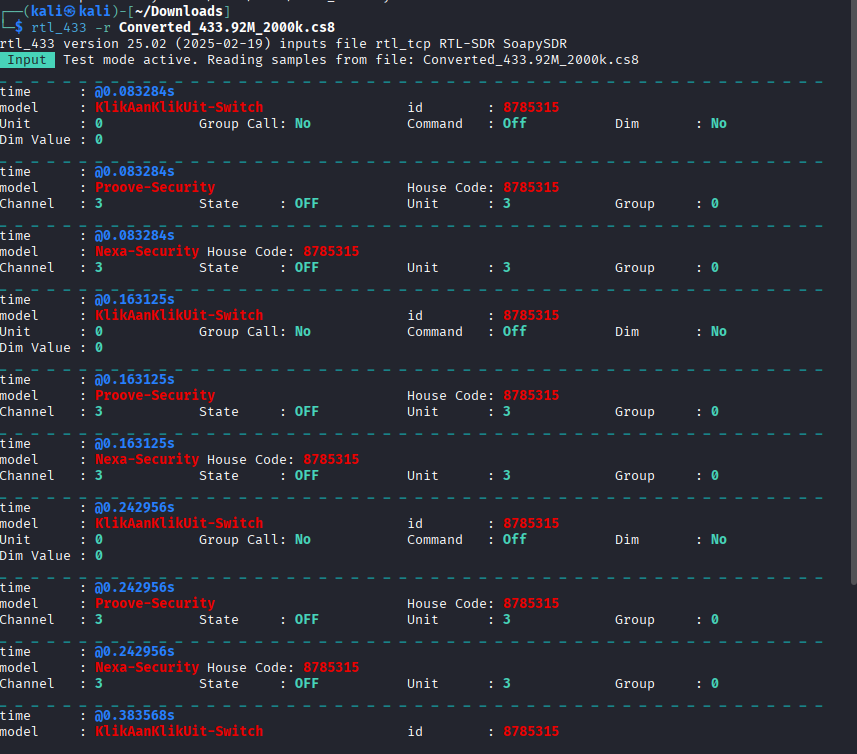
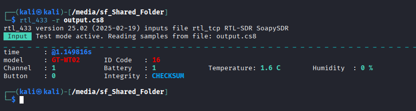
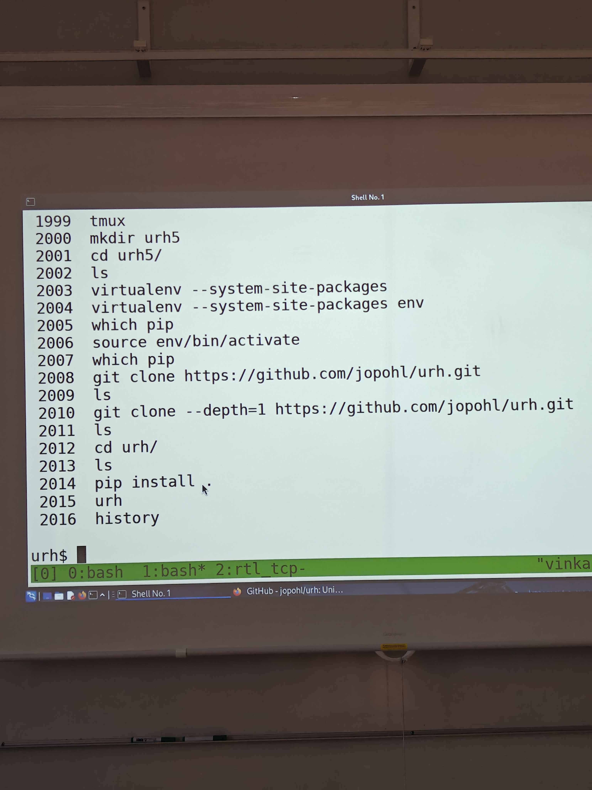
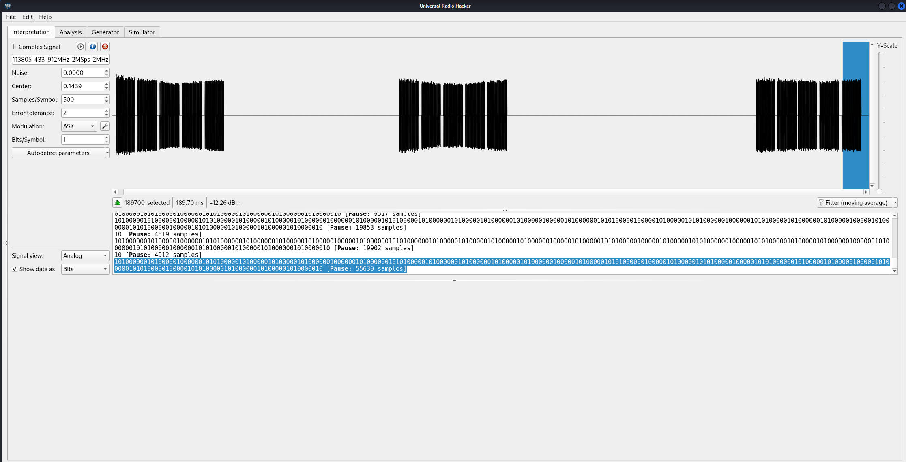
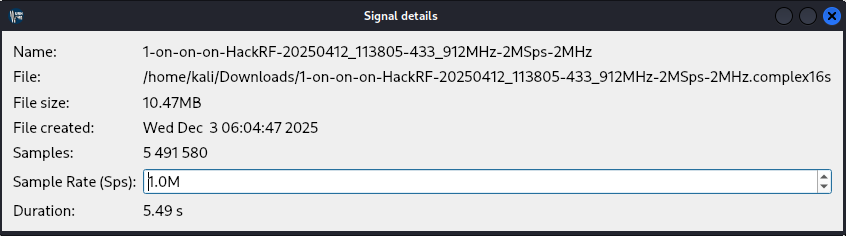
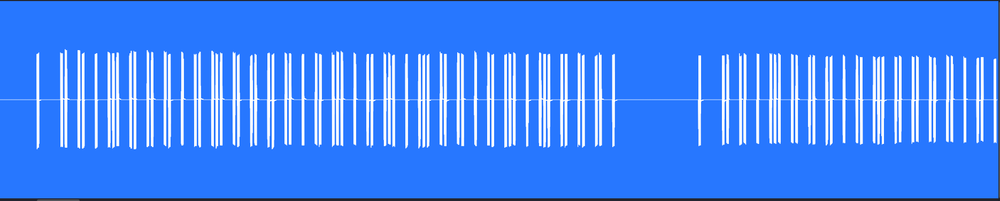
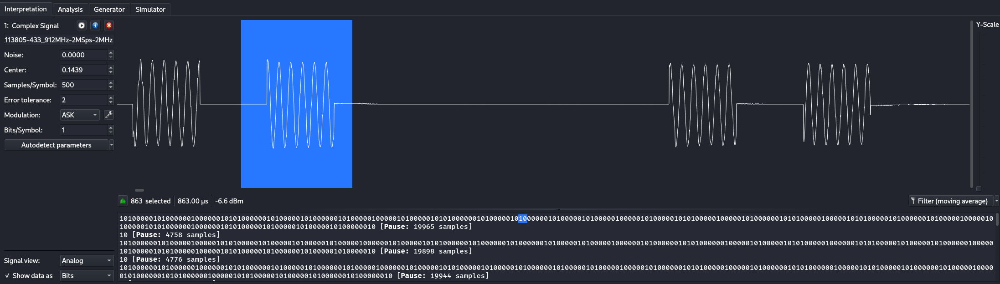

# H6

## x. Summaries

### Hubacek URH

In this video, we look at how we use universal radio hacker tool to record a signal.

We choose the correct frequency and look at the waterfall frequency. 

When we intercept a signal, we can stop and then tune into the frequency to see where the signal is.

Then we can go into frequency and record the signal and get the waveform info and save it.

Then we can go back to main view and choose the right modulation and see if we can get the autodetect parameters.

We can modify parameters such as bit length, noise, etc.

We can then demodulate it in case the signal isn't too clear.

Finally we can choose to view the info in hex or ASC. 


### Cornelius 2022 Decode Weather Station

In this writeup, we read about a user who decodes and reverse engineers a wireless protocol of a weather station sold by Lidl because they broke the sensor and now they are replicating it.

Decode with rtl_433 first and identified device as Nexus-TH. They were able to see information such as temperature and humidity.

They then used URH to record, analyze and retransmit information if the hardware had the function.

They go through the process of capturing, tunneling in and saving the captured signal. They note that "the captured signal should be at least double the noise amplitude"

They then create a signal based on a chosen part of the recorded signal and demodulate it. Then they go through a decoding process and can reproduce it using an Arduino and 433 MHZ transmitter in ASK modulation.


## a. WebSDR

In this task we go on a website which allows you to tune into radio frequencies of diffent countries.

We go on websdr.org

From there we can choose a bunch of different locations which have radio listening which we can tune into. 

For example, we will take University of Twente in Netherlands: http://websdr.ewi.utwente.nl:8901/


We find a frequency which has a broadcast information which is highlighted by the yellow in the waterfall display. 

We zoom in and must then test the different modulation modes like FM, AM. 

In this case we can listen to actual broadcast with AM. I'm not sure how confidential the broadcast is so I won't mention the contents.

The frequency is 7281kHz in AM modulation. 

Wavelength is 300 / 7.281 = 41.2 meters

Content: a broadcast in Mandarin.

## b. rtl_433 installation

`sudo apt-get update`

`sudo apt install rtl-433`


## c. Automatic Analysis RTL

We analyze a .cs8 packet using rtl_433 software. 

We run `rtl_433 -r <file_name>`

In this case -r specifies a file that we need to decode instead of running it from a receiver.

We get the decoded results.



## d. .Complex16s

In this task we must take a URH recorded transmission that is in Complex16s and use rtl_433 to decode.

We must first turn the format into something rtl can understand. I asked ChatGPT 5.1 (3.12.2025) "how to turn a .complex16s into a .cs8 file" and it suggested using csdr which I did not have on my Kali, and and then suggested a python script:

```python
import numpy as np

# Input URH file (.complex16s)
data = np.fromfile("input.complex16s", dtype=np.int16)

iq = data.astype(np.float32) / 256.0  
iq8 = iq.astype(np.int8)

# Save rtl_433 compatible file
iq8.tofile("output.cs8")

print("Conversion complete → output.cs8")
```

We turn the `input.complex16s` into a `output.cs8` when we run this script `python3 convert.py` in the folder with the complex16s file.

This is the result we get when we run `rtl_433 -r output.cs8`





## e. Install Universal Radio Hacker

In this task we download URH. I have followed Tero's process in class and done the installation and will break it down:



`mkdir urh5` we wanna install this in a new folder because we will git clone

`cd urh5` 

(Optional)
`virtualenv --system-site-packages env`

`source env/bin/activate`

We can make a virtualenv with system dependencies but it's not necessary and you can skip all of this

`git clone --depth=1 https://github.com/jopohl/urh`

We do depth=1 because we don't want older commits, just the latest version.

`cd urh`

`pip install .` here you might be missing some dependencies so you should install them first if there is any errors. It will tell you what you're missing.

`urh` to start it. (make sure you have virtualenv enabled `source env/bin/activate`)

We then analyze complex16s file with URH

First we open the file in URH.



## f. Overview of the sample



The file is 5.49s long

The frequency is 433_912MHz

The time of creation is Wed Dec 3rd 6:04AM 2025

The file shows pulses of on/



By zooming in you can see the bits between each pulse.

## g. Demodulate the signal

The modulation mode is in ASK as it has clear 1 and 0s



Demodulated version:


1 bit in length is around 500 microseconds.

## h. Optional

## References

Terokarvinen: https://terokarvinen.com/verkkoon-tunkeutuminen-ja-tiedustelu/

Hubacek 2019: Universal Radio Hacker SDR Tutorial on 433 MHz radio plugs: https://www.youtube.com/watch?v=sbqMqb6FVMY&t=199s

Cornelius 2022: Decode 433.92 MHz weather station data: https://www.onetransistor.eu/2022/01/decode-433mhz-ask-signal.html
