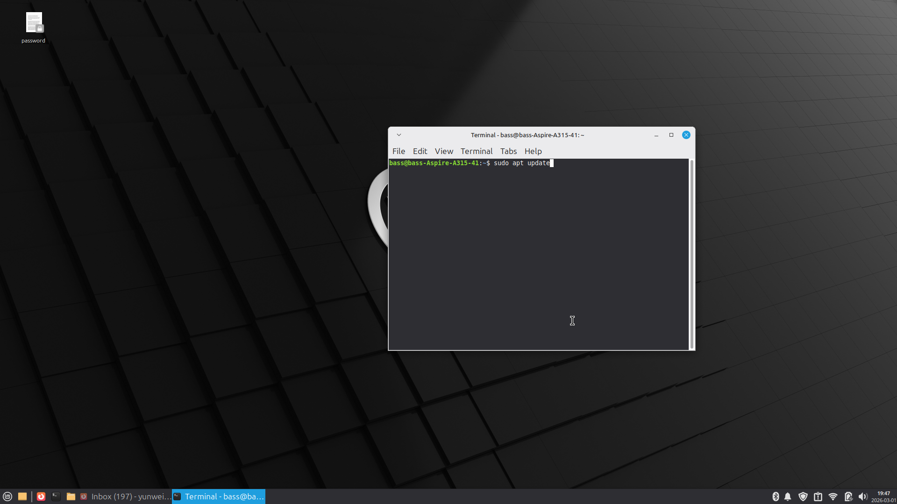
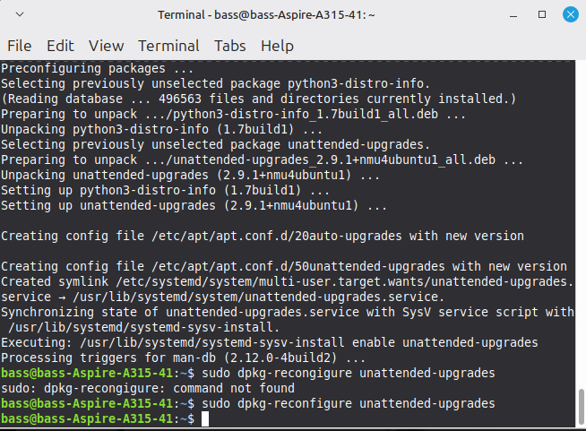
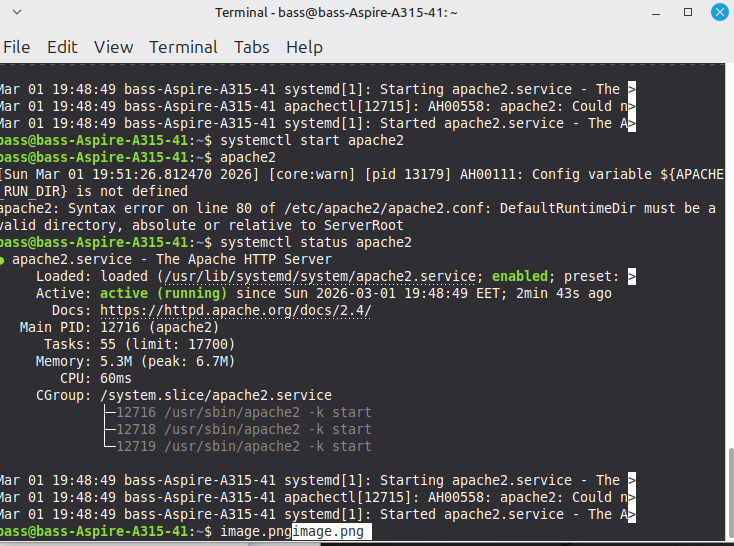
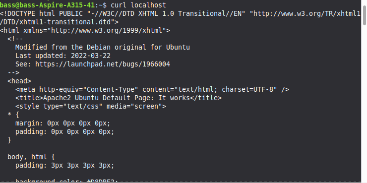
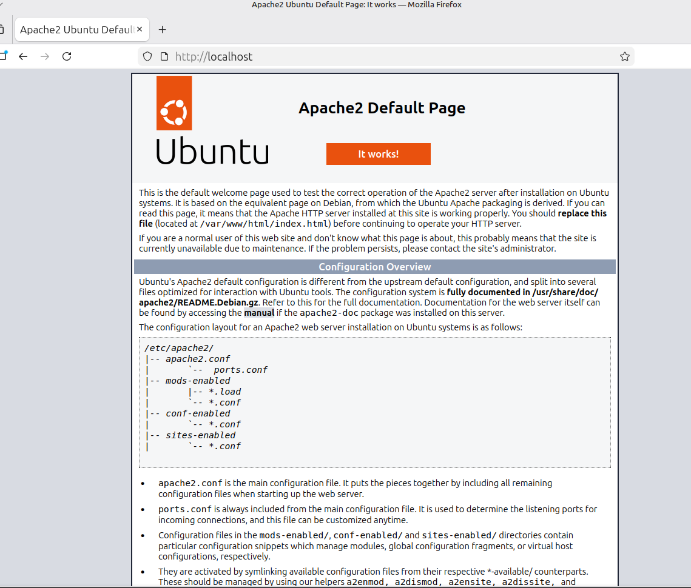
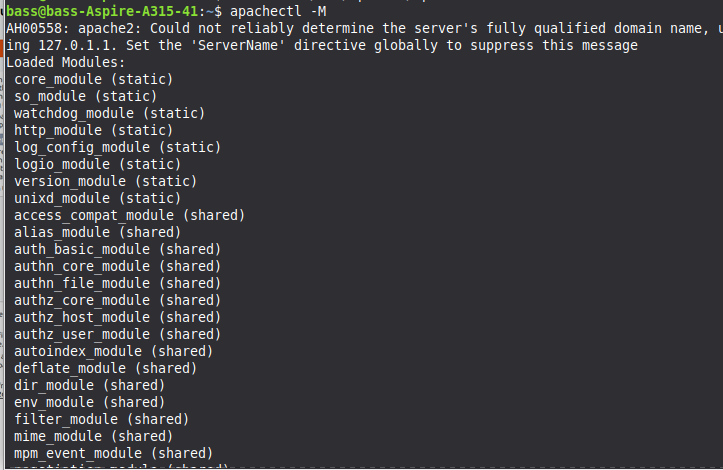
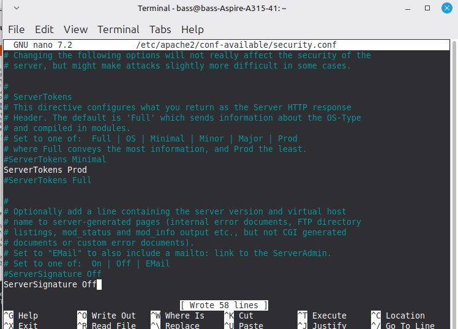
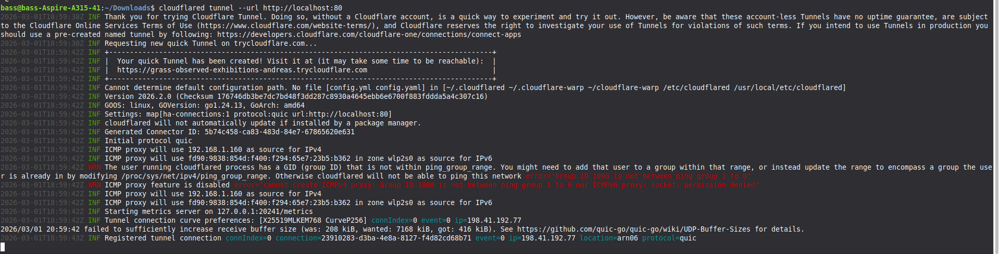

# Linux Project: Hosting local apache 2 server and exposing it to the public 2026

## Bonus: Clawdbot installation if I remember to do it

We have a fresh Linux Mint installation and we want to host an apache web server and show it to the internet. How do we do it safely so people don't DDoS me or try to hack my server?

### 1. Updating linux & installing apache2

First, we install initial updates:

`sudo apt update`

`sudo apt upgrade`

Then we make sure we enable automatic updates:

`sudo apt install unattended-upgrades`

`sudo dpkg-reconfigure unattended-upgrades`

Finally let's install apache2:

`sudo apt install apache2`

`systemctl start apache2`

Check that it is running by going to localhost or doing:

`curl http://localhost:80`

By default it is running on port 80. This can be changed in /etc/apache2/ports.conf

### 2. Apache Configs

Lock down Apache basics by disabling unnecessary modules

List loaded apache2 modules: 
`apachectl -M`

Disable unused modules to reduce attack surface:

`sudo a2dismod status autoindex proxy proxy_http`

Accept and restart: 

`sudo systemctl restart apache2`

Harden Apache config by editing configs:

`sudo nano /etc/apache2/conf-available/security.conf`

Ensure:

ServerTokens Prod
ServerSignature Off

Disable .htaccess overrides (hypertext access) to improve performance:

`sudo nano /etc/apache2/apache2.conf`

Ensure this block exists, which should be there by default:

<Directory />
    AllowOverride None
    Require all denied
</Directory>

And this:

<Directory /var/www/>
    AllowOverride None
    Require all granted
</Directory>

Restart:

`sudo systemctl restart apache2`

### 3. Configuring UFW 

`sudo ufw default deny incoming`
`sudo ufw default allow outgoing`
`sudo ufw enable`
`sudo ufw status verbose`

We deny any incoming connections and only allow outgoing.

### 4. Cloudflare Tunnel

Install Clouflared:

Go to `https://github.com/cloudflare/cloudflared/releases/latest`

Download the latest cloudflared-linux-amd64.deb

Install:
`sudo dpkg -i cloudflared-linux-amd64.deb`

Check version:

`cloudflared --version`

Login:

`cloudflared tunnel --url http://localhost:80`

Cloudflare will create a temporary trycloudflare.com URL for you without needing to log in, which is perfect. But this URL will disappear the moment you close the cloudflare process or shut down your computer.

If you want, you can setup your own custom domain in cloudflare and use that to tunnel your connection persistently so the URL doesn't change as long as the PC is on.

You can also create a named tunnel with cloudflare credentials but I won't do so now. This is what a succesful cloudflare tunnel looks like:

My one time URL: https://grass-observed-exhibitions-andreas.trycloudflare.com/

## References

https://www.digitalocean.com/community/tutorials/how-to-configure-the-apache-web-server-on-an-ubuntu-or-debian-vps

https://developers.cloudflare.com/cloudflare-one/networks/connectors/cloudflare-tunnel/do-more-with-tunnels/trycloudflare/

https://www.aptive.co.uk/blog/apacheconfig-security-hardening/

https://idroot.us/apache-security-hardening/

https://httpd.apache.org/docs/2.4/en/howto/htaccess.html

