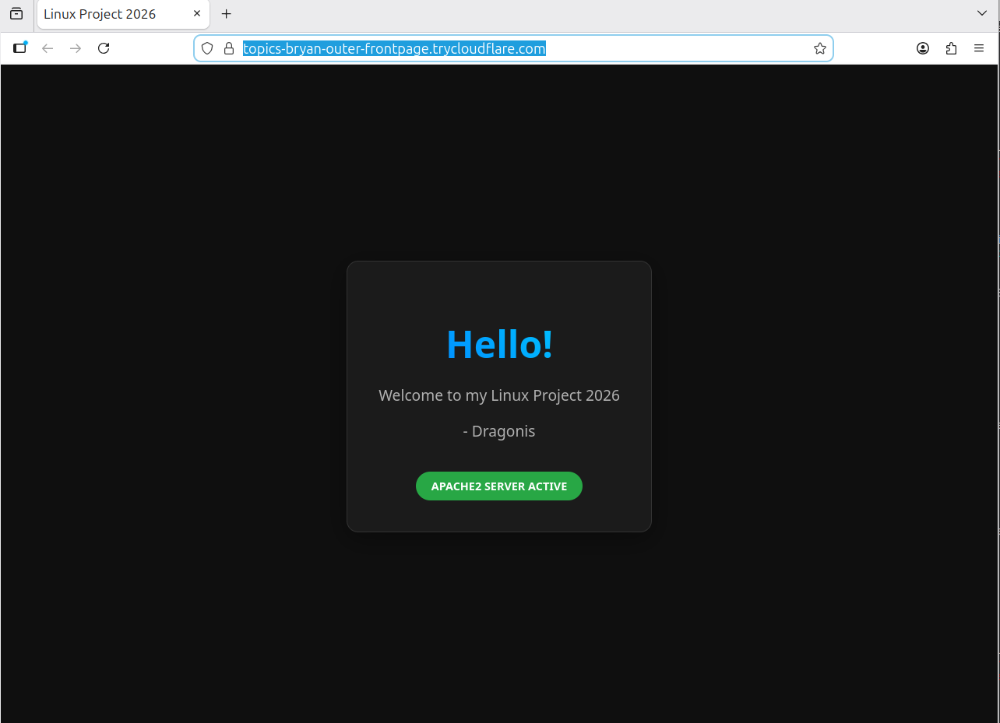
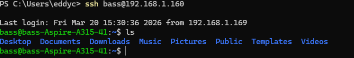
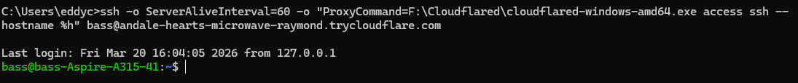

# Linux Project: Hosting local apache 2 server and exposing it to the public 2026

## Bonus: Clawdbot installation if I remember to do it

We have a fresh Linux Mint installation and we want to host an apache web server and show it to the internet. How do we do it safely so people don't DDoS me or try to hack my server?

### 1. Updating linux & installing apache2

First, we install initial updates:

`sudo apt update`

`sudo apt upgrade`

Then we make sure we enable automatic updates:

`sudo apt install unattended-upgrades`

`sudo dpkg-reconfigure unattended-upgrades`

Finally let's install apache2:

`sudo apt install apache2`

`systemctl start apache2`

Check that it is running by going to localhost or doing:

`curl http://localhost:80`

By default it is running on port 80. This can be changed in /etc/apache2/ports.conf

I also want to make sure my laptop never goes to sleep by:
`sudo nano /etc/systemd/sleep.conf`

Uncomment and set:
AllowSuspend=no
AllowHibernation=no
AllowSuspendThenHibernate=no
AllowHybridSleep=no

Reload system: 
`sudo systemctl daemon-reexec`

### 2. Apache Configs

Lock down Apache basics by disabling unnecessary modules

List loaded apache2 modules: 
`apachectl -M`

Disable unused modules to reduce attack surface:

`sudo a2dismod status autoindex proxy proxy_http`

Accept and restart: 

`sudo systemctl restart apache2`

Harden Apache config by editing configs:

`sudo nano /etc/apache2/conf-available/security.conf`

Ensure:

ServerTokens Prod
ServerSignature Off

Disable .htaccess overrides (hypertext access) to improve performance:

`sudo nano /etc/apache2/apache2.conf`

Ensure this block exists, which should be there by default:

<Directory />
    AllowOverride None
    Require all denied
</Directory>

And this:

<Directory /var/www/>
    AllowOverride None
    Require all granted
</Directory>

Restart:

`sudo systemctl restart apache2`

### 3. Configuring UFW 

`sudo ufw default deny incoming`
`sudo ufw default allow outgoing`
`sudo ufw enable`
`sudo ufw status verbose`

We deny any incoming connections and only allow outgoing.

### 4. Cloudflare Tunnel

Install Clouflared:

Go to `https://github.com/cloudflare/cloudflared/releases/latest`

Download the latest cloudflared-linux-amd64.deb

Install:
`sudo dpkg -i cloudflared-linux-amd64.deb`

Check version:

`cloudflared --version`

Setup:

`cloudflared tunnel --url http://localhost:80`

Cloudflare will create a temporary trycloudflare.com URL for you without needing to log in, which is perfect. But this URL will disappear the moment you close the cloudflare process or shut down your computer.

If you want, you can setup your own custom domain in cloudflare and use that to tunnel your connection persistently so the URL doesn't change as long as the PC is on.

My one time URL: https://topics-bryan-outer-frontpage.trycloudflare.com/

This might not work when you check it but just understand I did get my apache2 server up and running properly.

## Installing OpenSSH and using cloudflare to tunnel to my laptop via trycloudflare.com domain

So I wanna now ssh into my server and configure my apache remotely. I will first need to create a ssh keypair on my client machine that I will copy to my server machine.

I will run in CMD `ssh-keygen -t ed25519` 

Now it has created a keypair. I need to copy my public key to my server

First ensure server has openssh-server installed

`sudo apt install openssh-server`

`sudo systemctl enable --now ssh`

Enable firewall access to ssh:

`sudo ufw allow ssh`

I am on the same network as my server, so I can copy my keypair directly from my windows machine. I am going to use powershell for this step.

According to Gemini 3 Pro, I can do the following command to copy my public key from client to server machine:

`Get-Content $env:USERPROFILE\.ssh\id_ed25519.pub | ssh {user@ip} "mkdir -p ~/.ssh && cat >> ~/.ssh/authorized_keys && chmod 700 ~/.ssh && chmod 600 ~/.ssh/authorized_keys"`

If it works, now you can ssh into it in your local area network:

`ssh {yourusername@192.168.1.x}` and you should be in.

We want to disable password login before we open this up via cloudflare

In my active ssh session, I will do `sudo nano /etc/ssh/sshd_config`

Set:

`PasswordAuthentication no`
`PubkeyAuthentication yes`

`sudo systemctl restart ssh`

According to Gemini 3 Pro, I should also add fail2ban to prevent brute-force attacks:

`sudo apt install fail2ban`

I must also remember, if I want to add a new machine, I NEED to either copy my current private key to that machine, or then create a new public key on the new machine, send it to my first machine that has the connection, and then add that to the server somehow. Note: Appending a new key to ~/.ssh/authorized_keys in my server is the safest way to add a second machine

Now we will configure cloudflare tunnel. Since we already have cloudflared installed on our mint server, we can just run:

`cloudflared tunnel --url ssh://localhost:22`

We will get a random url which is the url we will connect to via cloudflared.

Before we connect from our client however, we need to install cloudflared on our client machine too. Go to `https://developers.cloudflare.com/cloudflare-one/networks/connectors/cloudflare-tunnel/downloads/`

Download the cloudflared.exe for windows, and move it to a folder you can access and remember. I have mine in `F:\Cloudflared`

Now it should show your random cloudflare url for your ssh tunnel, and you can access it from your client machine using:

`ssh -o ServerAliveInterval=60 -o "ProxyCommand=F:\Cloudflared\cloudflared-windows-amd64.exe access ssh --hostname %h" bass@your-random-url.trycloudflare.com`

-o ServerAliveInterval=60 in this case is a keep-alive setting which keeps the connection open via cloudflare when you're afk so it doesn't freeze the connection

That's it, now it should work!

## References

https://www.digitalocean.com/community/tutorials/how-to-configure-the-apache-web-server-on-an-ubuntu-or-debian-vps

https://developers.cloudflare.com/cloudflare-one/networks/connectors/cloudflare-tunnel/do-more-with-tunnels/trycloudflare/

https://www.aptive.co.uk/blog/apacheconfig-security-hardening/

https://idroot.us/apache-security-hardening/

https://httpd.apache.org/docs/2.4/en/howto/htaccess.html

